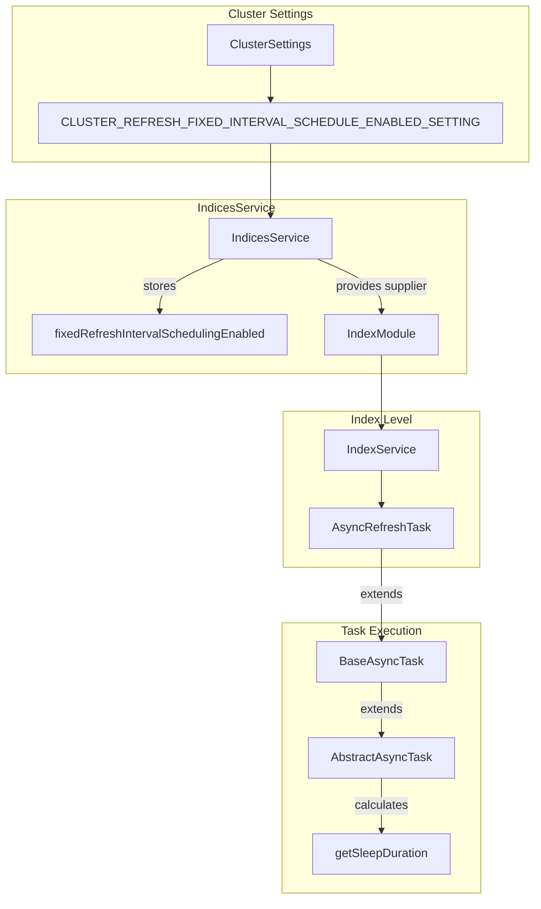
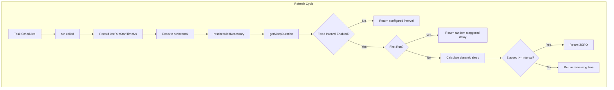

# Refresh Task Scheduling

## Summary

Refresh Task Scheduling is a feature that provides deterministic timing for index refresh operations in OpenSearch. By tracking actual refresh execution times and dynamically calculating sleep durations, this feature ensures consistent intervals between refreshes regardless of how long each refresh operation takes. This is particularly important for remote store indexes where predictable data freshness is critical.

## Details

### Architecture



### Data Flow



### Components

| Component | Class | Description |
|-----------|-------|-------------|
| Cluster Setting | `IndicesService.CLUSTER_REFRESH_FIXED_INTERVAL_SCHEDULE_ENABLED_SETTING` | Boolean setting to enable/disable fixed interval scheduling |
| Task Base Class | `AbstractAsyncTask` | Enhanced to track last run time and calculate dynamic sleep durations |
| Index Task | `IndexService.AsyncRefreshTask` | Refresh task that uses the fixed interval scheduling supplier |
| Sleep Calculator | `AbstractAsyncTask.getSleepDuration()` | Method that determines the next sleep duration |

### Configuration

| Setting | Description | Default | Scope |
|---------|-------------|---------|-------|
| `cluster.index.refresh.fixed_interval_scheduling.enabled` | Enables fixed interval scheduling for refresh tasks | `false` | Cluster (Dynamic) |

### Usage Example

Enable fixed interval refresh scheduling:

```json
PUT _cluster/settings
{
  "persistent": {
    "cluster.index.refresh.fixed_interval_scheduling.enabled": true
  }
}
```

Combine with custom refresh interval per index:

```json
PUT /my-index/_settings
{
  "index": {
    "refresh_interval": "5s"
  }
}
```

### Behavior Comparison

| Scenario | Without Fixed Interval | With Fixed Interval |
|----------|----------------------|---------------------|
| Refresh takes 200ms, interval 1s | Next refresh in 1s (total 1.2s) | Next refresh in 800ms (total 1s) |
| Refresh takes 1.5s, interval 1s | Next refresh in 1s (total 2.5s) | Next refresh immediately (total 1.5s) |
| Initial refresh | Starts immediately | Starts with random delay (0 to interval) |

## Limitations

- Cluster-wide setting only; cannot be configured per-index
- No backpressure when refreshes consistently exceed the interval
- Staggered start applies only to initial refresh after task creation
- Does not address the underlying cause of slow refreshes

## Change History

- **v3.0.0** (2025-05-06): Initial implementation with cluster-level setting and dynamic sleep duration calculation

## References

### Documentation
- [Refresh Index API](https://docs.opensearch.org/3.0/api-reference/index-apis/refresh/): Official documentation on refresh operations

### Blog Posts
- [Blog: Optimize OpenSearch Refresh Interval](https://opensearch.org/blog/optimize-refresh-interval/): Background on refresh interval concepts
- [Blog: Adaptive refresh for resilient segment replication](https://opensearch.org/blog/adaptive-refresh-for-resilient-segment-replication/): Related refresh improvements for segment replication

### Pull Requests
| Version | PR | Description | Related Issue |
|---------|-----|-------------|---------------|
| v3.0.0 | [#17777](https://github.com/opensearch-project/OpenSearch/pull/17777) | Implement fixed interval refresh task scheduling |   |

### Issues (Design / RFC)
- [Issue #17776](https://github.com/opensearch-project/OpenSearch/issues/17776): META - Improve Data Freshness for Remote Store Indexes
