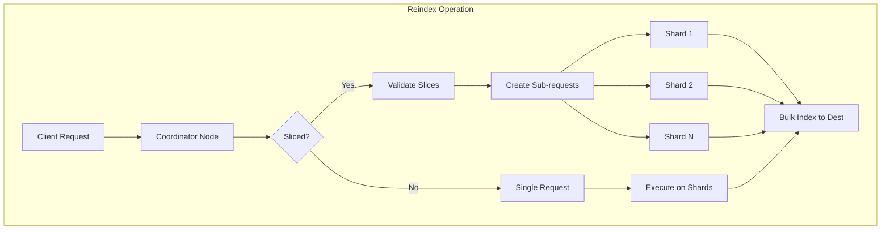
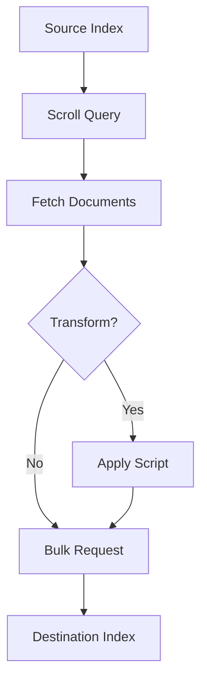

# Reindex API

## Summary

The Reindex API allows copying documents from one index to another, with support for transformations, filtering, and parallel processing through slicing. It is essential for index migrations, data transformations, and reindexing after mapping changes.

## Details

### Architecture



### Data Flow



### Components

| Component | Description |
|-----------|-------------|
| `BulkByScrollParallelizationHelper` | Manages parallel execution of reindex operations using slices |
| `Reindexer` | Core reindex logic, handles local and remote reindex operations |
| `TransportReindexAction` | Transport action for handling reindex requests |
| `BulkByScrollTask` | Task that tracks progress of bulk-by-scroll operations |

### Configuration

| Setting | Description | Default |
|---------|-------------|---------|
| `index.max_slices_per_scroll` | Maximum number of slices allowed per scroll/reindex operation | 1024 |
| `reindex.remote.whitelist` | List of remote hosts allowed for remote reindex | Empty |

### Usage Example

```json
// Basic reindex
POST _reindex
{
  "source": {
    "index": "source_index"
  },
  "dest": {
    "index": "dest_index"
  }
}

// Reindex with slices for parallel processing
POST _reindex?slices=auto
{
  "source": {
    "index": "source_index"
  },
  "dest": {
    "index": "dest_index"
  }
}

// Reindex with query filter
POST _reindex
{
  "source": {
    "index": "source_index",
    "query": {
      "term": {
        "status": "active"
      }
    }
  },
  "dest": {
    "index": "dest_index"
  }
}

// Reindex with script transformation
POST _reindex
{
  "source": {
    "index": "source_index"
  },
  "dest": {
    "index": "dest_index"
  },
  "script": {
    "source": "ctx._source.timestamp = ctx._source.remove('date')"
  }
}
```

## Limitations

- Remote reindex requires explicit whitelist configuration
- Large reindex operations should use slices for better performance
- The `slices` parameter must not exceed `index.max_slices_per_scroll` (default: 1024)

## Change History

- **v3.3.0** (2026-01-11): Fixed slice validation to prevent JVM OOM on coordinator when using excessively large slice values

## References

### Documentation
- [Reindex API Documentation](https://docs.opensearch.org/3.0/api-reference/document-apis/reindex/): Official API documentation
- [Reindex Data Guide](https://docs.opensearch.org/3.0/im-plugin/reindex-data/): Guide for reindexing data

### Pull Requests
| Version | PR | Description |
|---------|-----|-------------|
| v3.3.0 | [#18964](https://github.com/opensearch-project/OpenSearch/pull/18964) | Fix slice validation to prevent OOM on coordinator |

### Issues (Design / RFC)
- [Issue #18963](https://github.com/opensearch-project/OpenSearch/issues/18963): Bug report for OOM with large slice values
