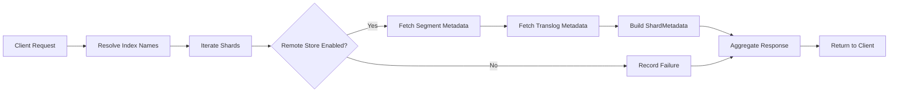

# Remote Store Metadata API

## Summary

The Remote Store Metadata API is a cluster-level API that enables users to retrieve detailed segment and translog metadata from remote-backed storage. This API provides visibility into the actual metadata files stored in remote repositories, including file checksums, sizes, replication checkpoints, and translog generation information. It complements the Remote Store Stats API by providing metadata content rather than performance metrics.

## Details

### Architecture

```mermaid
graph TB
    subgraph Client Layer
        REST[REST API Request]
    end
    
    subgraph Transport Layer
        REST --> RestHandler[RestRemoteStoreMetadataAction]
        RestHandler --> TransportAction[TransportRemoteStoreMetadataAction]
    end
    
    subgraph Data Access Layer
        TransportAction --> IndexResolver[IndexNameExpressionResolver]
        TransportAction --> SegmentDir[RemoteSegmentStoreDirectory]
        TransportAction --> TranslogMgr[TranslogTransferManager]
    end
    
    subgraph Remote Storage
        SegmentDir --> SegmentRepo[(Segment Repository)]
        TranslogMgr --> TranslogRepo[(Translog Repository)]
    end
    
    subgraph Response
        SegmentRepo --> ShardMeta[RemoteStoreShardMetadata]
        TranslogRepo --> ShardMeta
        ShardMeta --> Response[RemoteStoreMetadataResponse]
    end
```

### Data Flow



### Components

| Component | Description |
|-----------|-------------|
| `RemoteStoreMetadataAction` | Action type for the metadata API, registered as `cluster:admin/remote_store/metadata` |
| `RemoteStoreMetadataRequest` | Broadcast request supporting index patterns and optional shard filtering |
| `RemoteStoreMetadataResponse` | Aggregated response with per-shard metadata and failure information |
| `RemoteStoreShardMetadata` | Per-shard metadata container with segment and translog file details |
| `RemoteStoreMetadataRequestBuilder` | Fluent builder for client-side request construction |
| `RestRemoteStoreMetadataAction` | REST handler exposing the API endpoints |
| `TransportRemoteStoreMetadataAction` | Transport action that orchestrates metadata collection |

### API Endpoints

| Method | Endpoint | Description |
|--------|----------|-------------|
| GET | `/_remotestore/metadata/{index}` | Fetch metadata for all shards of specified index(es) |
| GET | `/_remotestore/metadata/{index}/{shard_id}` | Fetch metadata for a specific shard |

### Request Parameters

| Parameter | Type | Description |
|-----------|------|-------------|
| `index` | String | Index name or pattern (supports wildcards) |
| `shard_id` | String | Optional shard ID to filter results |
| `timeout` | TimeValue | Request timeout |

### Response Structure

```json
{
  "_shards": {
    "total": 1,
    "successful": 1,
    "failed": 0
  },
  "indices": {
    "<index_name>": {
      "shards": {
        "<shard_id>": [
          {
            "index": "<index_name>",
            "shard": 0,
            "latest_segment_metadata_filename": "metadata__...",
            "latest_translog_metadata_filename": "metadata__...",
            "available_segment_metadata_files": {
              "<filename>": {
                "files": {
                  "<segment_file>": {
                    "original_name": "...",
                    "checksum": "...",
                    "length": 1024
                  }
                },
                "replication_checkpoint": {
                  "primary_term": 1,
                  "segments_gen": 3,
                  "segment_infos_version": 9,
                  "codec": "Lucene101",
                  "created_timestamp": 163477705159875
                }
              }
            },
            "available_translog_metadata_files": {
              "<filename>": {
                "primary_term": 1,
                "generation": 3,
                "min_translog_gen": 3,
                "generation_to_primary_term": {"3": "1"}
              }
            }
          }
        ]
      }
    }
  }
}
```

### Usage Example

```bash
# Fetch metadata for all shards of an index
GET /_remotestore/metadata/my-index?pretty

# Fetch metadata for a specific shard
GET /_remotestore/metadata/my-index/0?pretty

# Fetch metadata for multiple indexes using wildcard
GET /_remotestore/metadata/logs-*?pretty
```

### Client API

```java
// Using the client API
RemoteStoreMetadataResponse response = client.admin()
    .cluster()
    .prepareRemoteStoreMetadata("my-index", "0")
    .setTimeout(TimeValue.timeValueSeconds(30))
    .get();

// Process response
response.groupByIndexAndShards().forEach((index, shardMap) -> {
    shardMap.forEach((shardId, metadataList) -> {
        for (RemoteStoreShardMetadata metadata : metadataList) {
            System.out.println("Segment files: " + metadata.getSegmentMetadataFiles());
            System.out.println("Translog files: " + metadata.getTranslogMetadataFiles());
        }
    });
});
```

### Permissions

When the Security plugin is enabled, users need the following permission:
- `cluster:admin/remotestore/metadata`

## Limitations

- Only works with indexes that have remote store enabled (`index.remote_store.enabled: true`)
- Returns up to 5 most recent metadata files per shard (configurable in implementation)
- Marked as `@ExperimentalApi` - the API surface may change in future releases
- Does not provide real-time metrics (use Remote Store Stats API for performance monitoring)

## Related PRs

| Version | PR | Description |
|---------|-----|-------------|
| v3.2.0 | [#18257](https://github.com/opensearch-project/OpenSearch/pull/18257) | Initial implementation of Remote Store Metadata API |

## References

- [Remote-backed storage documentation](https://docs.opensearch.org/3.0/tuning-your-cluster/availability-and-recovery/remote-store/index/)
- [Remote Store Stats API](https://docs.opensearch.org/3.0/tuning-your-cluster/availability-and-recovery/remote-store/remote-store-stats-api/)
- [Segment replication](https://docs.opensearch.org/3.0/tuning-your-cluster/availability-and-recovery/segment-replication/index/)

## Change History

- **v3.2.0**: Initial implementation - Added cluster-level API to fetch segment and translog metadata from remote store
