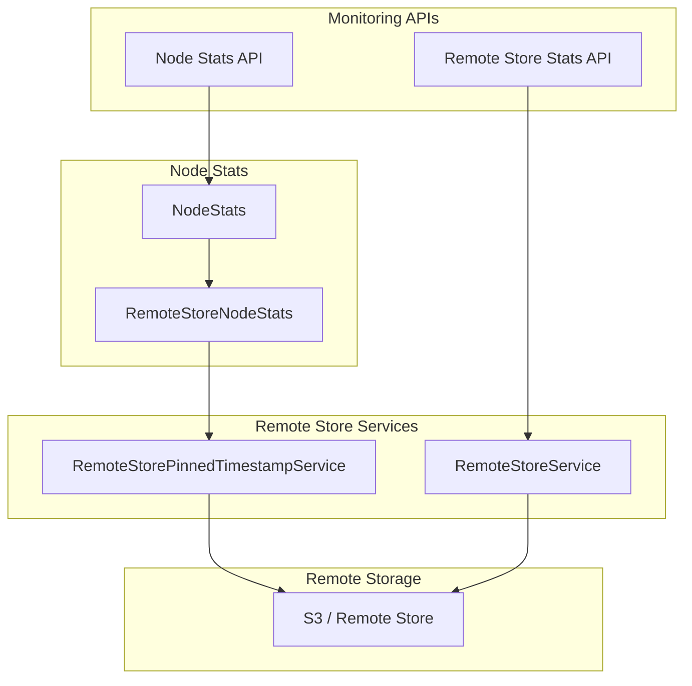
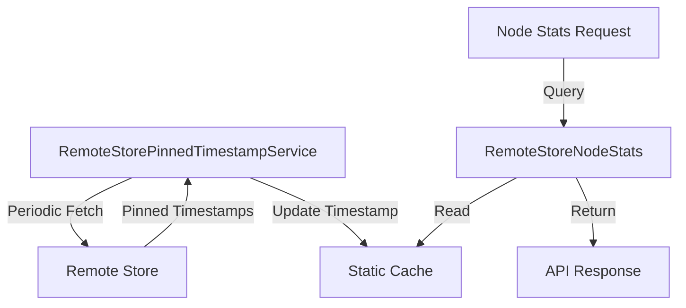

---
tags:
  - indexing
  - observability
  - performance
  - search
---

# Remote Store Metrics

## Summary

Remote Store Metrics provides node-level statistics for remote-backed storage operations in OpenSearch. This feature exposes metrics through the Node Stats API, enabling operators to monitor the health and performance of remote store operations, including pinned timestamp synchronization. These metrics complement the existing shard-level Remote Store Stats API by providing cluster-wide visibility into remote store operations.

## Details

### Architecture



### Data Flow



### Components

| Component | Description |
|-----------|-------------|
| `RemoteStoreNodeStats` | Holds node-level remote store statistics, implements `Writeable` and `ToXContentFragment` |
| `RemoteStorePinnedTimestampService` | Service that periodically fetches pinned timestamps from remote store |
| `NodesStatsRequest.Metric.REMOTE_STORE` | Metric enum for requesting remote store statistics |

### Configuration

| Setting | Description | Default |
|---------|-------------|---------|
| `cluster.remote_store.pinned_timestamps.enabled` | Enable pinned timestamps feature | `false` |
| `cluster.remote_store.pinned_timestamps.scheduler_interval` | Interval for fetching pinned timestamps | `3m` |

### Usage Example

Query remote store metrics:

```bash
# Get remote store metrics for all nodes
GET _nodes/stats/remote_store

# Get remote store metrics for specific node
GET _nodes/<node_id>/stats/remote_store

# Combine with other metrics
GET _nodes/stats/remote_store,indices,jvm
```

Example response:

```json
{
  "_nodes": {
    "total": 3,
    "successful": 3,
    "failed": 0
  },
  "cluster_name": "my-cluster",
  "nodes": {
    "node-1": {
      "name": "data-node-1",
      "remote_store": {
        "last_successful_fetch_of_pinned_timestamps": 1694171633644
      }
    }
  }
}
```

## Limitations

- Currently limited to pinned timestamp fetch metrics
- Only meaningful for clusters with remote-backed storage enabled
- Requires `cluster.remote_store.pinned_timestamps.enabled` to be `true` for meaningful data
- Does not include shard-level metrics (use Remote Store Stats API for shard-level data)

## Change History

- **v2.18.0** (2024-11-05): Initial implementation - added `last_successful_fetch_of_pinned_timestamps` metric to Node Stats API

## References

### Documentation
- [Remote Store Stats API](https://docs.opensearch.org/2.18/tuning-your-cluster/availability-and-recovery/remote-store/remote-store-stats-api/): Shard-level remote store statistics
- [Remote-backed Storage](https://docs.opensearch.org/2.18/tuning-your-cluster/availability-and-recovery/remote-store/index/): Remote store documentation
- [Nodes Stats API](https://docs.opensearch.org/2.18/api-reference/nodes-apis/nodes-stats/): Node statistics API

### Pull Requests
| Version | PR | Description | Related Issue |
|---------|-----|-------------|---------------|
| v2.18.0 | [#15611](https://github.com/opensearch-project/OpenSearch/pull/15611) | Add new metric REMOTE_STORE to NodeStats API response | [#15896](https://github.com/opensearch-project/OpenSearch/issues/15896) |

### Issues (Design / RFC)
- [Issue #15896](https://github.com/opensearch-project/OpenSearch/issues/15896): Original feature request
