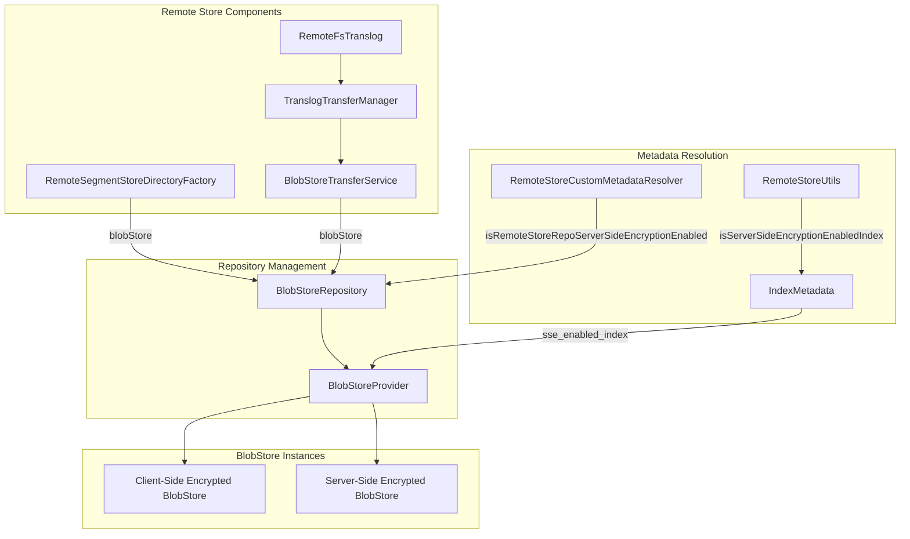
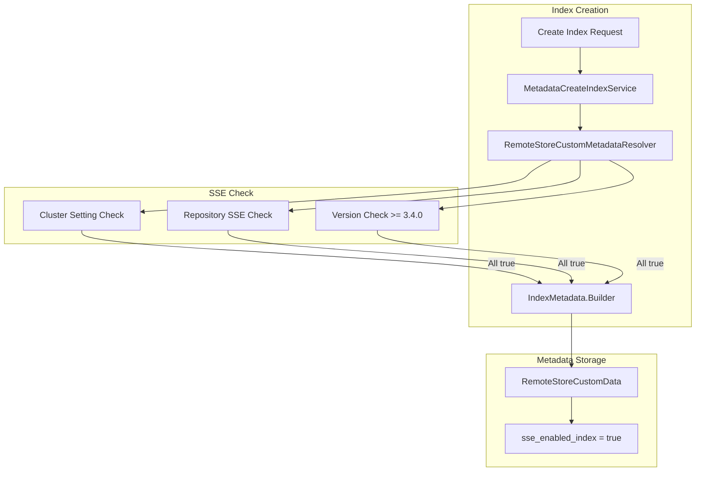

# Repository Encryption

## Summary

Repository Encryption enables OpenSearch remote store repositories to support both server-side encryption (SSE) and client-side encryption simultaneously. This feature allows data stored in remote repositories (such as S3) to be encrypted at rest using server-side encryption while maintaining compatibility with existing client-side encryption mechanisms.

The feature introduces a `BlobStoreProvider` abstraction that manages multiple `BlobStore` instances, enabling repositories to serve both encrypted and non-encrypted operations based on index-level configuration.

## Details

### Architecture



### Data Flow



### Components

| Component | Description |
|-----------|-------------|
| `BlobStoreProvider` | Manages creation and lifecycle of client-side and server-side encrypted `BlobStore` instances |
| `BlobStoreRepository.blobStore(boolean serverSideEncryptionEnabled)` | Returns appropriate `BlobStore` based on SSE flag |
| `RemoteStoreCustomMetadataResolver` | Resolves remote store custom metadata including SSE settings |
| `RemoteStoreUtils.isServerSideEncryptionEnabledIndex()` | Utility to check if an index has SSE enabled |
| `S3Repository.isSeverSideEncryptionEnabled()` | S3-specific implementation that returns `true` (S3 always supports SSE) |

### Configuration

| Setting | Description | Default | Scope |
|---------|-------------|---------|-------|
| `cluster.remote_store.server_side_encryption` | Enables server-side encryption for remote store repositories | `true` | Cluster (Dynamic) |

### Index Metadata

The SSE status is stored in index custom metadata under the `remote_store` key:

```json
{
  "custom": {
    "remote_store": {
      "sse_enabled_index": "true"
    }
  }
}
```

### Usage Example

Server-side encryption is automatically enabled for new indexes when all conditions are met:

```yaml
# opensearch.yml - No special configuration needed
# SSE is enabled by default when using S3 repositories

# To disable SSE at cluster level (not recommended):
cluster.remote_store.server_side_encryption: false
```

When creating an S3 repository for remote store:

```bash
PUT _snapshot/my-s3-repo
{
  "type": "s3",
  "settings": {
    "bucket": "my-bucket",
    "server_side_encryption": true
  }
}
```

## Limitations

- Server-side encryption support is currently implemented only for S3 repositories
- Requires all nodes in the cluster to be on v3.4.0 or later for SSE-enabled indexes
- The `BlobStoreProvider` maintains separate `BlobStore` instances, which may increase memory usage
- SSE setting is determined at index creation time and cannot be changed afterward
- Snapshot restore preserves the original SSE setting from the source index

## Change History

- **v3.4.0** (2025-10-28): Initial implementation with `BlobStoreProvider` and SSE support for S3 repositories

## References

### Documentation
- [Remote-backed storage](https://docs.opensearch.org/3.0/tuning-your-cluster/availability-and-recovery/remote-store/index/): Official documentation
- [S3 Server-side encryption](https://docs.aws.amazon.com/AmazonS3/latest/dev/serv-side-encryption.html): AWS S3 SSE documentation
- [Register Snapshot Repository](https://docs.opensearch.org/3.0/api-reference/snapshots/create-repository/): Repository configuration options

### Pull Requests
| Version | PR | Description |
|---------|-----|-------------|
| v3.4.0 | [#19630](https://github.com/opensearch-project/OpenSearch/pull/19630) | Add support for repository with Server side encryption enabled and client side encryption |

### Issues (Design / RFC)
- [Issue #19235](https://github.com/opensearch-project/OpenSearch/issues/19235): Original feature request
