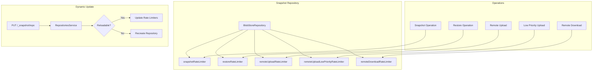
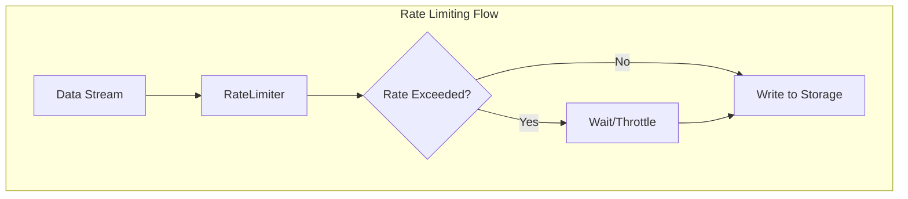

---
tags:
  - indexing
---

# Repository Rate Limiters

## Summary

Repository rate limiters control the throughput of snapshot and restore operations in OpenSearch. These settings allow operators to limit I/O bandwidth consumption during backup and recovery operations, preventing snapshot operations from overwhelming cluster resources. Starting from v3.2.0, these rate limiter settings can be dynamically adjusted without recreating the repository.

## Details

### Architecture



### Data Flow



### Components

| Component | Description |
|-----------|-------------|
| `BlobStoreRepository` | Base repository class managing rate limiters |
| `RateLimiter.SimpleRateLimiter` | Lucene rate limiter implementation |
| `RELOADABLE_SETTINGS` | Set of dynamically updatable setting keys |
| `isReloadableSettings()` | Method to check if settings can be hot-reloaded |
| `RepositoriesService` | Service handling repository registration and updates |

### Configuration

| Setting | Description | Default |
|---------|-------------|---------|
| `max_snapshot_bytes_per_sec` | Maximum rate for snapshot creation | `40mb` |
| `max_restore_bytes_per_sec` | Maximum rate for snapshot restore | `0` (unlimited) |
| `max_remote_upload_bytes_per_sec` | Maximum rate for remote store uploads | `0` (unlimited) |
| `max_remote_low_priority_upload_bytes_per_sec` | Maximum rate for low-priority remote uploads | `0` (unlimited) |
| `max_remote_download_bytes_per_sec` | Maximum rate for remote store downloads | `0` (unlimited) |

### Usage Example

```json
// Create repository with rate limits
PUT /_snapshot/my-repository
{
  "type": "fs",
  "settings": {
    "location": "/mnt/snapshots",
    "max_snapshot_bytes_per_sec": "100mb",
    "max_restore_bytes_per_sec": "200mb"
  }
}

// Dynamically update rate limits (v3.2.0+)
PUT /_snapshot/my-repository
{
  "type": "fs",
  "settings": {
    "max_snapshot_bytes_per_sec": "50mb",
    "max_restore_bytes_per_sec": "100mb"
  }
}
```

For S3 repositories:

```json
PUT /_snapshot/s3-repository
{
  "type": "s3",
  "settings": {
    "bucket": "my-bucket",
    "base_path": "snapshots",
    "max_snapshot_bytes_per_sec": "40mb",
    "max_restore_bytes_per_sec": "40mb"
  }
}
```

## Limitations

- Rate limiting applies per-node, not cluster-wide
- Setting value to `0` disables rate limiting (unlimited throughput)
- Only the five rate limiter settings are dynamically reloadable; other repository settings require recreation
- Rate changes affect ongoing operations immediately

## Change History

- **v3.2.0** (2025-07-01): Made rate limiter settings dynamically reloadable without repository recreation

## Related Features
- [OpenSearch Dashboards](../opensearch-dashboards/ai-chat.md)

## References

### Documentation
- [Register Snapshot Repository API](https://docs.opensearch.org/3.0/api-reference/snapshots/create-repository/): Official documentation
- [Take and Restore Snapshots](https://docs.opensearch.org/3.0/tuning-your-cluster/availability-and-recovery/snapshots/snapshot-restore/): Snapshot operations guide

### Pull Requests
| Version | PR | Description | Related Issue |
|---------|-----|-------------|---------------|
| v3.2.0 | [#18069](https://github.com/opensearch-project/OpenSearch/pull/18069) | Making multi rate limiters in repository dynamic | [#17488](https://github.com/opensearch-project/OpenSearch/issues/17488) |

### Issues (Design / RFC)
- [Issue #17488](https://github.com/opensearch-project/OpenSearch/issues/17488): Feature request for dynamic snapshot rate settings
