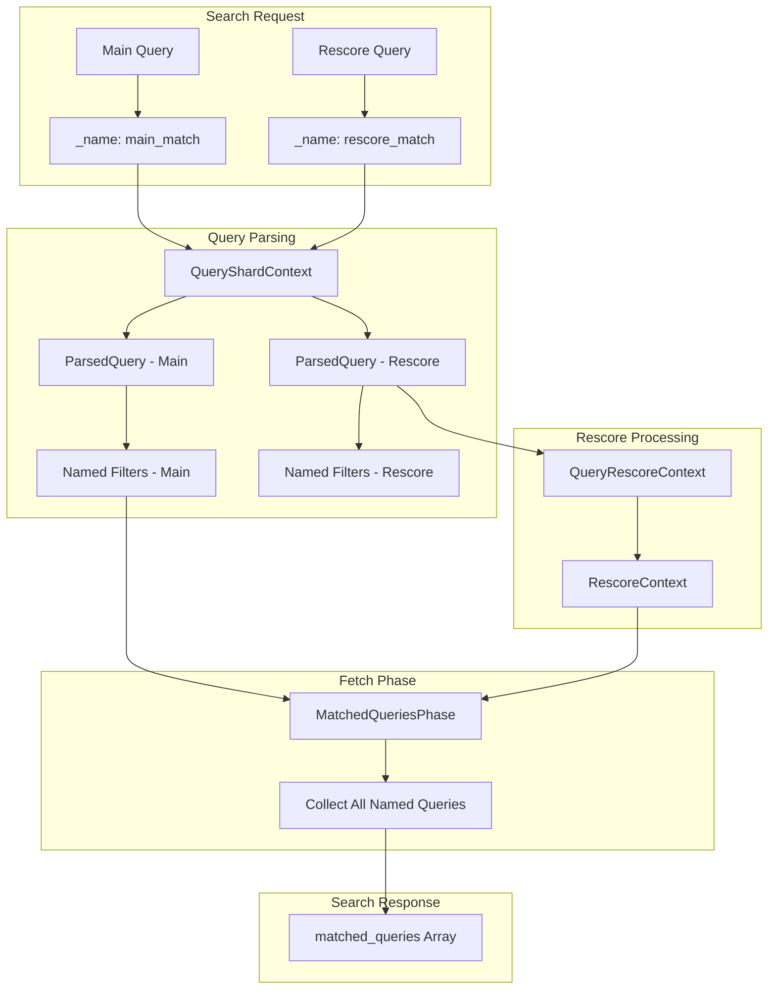
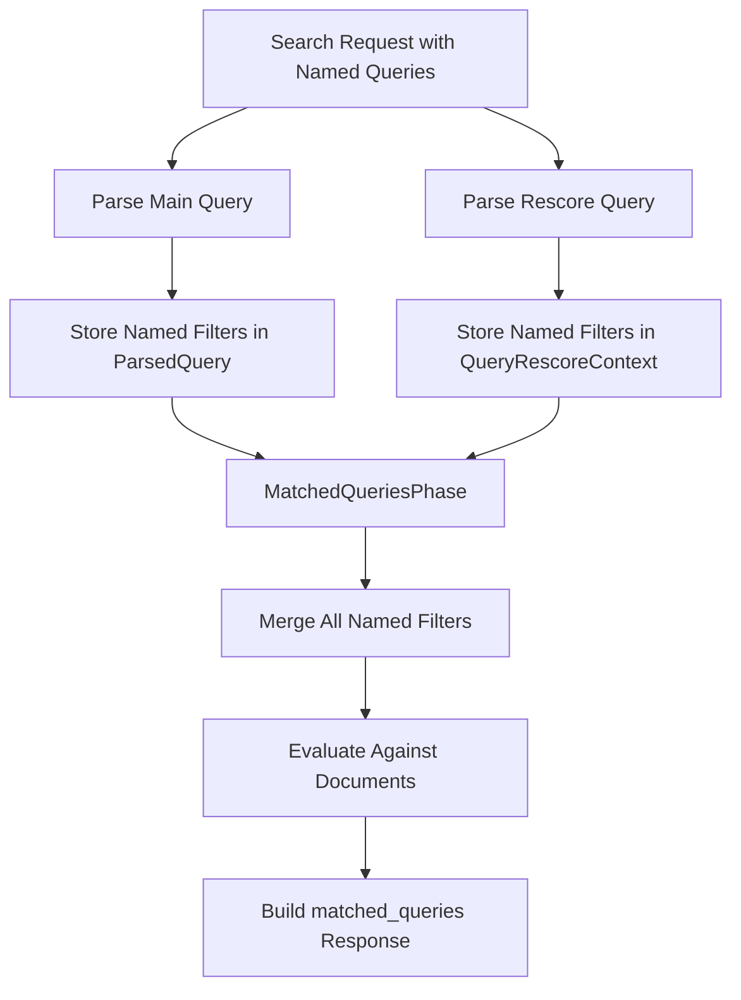

# Rescore Named Queries

## Summary

Rescore Named Queries enables named query clauses defined within rescore queries to be surfaced in the `matched_queries` array of search hits. This feature allows users to identify which specific rescore query clauses matched a document and contributed to its final ranking score, providing better observability for debugging, logging, and building ML models that rely on signal-level match information.

## Details

### Architecture



### Data Flow



### Components

| Component | Description |
|-----------|-------------|
| `ParsedQuery` | Holds the Lucene query and associated named filters map |
| `RescoreContext` | Base class for rescore contexts, provides `getParsedQueries()` method |
| `QueryRescoreContext` | Stores `ParsedQuery` instead of raw `Query` to preserve named query metadata |
| `QueryRescorerBuilder` | Builds rescore context using `context.toQuery()` to capture named filters |
| `MatchedQueriesPhase` | Fetch sub-phase that collects and evaluates all named queries including from rescore |
| `DfsPhase` | Distributed frequency search phase, updated to work with `ParsedQuery` |

### Configuration

This feature requires no additional configuration. Named queries in rescore work automatically when:

| Setting | Description | Default |
|---------|-------------|---------|
| `_name` | Query parameter to name a query clause | None |
| `include_named_queries_score` | Search parameter to include scores in matched_queries | `false` |

### Usage Example

#### Basic Named Query in Rescore

```json
GET /my_index/_search
{
  "query": {
    "match": {
      "title": {
        "query": "search engine",
        "_name": "title_match"
      }
    }
  },
  "rescore": {
    "window_size": 100,
    "query": {
      "rescore_query": {
        "match_phrase": {
          "content": {
            "query": "distributed search",
            "_name": "content_phrase"
          }
        }
      },
      "query_weight": 0.7,
      "rescore_query_weight": 1.2
    }
  }
}
```

#### Response

```json
{
  "hits": {
    "hits": [
      {
        "_index": "my_index",
        "_id": "1",
        "_score": 5.234,
        "matched_queries": ["title_match", "content_phrase"]
      }
    ]
  }
}
```

#### With Scores

```json
GET /my_index/_search?include_named_queries_score=true
{
  "query": {
    "match": {
      "title": {
        "query": "search",
        "_name": "main_query"
      }
    }
  },
  "rescore": {
    "window_size": 50,
    "query": {
      "rescore_query": {
        "match": {
          "content": {
            "query": "relevance",
            "_name": "rescore_query"
          }
        }
      }
    }
  }
}
```

#### Response with Scores

```json
{
  "hits": {
    "hits": [
      {
        "_id": "1",
        "matched_queries": {
          "main_query": 2.345,
          "rescore_query": 1.567
        }
      }
    ]
  }
}
```

## Limitations

- Only supported in OpenSearch 3.2.0 and above
- Custom rescorer implementations must override `getParsedQueries()` to support named queries
- Named queries are evaluated per-document during the fetch phase, which may have performance implications for very large result sets

## Related PRs

| Version | PR | Description |
|---------|-----|-------------|
| v3.2.0 | [#18697](https://github.com/opensearch-project/OpenSearch/pull/18697) | Include named queries from rescore contexts in matched_queries array |

## References

- [Issue #18665](https://github.com/opensearch-project/OpenSearch/issues/18665): Original feature request
- [Highlight query matches](https://docs.opensearch.org/3.2/search-plugins/searching-data/highlight/): Documentation on rescore and highlighting

## Change History

- **v3.2.0** (2025-07-09): Initial implementation - named queries from rescore contexts now appear in matched_queries array
