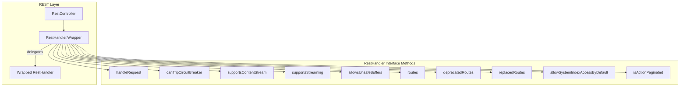

# RestHandler.Wrapper

## Summary

The `RestHandler.Wrapper` class is an internal utility in OpenSearch that wraps REST handlers to add cross-cutting functionality. It implements the decorator pattern, delegating all `RestHandler` interface methods to an underlying handler. This enables features like authentication, authorization, and request modification to be applied transparently to any REST endpoint.

## Details

### Architecture



### Components

| Component | Description |
|-----------|-------------|
| `RestHandler` | Interface defining REST endpoint behavior |
| `RestHandler.Wrapper` | Decorator class that delegates all methods to wrapped handler |
| `RestController` | Routes incoming requests to appropriate handlers |

### Key Methods

| Method | Description |
|--------|-------------|
| `handleRequest()` | Processes the REST request |
| `canTripCircuitBreaker()` | Whether request can trigger circuit breaker |
| `supportsContentStream()` | Whether handler supports streaming content |
| `supportsStreaming()` | Whether handler supports request/response streaming |
| `allowsUnsafeBuffers()` | Whether handler can work with pooled buffers |
| `routes()` | List of routes handled |
| `deprecatedRoutes()` | List of deprecated routes |
| `replacedRoutes()` | List of routes with changed paths/methods |
| `allowSystemIndexAccessByDefault()` | Whether system index access is allowed |
| `isActionPaginated()` | Whether handler supports paginated responses |

### Usage Example

```java
// Creating a wrapper around an existing handler
RestHandler originalHandler = new MyRestHandler();
RestHandler wrappedHandler = RestHandler.wrapper(originalHandler);

// Or using the Wrapper class directly
RestHandler.Wrapper wrapper = new RestHandler.Wrapper(originalHandler);

// All method calls are delegated to the original handler
wrapper.handleRequest(request, channel, client);
boolean paginated = wrapper.isActionPaginated();
boolean streaming = wrapper.supportsStreaming();
```

### Implementation Details

The `Wrapper` class is marked as `@opensearch.internal` and implements all `RestHandler` interface methods by delegating to the wrapped handler:

```java
class Wrapper implements RestHandler {
    private final RestHandler delegate;

    public Wrapper(RestHandler delegate) {
        this.delegate = Objects.requireNonNull(delegate, 
            "RestHandler delegate can not be null");
    }

    @Override
    public void handleRequest(RestRequest request, RestChannel channel, 
                              NodeClient client) throws Exception {
        delegate.handleRequest(request, channel, client);
    }
    
    // All other methods delegate similarly...
}
```

## Limitations

- Internal API: Not intended for direct use by plugins
- Must be kept in sync with `RestHandler` interface changes
- Reflection-based test ensures completeness but adds test complexity

## Change History

- **v2.18.0** (2024-11-12): Added missing delegation for `isActionPaginated()` and `supportsStreaming()` methods, added reflection-based test to prevent future regressions

## References

### Documentation
- [RestHandler.java](https://github.com/opensearch-project/OpenSearch/blob/main/server/src/main/java/org/opensearch/rest/RestHandler.java): Source code
- [BaseRestHandlerTests.java](https://github.com/opensearch-project/OpenSearch/blob/main/server/src/test/java/org/opensearch/rest/BaseRestHandlerTests.java): Test coverage

### Pull Requests
| Version | PR | Description | Related Issue |
|---------|-----|-------------|---------------|
| v2.18.0 | [#16154](https://github.com/opensearch-project/OpenSearch/pull/16154) | Ensure Wrapper delegates all implementations |   |
| v2.17.0 | [#14718](https://github.com/opensearch-project/OpenSearch/pull/14718) | Added `isActionPaginated()` method (caused delegation gap) | [#14258](https://github.com/opensearch-project/OpenSearch/issues/14258) |
| v1.0.0 | [#1004](https://github.com/opensearch-project/OpenSearch/pull/1004) | Original introduction of RestHandler.Wrapper |   |
