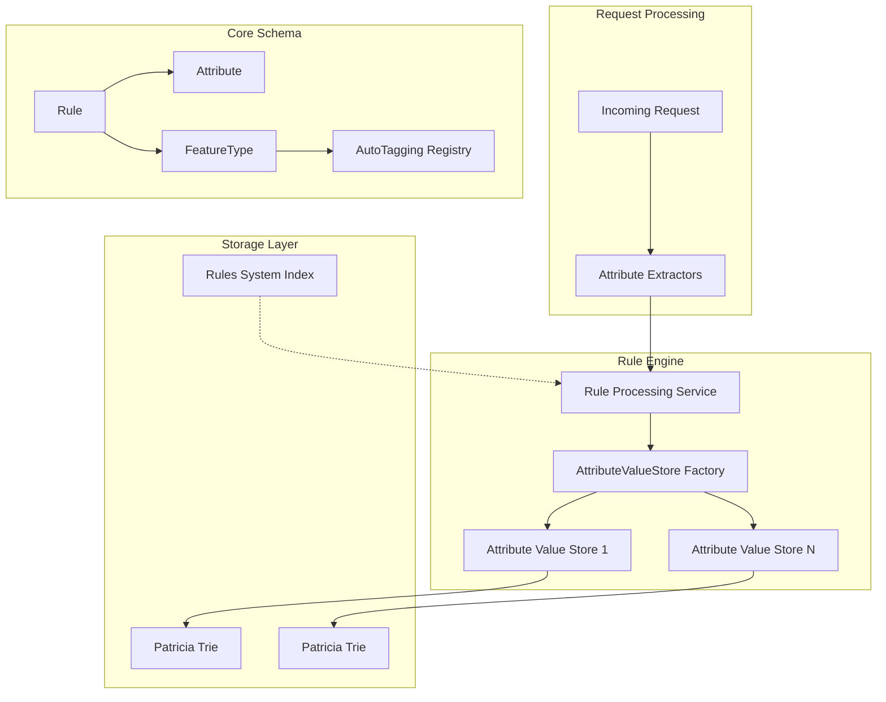
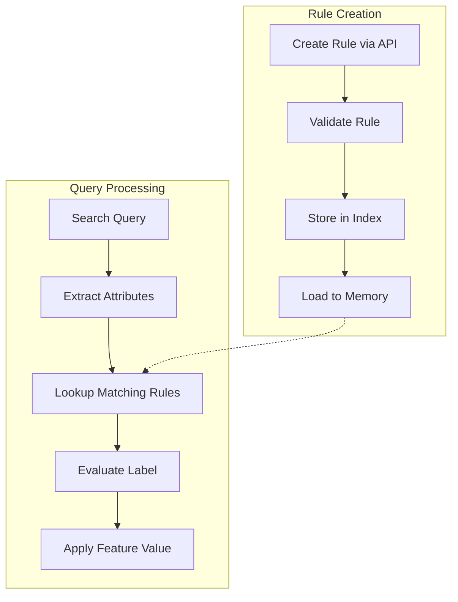

# Rule-Based Auto-Tagging

## Summary

Rule-Based Auto-Tagging is an OpenSearch feature that automatically assigns feature values to incoming queries based on configurable rules. It enables automatic query categorization by matching request attributes (such as index patterns) against predefined rules, eliminating the need for manual query tagging.

The primary use case is integration with Workload Management, where rules can automatically route queries to specific workload groups based on the indexes they target.

## Details

### Architecture



### Data Flow



### Components

| Component | Package | Description |
|-----------|---------|-------------|
| `Rule` | `org.opensearch.autotagging` | Core rule object with description, attributes, feature type, and feature value |
| `Attribute` | `org.opensearch.autotagging` | Interface for rule attributes with name and validation |
| `FeatureType` | `org.opensearch.autotagging` | Interface defining feature categories and their allowed attributes |
| `AutoTaggingRegistry` | `org.opensearch.autotagging` | Singleton registry for feature type management |
| `RuleValidator` | `org.opensearch.autotagging` | Validates rule constraints and attribute values |
| `AttributeValueStore` | `org.opensearch.rule.storage` | Interface for attribute value storage and retrieval |
| `DefaultAttributeValueStore` | `org.opensearch.rule.storage` | Patricia Trie-based implementation with thread-safe operations |
| `AttributeValueStoreFactory` | `org.opensearch.rule.storage` | Factory for creating per-attribute stores |
| `InMemoryRuleProcessingService` | `org.opensearch.rule` | Service for rule management and label evaluation |
| `AttributeExtractor` | `org.opensearch.rule.attribute_extractor` | Interface for extracting attributes from requests |

### Configuration

| Setting | Description | Default |
|---------|-------------|---------|
| `MAX_DESCRIPTION_LENGTH` | Maximum characters for rule description | 256 |
| `MAX_FEATURE_TYPE_NAME_LENGTH` | Maximum characters for feature type name | 30 |
| `DEFAULT_MAX_ATTRIBUTE_VALUES` | Maximum number of values per attribute | 10 |
| `DEFAULT_MAX_ATTRIBUTE_VALUE_LENGTH` | Maximum characters per attribute value | 100 |

### Rule Schema

A rule consists of:

```json
{
  "_id": "auto-generated-id",
  "description": "Human-readable description",
  "<attribute_key>": ["value1", "value2"],
  "<feature_type>": "feature_value",
  "updated_at": "ISO-8601 timestamp"
}
```

Example for workload management:

```json
{
  "_id": "wi6VApYBoX5wstmtU_8l",
  "description": "Route analytics queries",
  "index_pattern": ["logs-*", "metrics-*"],
  "workload_group": "analytics-group-id",
  "updated_at": "2025-04-04T20:54:22.406Z"
}
```

### API Reference

#### Create Rule

```
PUT /_rules/{feature_type}
POST /_rules/{feature_type}
```

#### Update Rule

```
PUT /_rules/{feature_type}/{_id}
POST /_rules/{feature_type}/{_id}
```

#### Get Rules

```
GET /_rules/{feature_type}/{_id}
GET /_rules/{feature_type}
GET /_rules/{feature_type}?<attribute_key>=value1,value2
GET /_rules/{feature_type}?search_after=<token>
```

#### Delete Rule

```
DELETE /_rules/{feature_type}/{_id}
```

### Usage Example

```json
// Create a rule
PUT _rules/workload_group
{
  "description": "Route log queries to dedicated workload group",
  "index_pattern": ["log*", "event*"],
  "workload_group": "EITBzjFkQ6CA-semNWGtRQ"
}

// Update a rule
PUT _rules/workload_group/wi6VApYBoX5wstmtU_8l
{
  "description": "Updated description",
  "index_pattern": ["log*"]
}

// Get all rules for workload_group
GET _rules/workload_group

// Filter rules by attribute
GET _rules/workload_group?index_pattern=log*

// Delete a rule
DELETE _rules/workload_group/wi6VApYBoX5wstmtU_8l
```

### Implementation Details

#### Patricia Trie Storage

The `DefaultAttributeValueStore` uses Apache Commons Collections' Patricia Trie for efficient prefix-based lookups:

- O(k) lookup time where k is key length
- Memory-efficient storage for string keys with common prefixes
- Thread-safe with `ReentrantReadWriteLock`
- Supports longest prefix matching for wildcard patterns

#### Rule Evaluation Logic

When evaluating a request:

1. Extract attribute values from the request using `AttributeExtractor` implementations
2. For each attribute, lookup matching rules in the corresponding `AttributeValueStore`
3. If all attributes match the same feature value, return that value
4. If no match or conflicting matches, return empty (use default behavior)

## Limitations

- Rules are evaluated in memory; large rule sets may impact memory usage
- Prefix matching only (no suffix or regex patterns)
- Single feature value per rule (cannot assign multiple workload groups)
- All attribute conditions must match (AND logic, no OR support)
- Feature types must be registered at startup

## Change History

- **v3.0.0** (2025-03-11): Initial implementation with rule schema, Patricia Trie-based storage, and rule processing service

## References

### Documentation
- [Rule Lifecycle API Documentation](https://docs.opensearch.org/3.0/tuning-your-cluster/availability-and-recovery/rule-based-autotagging/rule-lifecycle-api/)
- [Workload Management Overview](https://docs.opensearch.org/3.0/tuning-your-cluster/availability-and-recovery/workload-management/wlm-feature-overview/)

### Pull Requests
| Version | PR | Description | Related Issue |
|---------|-----|-------------|---------------|
| v3.0.0 | [#17238](https://github.com/opensearch-project/OpenSearch/pull/17238) | Add rule schema for auto tagging | [#16797](https://github.com/opensearch-project/OpenSearch/issues/16797) |
| v3.0.0 | [#17342](https://github.com/opensearch-project/OpenSearch/pull/17342) | Add in-memory attribute value store | [#16797](https://github.com/opensearch-project/OpenSearch/issues/16797) |
| v3.0.0 | [#17365](https://github.com/opensearch-project/OpenSearch/pull/17365) | Add in-memory rule processing service | [#16797](https://github.com/opensearch-project/OpenSearch/issues/16797) |

### Issues (Design / RFC)
- [Issue #16797](https://github.com/opensearch-project/OpenSearch/issues/16797): RFC - Automated labeling of search requests
