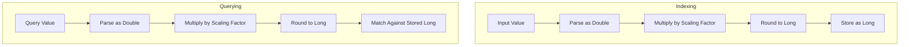

# Scaled Float Field

## Summary

The `scaled_float` field type stores floating-point values as long integers by multiplying them by a scaling factor. This provides disk space savings compared to native floating-point types while maintaining configurable precision. It's particularly useful for storing prices, percentages, and other decimal values where the precision requirements are known in advance.

## Details

### Architecture



### How It Works

1. **At Index Time**: The input value is multiplied by the `scaling_factor` and rounded to the nearest long integer
2. **At Query Time**: Query values undergo the same transformation before matching
3. **At Retrieval Time**: Stored values are divided by the scaling factor to return the original precision

### Configuration

| Setting | Description | Required |
|---------|-------------|----------|
| `type` | Must be `scaled_float` | Yes |
| `scaling_factor` | Multiplier for converting float to long | Yes |
| `boost` | Field-level relevance boost | No (default: 1.0) |
| `coerce` | Coerce strings to numbers | No (default: false) |
| `doc_values` | Enable doc values for sorting/aggregations | No (default: true) |
| `ignore_malformed` | Ignore malformed values | No (default: false) |
| `index` | Make field searchable | No (default: true) |
| `null_value` | Value to use for null inputs | No |
| `store` | Store field separately from _source | No (default: false) |

### Usage Example

```json
// Create index with scaled_float field
PUT products
{
  "mappings": {
    "properties": {
      "price": {
        "type": "scaled_float",
        "scaling_factor": 100
      }
    }
  }
}

// Index a document
PUT products/_doc/1
{
  "price": 19.99
}

// The value 19.99 is stored as 1999 (19.99 * 100)

// Range query
POST products/_search
{
  "query": {
    "range": {
      "price": {
        "gte": 10.00,
        "lte": 20.00
      }
    }
  }
}

// Term query
POST products/_search
{
  "query": {
    "term": {
      "price": 19.99
    }
  }
}
```

### Choosing a Scaling Factor

| Use Case | Recommended Factor | Precision |
|----------|-------------------|-----------|
| Currency (cents) | 100 | 2 decimal places |
| Percentages | 100 or 1000 | 2-3 decimal places |
| Scientific data | 1000000 | 6 decimal places |

Higher scaling factors provide more precision but require more storage space.

## Limitations

- **Floating-point precision**: Due to IEEE 754 floating-point representation, some values may have minor precision loss (e.g., `79.99 * 100` may compute as `7998.999...`)
- **Range**: Values must fit within a long integer after scaling (approximately ±9.2 × 10¹⁸)
- **No exact decimal arithmetic**: Unlike BigDecimal, scaled_float uses native floating-point multiplication

## Change History

- **v3.3.0**: Fixed precision issue where `match` queries failed for certain values due to inconsistent scaling between indexing and querying. The `scale()` method now uses direct multiplication for both operations.

## References

### Documentation
- [Numeric field types](https://docs.opensearch.org/3.0/field-types/supported-field-types/numeric/): Official documentation

### Pull Requests
| Version | PR | Description | Related Issue |
|---------|-----|-------------|---------------|
| v3.3.0 | [#19188](https://github.com/opensearch-project/OpenSearch/pull/19188) | Fix precision issue between indexing and querying | [#12433](https://github.com/opensearch-project/OpenSearch/issues/12433) |

### Issues (Design / RFC)
- [Issue #12433](https://github.com/opensearch-project/OpenSearch/issues/12433): Bug report for precision mismatch
