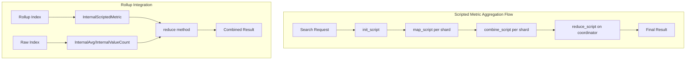

# Scripted Metric Aggregation

## Summary

Scripted metric aggregation is a multi-value metric aggregation that returns metrics calculated from user-defined scripts. It provides flexibility for custom aggregation logic through four script stages: init, map, combine, and reduce. In v3.2.0, support was added for using scripted metric aggregations when reducing `InternalValueCount` and `InternalAvg` aggregations, enabling seamless searches across rollup and raw indices. In v3.3.0, the `ScriptedAvg` class was added to the Painless SPI allowlist, enabling plugins to use this class directly in Painless scripts.

## Details

### Architecture



### Components

| Component | Description |
|-----------|-------------|
| `InternalScriptedMetric` | Internal representation of scripted metric aggregation results |
| `ScriptedAvg` | Helper class containing sum and count for average calculations |
| `InternalAvg` | Average aggregation with scripted metric support in reduce |
| `InternalValueCount` | Value count aggregation with scripted metric support in reduce |

### Painless SPI Allowlist (v3.3.0)

The `ScriptedAvg` class is available in Painless scripts with the following methods:

| Method | Description |
|--------|-------------|
| `ScriptedAvg(double sum, long count)` | Constructor to create a new ScriptedAvg instance |
| `double getSum()` | Returns the sum value |
| `long getCount()` | Returns the count value |

### Script Stages

| Stage | Description | Scope |
|-------|-------------|-------|
| `init_script` | Sets initial state before document collection | Once per shard |
| `map_script` | Processes each document and updates state | Per document |
| `combine_script` | Aggregates state from each shard | Per shard |
| `reduce_script` | Combines results from all shards | Coordinator node |

### Configuration

| Setting | Description | Default |
|---------|-------------|---------|
| `init_script` | Script to initialize state | Optional |
| `map_script` | Script to process documents | Required |
| `combine_script` | Script to combine shard results | Required |
| `reduce_script` | Script to reduce all results | Required |

### Usage Example

Basic scripted metric aggregation:

```json
GET my_index/_search
{
  "size": 0,
  "aggs": {
    "responses.counts": {
      "scripted_metric": {
        "init_script": "state.responses = ['error':0L,'success':0L,'other':0L]",
        "map_script": """
          def code = doc['response.keyword'].value;
          if (code.startsWith('5') || code.startsWith('4')) {
            state.responses.error += 1;
          } else if(code.startsWith('2')) {
            state.responses.success += 1;
          } else {
            state.responses.other += 1;
          }
        """,
        "combine_script": "state.responses",
        "reduce_script": """
          def counts = ['error': 0L, 'success': 0L, 'other': 0L];
          for (responses in states) {
            counts.error += responses['error'];
            counts.success += responses['success'];
            counts.other += responses['other'];
          }
          return counts;
        """
      }
    }
  }
}
```

Searching across rollup and raw indices (enabled in v3.2.0):

```json
GET rollup_index,raw_index/_search
{
  "size": 0,
  "aggs": {
    "avg_value": {
      "avg": {
        "field": "numeric_field"
      }
    }
  }
}
```

## Limitations

- Scripts must be written in Painless scripting language
- The `reduce_script` has access to a `states` variable containing combined results from all shards
- When using with rollup indices, the scripted metric result must match expected formats (`ScriptedAvg` for avg, numeric for value_count)
- Invalid scripted metric results throw `IllegalArgumentException` with descriptive error messages

## Change History

- **v3.3.0** (2025-08-19): Added `ScriptedAvg` class to Painless SPI allowlist, enabling plugins to use scripted averages in Painless scripts; registered `ScriptedAvg` in `Streamables.java` with byte marker 28 for cross-node streaming
- **v3.2.0** (2025-08-06): Added support for `InternalScriptedMetric` in `InternalValueCount` and `InternalAvg` reduce methods, enabling searches across rollup and raw indices

## References

### Documentation
- [Scripted Metric Aggregation Documentation](https://docs.opensearch.org/3.0/aggregations/metric/scripted-metric/): Official documentation
- [Index Rollups Documentation](https://docs.opensearch.org/3.0/im-plugin/index-rollups/index/): Rollup feature documentation
- [Index Management PR #1268](https://github.com/opensearch-project/index-management/pull/1268): Original rollup and raw indices search support

### Pull Requests
| Version | PR | Description | Related Issue |
|---------|-----|-------------|---------------|
| v3.3.0 | [#19006](https://github.com/opensearch-project/OpenSearch/pull/19006) | Adding ScriptedAvg class to painless spi to allowlist usage from plugins |   |
| v3.2.0 | [#18411](https://github.com/opensearch-project/OpenSearch/pull/18411) | Supporting Scripted Metric Aggregation when reducing aggregations in InternalValueCount and InternalAvg |   |
