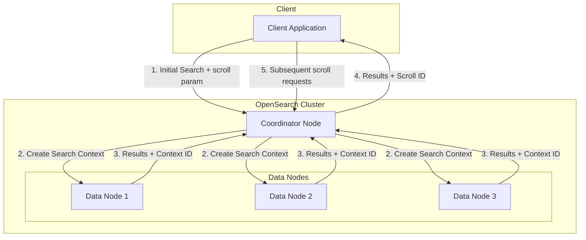
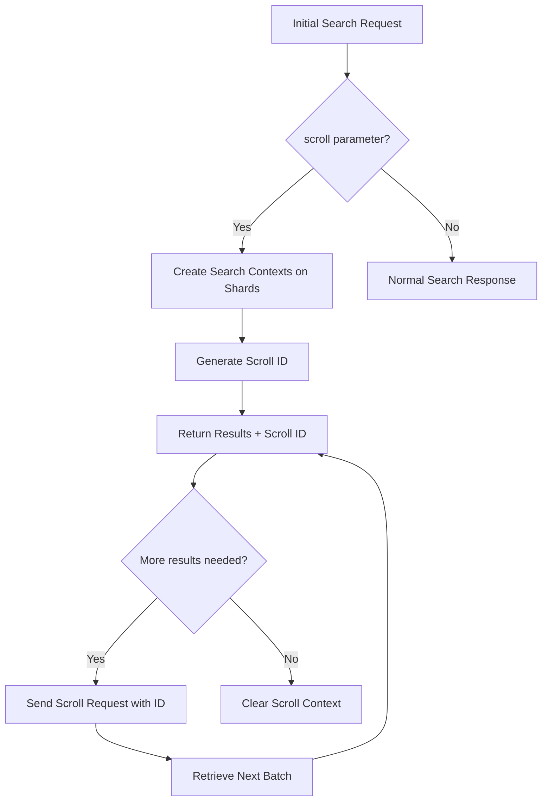

# Scroll API

## Summary

The Scroll API enables retrieval of large numbers of results from a search query by maintaining a search context across multiple requests. It is designed for processing large datasets in batches, such as for machine learning jobs or data export operations, rather than for real-time user queries.

## Details

### Architecture



### Data Flow



### Components

| Component | Description |
|-----------|-------------|
| `SearchScrollAsyncAction` | Handles asynchronous scroll search execution across nodes |
| `ParsedScrollId` | Parses and validates scroll IDs containing node and context references |
| `SearchContextIdForNode` | Stores search context ID and associated node information |
| `InternalScrollSearchRequest` | Internal representation of scroll search requests |
| `ScrollContext` | Maintains scroll state including cached `StoredFieldsReader` instances per segment |
| `FetchPhase` | Executes document fetch with sequential reader optimization for scroll queries |

### Scroll ID Structure

Scroll IDs are Base64-encoded payloads containing:
- Target node references
- Shard-local searcher context IDs
- Cluster alias (for cross-cluster searches)

### Configuration

| Setting | Description | Default |
|---------|-------------|---------|
| `scroll` | Duration to keep the search context alive | Required parameter |
| `size` | Number of results per batch | 10 |

### Usage Example

Initial search with scroll:

```json
GET /my-index/_search?scroll=10m
{
  "size": 1000,
  "query": {
    "match_all": {}
  }
}
```

Subsequent scroll requests:

```json
GET _search/scroll
{
  "scroll": "10m",
  "scroll_id": "DXF1ZXJ5QW5kRmV0Y2gBAAAAAAAAAAUWdmpUZDhnRFBUcWFtV21nMmFwUGJEQQ=="
}
```

Clear scroll context when done:

```bash
DELETE _search/scroll/DXF1ZXJ5QW5kRmV0Y2gBAAAAAAAAAAUWdmpUZDhnRFBUcWFtV21nMmFwUGJEQQ==
```

Clear all scroll contexts:

```bash
DELETE _search/scroll/_all
```

### Sliced Scroll

For parallel processing of large datasets:

```json
GET /my-index/_search?scroll=10m
{
  "slice": {
    "id": 0,
    "max": 5
  },
  "query": {
    "match_all": {}
  }
}
```

## Limitations

- Search contexts consume memory; avoid using scroll for frequent user queries
- Scroll results reflect a point-in-time snapshot; documents added after the initial search are not included
- Scroll IDs become invalid when referenced nodes leave the cluster
- For real-time pagination, consider using `search_after` with Point in Time (PIT) instead

## Related PRs

| Version | PR | Description |
|---------|-----|-------------|
| v3.4.0 | [#20112](https://github.com/opensearch-project/OpenSearch/pull/20112) | Cache `StoredFieldsReader` for scroll query optimization |
| v3.3.0 | [#19031](https://github.com/opensearch-project/OpenSearch/pull/19031) | Improved error handling for invalid scroll IDs |

## References

- [Scroll API Documentation](https://docs.opensearch.org/3.0/api-reference/search-apis/scroll/)
- [Point in Time API](https://docs.opensearch.org/3.0/search-plugins/searching-data/point-in-time/)
- [Paginate Results](https://docs.opensearch.org/3.0/search-plugins/searching-data/paginate/)
- [Issue #16262](https://github.com/opensearch-project/OpenSearch/issues/16262): Performance degradation with Scroll API in versions >= 2.6

## Change History

- **v3.4.0**: Added `StoredFieldsReader` caching per segment in `ScrollContext` to optimize sequential document access across scroll batches, addressing performance regression in versions >= 2.6.0
- **v3.3.0**: Improved error handling - scroll IDs referencing missing nodes now return HTTP 400 (Bad Request) with `IllegalArgumentException` instead of HTTP 500 (Internal Server Error) with `IllegalStateException`
