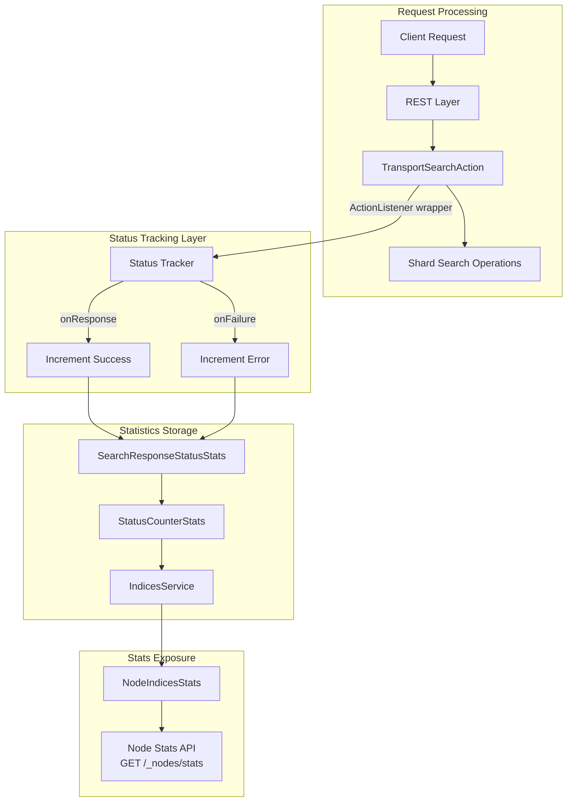
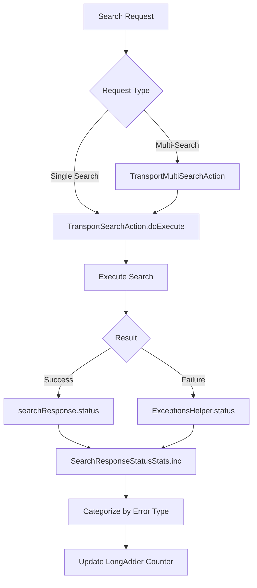

# Search API Tracker

## Summary

The Search API Tracker provides visibility into search request outcomes at the coordinator node level. It tracks HTTP response status codes for search operations, enabling operators to monitor partial failures in multi-search (`_msearch`) requests that would otherwise be hidden behind a successful HTTP 200 response.

This feature is particularly valuable for:
- Detecting hidden failures in `_msearch` operations
- Monitoring search API health across the cluster
- Identifying trends in user errors vs system failures
- Building alerting and dashboards based on search success rates

## Details

### Architecture



### Data Flow



### Components

| Component | Package | Description |
|-----------|---------|-------------|
| `StatusCounterStats` | `o.o.action.admin.indices.stats` | Container for doc and search response status stats |
| `SearchResponseStatusStats` | `o.o.action.admin.indices.stats` | Tracks search response status by HTTP family |
| `DocStatusStats` | `o.o.action.admin.indices.stats` | Tracks indexing document status by HTTP family |
| `RestStatus.getErrorType()` | `o.o.core.rest` | Maps HTTP status codes to error type categories |

### Configuration

No configuration is required. The feature is enabled by default and has minimal performance overhead due to the use of `LongAdder` for concurrent counter updates.

### Usage Example

#### Querying Search API Statistics

```bash
GET /_nodes/stats/indices
```

#### Response Structure

```json
{
  "_nodes": {
    "total": 3,
    "successful": 3,
    "failed": 0
  },
  "cluster_name": "my-cluster",
  "nodes": {
    "node-1": {
      "indices": {
        "status_counter": {
          "doc_status": {
            "success": 50000,
            "user_error": 150,
            "system_failure": 2
          },
          "search_response_status": {
            "success": 25000,
            "user_error": 500,
            "system_failure": 10
          }
        }
      }
    }
  }
}
```

#### Monitoring Use Cases

Calculate search error rate:
```
error_rate = (user_error + system_failure) / (success + user_error + system_failure)
```

Detect _msearch partial failures by comparing:
- HTTP-level 200 responses (from load balancer/proxy logs)
- `search_response_status.user_error` + `search_response_status.system_failure` counters

### Error Type Mapping

| Error Type | HTTP Status Family | Examples |
|------------|-------------------|----------|
| `success` | 1xx, 2xx, 3xx | 200 OK, 201 Created |
| `user_error` | 4xx | 400 Bad Request, 404 Not Found, 429 Too Many Requests |
| `system_failure` | 5xx | 500 Internal Server Error, 503 Service Unavailable |

### Implementation Details

The tracking is implemented by wrapping the `ActionListener` in `TransportSearchAction.doExecute()`:

```java
ActionListener<SearchResponse> searchStatusStatsUpdateListener = ActionListener.wrap(
    (searchResponse) -> {
        listener.onResponse(searchResponse);
        indicesService.getSearchResponseStatusStats().inc(searchResponse.status());
    },
    (e) -> {
        listener.onFailure(e);
        indicesService.getSearchResponseStatusStats().inc(ExceptionsHelper.status(e));
    }
);
```

## Limitations

- Statistics are node-local and cumulative since node startup
- No per-index or per-shard breakdown of search status
- Historical data is not persisted; counters reset on node restart
- Does not track internal search phases (query, fetch) separately

## Change History

- **v3.4.0**: Initial implementation with `StatusCounterStats`, `SearchResponseStatusStats`, and refactored `DocStatusStats`

## References

### Documentation
- [Node Stats API](https://docs.opensearch.org/3.0/api-reference/nodes-apis/nodes-stats/): Official documentation for the Node Stats API

### Pull Requests
| Version | PR | Description | Related Issue |
|---------|-----|-------------|---------------|
| v3.4.0 | [#18601](https://github.com/opensearch-project/OpenSearch/pull/18601) | Add search API tracker |   |

### Issues (Design / RFC)
- [Issue #18377](https://github.com/opensearch-project/OpenSearch/issues/18377): Feature request for tracking non-successful Search API calls across coordinator nodes
- [Issue #18438](https://github.com/opensearch-project/OpenSearch/issues/18438): Bug report requesting DocStatusStats refactoring
