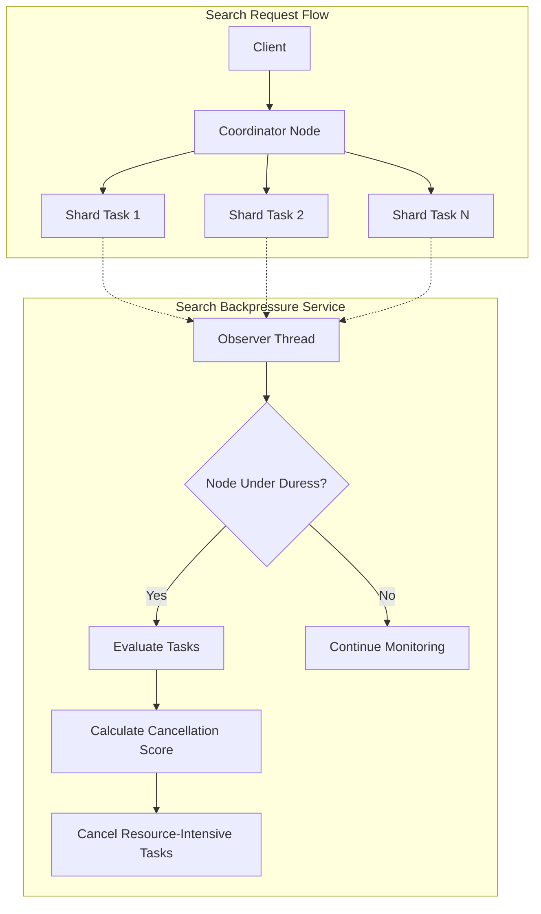
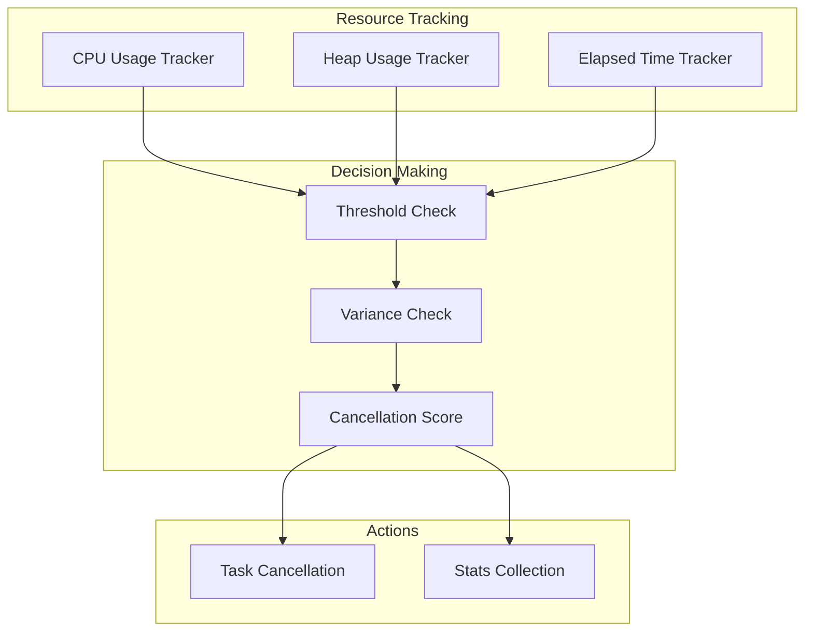

# Search Backpressure

## Summary

Search Backpressure is a mechanism that identifies resource-intensive search requests and cancels them when a node is under duress. It monitors CPU usage, heap usage, and elapsed time for search tasks, applying configurable thresholds to protect cluster stability. The feature operates at both the coordinator (search task) and shard (search shard task) levels.

## Details

### Architecture



### Data Flow



### Components

| Component | Description |
|-----------|-------------|
| `SearchBackpressureService` | Main service that coordinates backpressure monitoring and task cancellation |
| `SearchTaskStats` | Statistics for coordinator-level search tasks |
| `SearchShardTaskStats` | Statistics for shard-level search tasks |
| `CpuUsageTracker` | Tracks CPU time consumed by search tasks |
| `HeapUsageTracker` | Tracks heap memory usage by search tasks |
| `ElapsedTimeTracker` | Tracks elapsed wall-clock time for search tasks |

### Configuration

| Setting | Description | Default |
|---------|-------------|---------|
| `search_backpressure.mode` | Operating mode: `monitor_only`, `enforced`, or `disabled` | `monitor_only` |
| `search_backpressure.node_duress.cpu_threshold` | CPU usage threshold for node duress | 90% |
| `search_backpressure.node_duress.heap_threshold` | Heap usage threshold for node duress | 70% |
| `search_backpressure.node_duress.num_successive_breaches` | Successive breaches before node is considered under duress | 3 |
| `search_backpressure.search_task.elapsed_time_millis_threshold` | Elapsed time threshold for search tasks | 45,000ms |
| `search_backpressure.search_task.heap_percent_threshold` | Heap usage threshold for search tasks | 2% |
| `search_backpressure.search_task.cpu_time_millis_threshold` | CPU time threshold for search tasks | 30,000ms |
| `search_backpressure.search_shard_task.elapsed_time_millis_threshold` | Elapsed time threshold for shard tasks | 30,000ms |
| `search_backpressure.search_shard_task.heap_percent_threshold` | Heap usage threshold for shard tasks | 0.5% |
| `search_backpressure.search_shard_task.cpu_time_millis_threshold` | CPU time threshold for shard tasks | 15,000ms |

### Usage Example

```bash
# Get search backpressure stats
GET _nodes/stats/search_backpressure

# Configure search backpressure mode
PUT /_cluster/settings
{
  "persistent": {
    "search_backpressure": {
      "mode": "enforced"
    }
  }
}

# Adjust thresholds
PUT /_cluster/settings
{
  "persistent": {
    "search_backpressure.search_task.elapsed_time_millis_threshold": 60000,
    "search_backpressure.search_shard_task.cpu_time_millis_threshold": 20000
  }
}
```

## Limitations

- Operates in `monitor_only` mode by default; must be explicitly set to `enforced` to cancel tasks
- Cancellation may result in partial search results
- Statistics are reset on node restart
- Mixed-version clusters may have inconsistent stats reporting

## Related PRs

| Version | PR | Description |
|---------|-----|-------------|
| v3.2.0 | [#18649](https://github.com/opensearch-project/OpenSearch/pull/18649) | Make node duress values cacheable for NodeDuressTrackers |
| v3.0.0 | [#10028](https://github.com/opensearch-project/OpenSearch/pull/10028) | Add task completion count in search backpressure stats API |
| v2.18.0 | [#15501](https://github.com/opensearch-project/OpenSearch/pull/15501) | Add validation for the search backpressure cancellation settings |

## References

- [Issue #18641](https://github.com/opensearch-project/OpenSearch/issues/18641): Latency regression due to node duress trackers
- [Issue #8698](https://github.com/opensearch-project/OpenSearch/issues/8698): Add total successful task count in nodeStats API
- [Issue #15495](https://github.com/opensearch-project/OpenSearch/issues/15495): [BUG] Updating some search backpressure settings crash the cluster
- [Search Backpressure Documentation](https://docs.opensearch.org/3.0/tuning-your-cluster/availability-and-recovery/search-backpressure/): Official documentation

## Change History

- **v3.2.0** (2025-07-01): Added time-based caching for node duress values to reduce latency overhead from /proc filesystem reads
- **v3.0.0** (2025-05-06): Added `completion_count` field to stats API for calculating cancellation percentages
- **v2.18.0** (2024-11-05): Added validation for `cancellation_rate`, `cancellation_ratio`, and `cancellation_burst` settings to prevent cluster crashes
