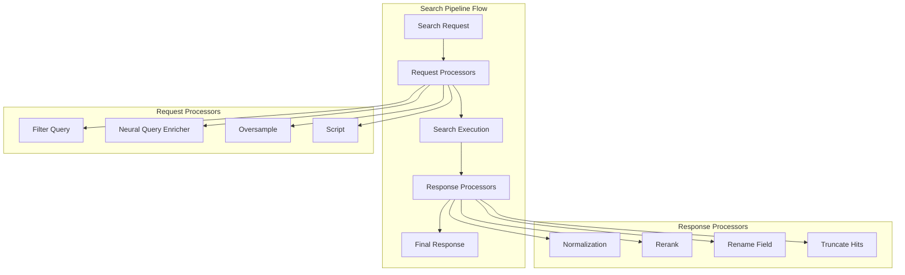
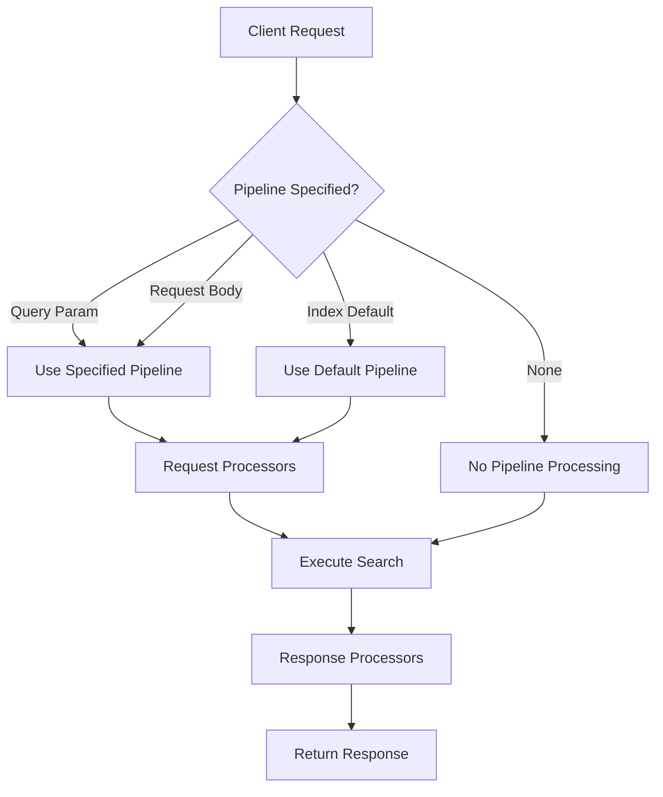

# Search Pipeline

## Summary

Search pipelines in OpenSearch provide a mechanism to preprocess search requests and postprocess search responses. They enable powerful search customization including query enrichment, result normalization for hybrid search, field renaming, and ML-based reranking. Search pipelines can be applied per-request, set as index defaults, or defined inline for ad-hoc use.

## Details

### Architecture



### Data Flow



### Components

| Component | Description |
|-----------|-------------|
| `SearchPipelineService` | Core service managing pipeline lifecycle and execution |
| `SearchPipeline` | Container for request and response processors |
| `SearchRequestProcessor` | Interface for request transformation processors |
| `SearchResponseProcessor` | Interface for response transformation processors |
| `SearchPhaseResultsProcessor` | Interface for processing results between search phases |

### Configuration

| Setting | Description | Default |
|---------|-------------|---------|
| `index.search.default_pipeline` | Default search pipeline for an index | None |
| `search_pipeline` (query param) | Pipeline to use for a specific request | None |
| `search_pipeline` (request body) | Pipeline name in search source (v2.18.0+) | None |

### Usage Examples

#### Creating a Search Pipeline

```json
PUT /_search/pipeline/my_pipeline
{
  "description": "A search pipeline with normalization",
  "request_processors": [
    {
      "filter_query": {
        "query": {
          "term": { "status": "published" }
        }
      }
    }
  ],
  "response_processors": [
    {
      "rename_field": {
        "field": "message",
        "target_field": "notification"
      }
    }
  ]
}
```

#### Using Pipeline with Single Search

```json
GET /my-index/_search?search_pipeline=my_pipeline
{
  "query": { "match_all": {} }
}
```

#### Using Pipeline with msearch (v2.18.0+)

```json
GET /_msearch
{ "index": "test"}
{ "query": { "match_all": {} }, "search_pipeline": "hybrid_pipeline"}
{ "index": "test-2"}
{ "query": { "match": { "title": "opensearch" }}, "search_pipeline": "rerank_pipeline"}
```

#### Setting Default Pipeline

```json
PUT /my_index/_settings
{
  "index.search.default_pipeline": "my_pipeline"
}
```

#### Temporary Inline Pipeline

```json
POST /my-index/_search
{
  "query": { "match": { "text_field": "search text" }},
  "search_pipeline": {
    "request_processors": [
      {
        "filter_query": {
          "query": { "term": { "visibility": "public" }}
        }
      }
    ]
  }
}
```

## Limitations

- Search pipelines add processing overhead to search requests
- Complex pipelines with ML inference can significantly increase latency
- Pipeline errors can cause search failures if not handled properly
- msearch pipeline support requires OpenSearch 2.18.0 or later

## Related PRs

| Version | PR | Description |
|---------|-----|-------------|
| v2.18.0 | [#15923](https://github.com/opensearch-project/OpenSearch/pull/15923) | Added msearch API support for search pipeline name |

## References

- [Issue #15748](https://github.com/opensearch-project/OpenSearch/issues/15748): Feature request for msearch pipeline support
- [Search Pipelines Documentation](https://docs.opensearch.org/latest/search-plugins/search-pipelines/index/): Official documentation
- [Using a Search Pipeline](https://docs.opensearch.org/latest/search-plugins/search-pipelines/using-search-pipeline/): Usage guide
- [Creating a Search Pipeline](https://docs.opensearch.org/latest/search-plugins/search-pipelines/creating-search-pipeline/): Creation guide
- [Hybrid Search Blog](https://opensearch.org/blog/hybrid-search/): Hybrid search with normalization processor
- [Optimizing Hybrid Search Blog](https://opensearch.org/blog/hybrid-search-optimization/): Performance optimization

## Change History

- **v2.18.0** (2024-11-05): Added support for specifying search pipeline in msearch API request body
