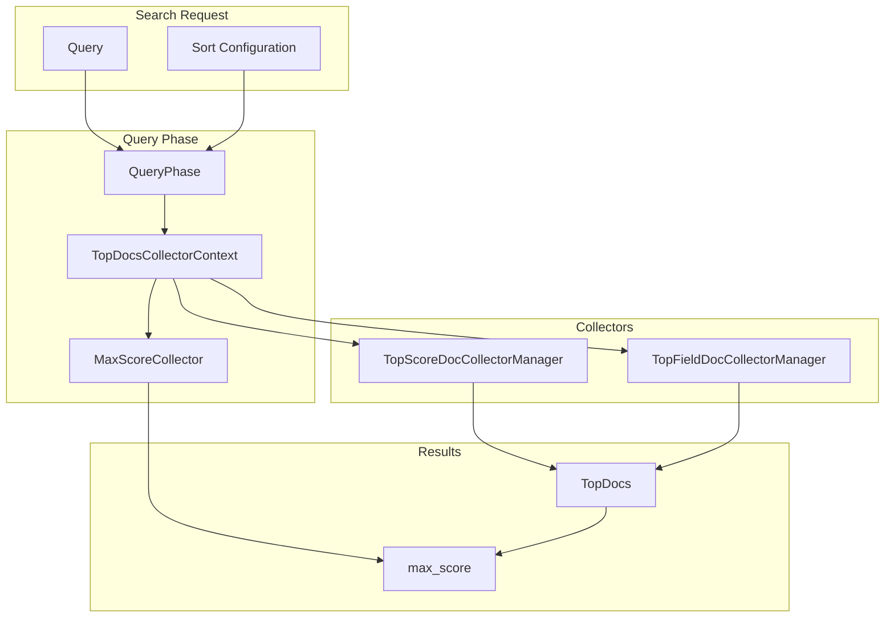
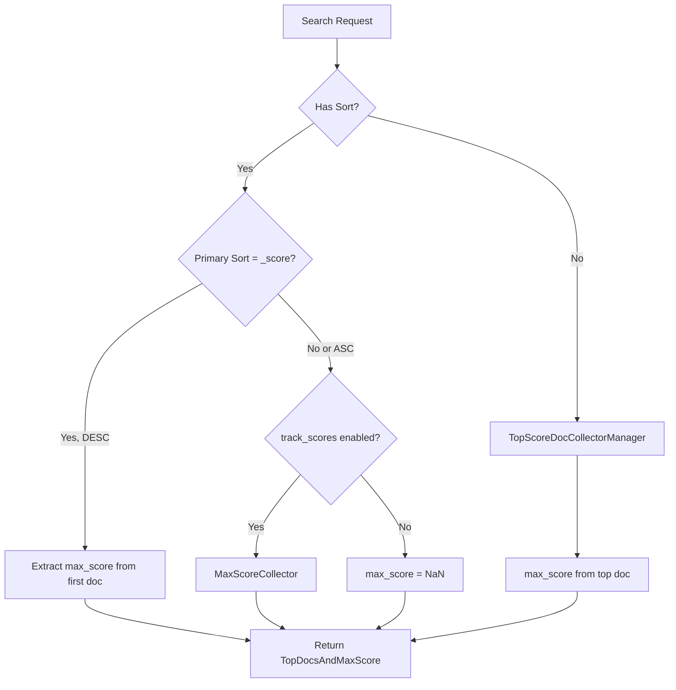

# Search Scoring

## Summary

Search scoring in OpenSearch determines how documents are ranked in search results based on relevance. The `max_score` field in search responses indicates the highest relevance score among all matching documents. OpenSearch supports various sorting options including sorting by `_score` (relevance), field values, or combinations thereof. The scoring system integrates with Lucene's collector framework to efficiently compute and return scores.

## Details

### Architecture



### Data Flow



### Components

| Component | Description |
|-----------|-------------|
| `TopDocsCollectorContext` | Manages collector creation and max_score computation |
| `TopScoreDocCollectorManager` | Collects top documents sorted by score |
| `TopFieldDocCollectorManager` | Collects top documents sorted by field values |
| `MaxScoreCollector` | Dedicated collector for tracking maximum score |
| `TopDocsAndMaxScore` | Container for top docs and max_score result |

### Configuration

| Setting | Description | Default |
|---------|-------------|---------|
| `track_scores` | Track scores when sorting by field | `false` |
| `track_total_hits` | Track total hit count | `10000` |

### max_score Behavior

The `max_score` field in search results follows these rules:

| Scenario | max_score Value |
|----------|-----------------|
| No sort (default relevance) | Highest score from results |
| Sort by `_score` DESC only | Highest score from results |
| Sort by `_score` DESC + other fields | Highest score from first result (v3.2.0+) |
| Sort by `_score` ASC | `null` |
| Sort by field (not score) | `null` (unless `track_scores: true`) |
| Sort by field with `track_scores: true` | Highest score from all results |

### Usage Example

```json
// Basic search - max_score automatically computed
GET /my-index/_search
{
  "query": {
    "match": { "content": "opensearch" }
  }
}

// Sort by score with secondary sort - max_score computed (v3.2.0+)
GET /my-index/_search
{
  "query": {
    "match": { "content": "opensearch" }
  },
  "sort": [
    { "_score": { "order": "desc" } },
    { "timestamp": { "order": "desc" } }
  ]
}

// Sort by field with score tracking
GET /my-index/_search
{
  "query": {
    "match": { "content": "opensearch" }
  },
  "sort": [
    { "timestamp": { "order": "desc" } }
  ],
  "track_scores": true
}
```

### Response Structure

```json
{
  "took": 10,
  "timed_out": false,
  "_shards": {
    "total": 5,
    "successful": 5,
    "skipped": 0,
    "failed": 0
  },
  "hits": {
    "total": {
      "value": 1000,
      "relation": "eq"
    },
    "max_score": 5.234,
    "hits": [
      {
        "_index": "my-index",
        "_id": "1",
        "_score": 5.234,
        "_source": { ... }
      }
    ]
  }
}
```

## Limitations

- `max_score` computation adds overhead when `track_scores` is enabled with field sorting
- Ascending score sort does not compute `max_score` (returns `null`)
- `max_score` reflects only the scores of returned documents, not all matching documents

## Related PRs

| Version | PR | Description |
|---------|-----|-------------|
| v3.2.0 | [#18715](https://github.com/opensearch-project/OpenSearch/pull/18715) | Fix max_score is null when sorting on score firstly |
| v3.2.0 | [#18802](https://github.com/opensearch-project/OpenSearch/pull/18802) | Use ScoreDoc instead of FieldDoc for TopScoreDocCollectorManager |
| v3.1.0 | [#18395](https://github.com/opensearch-project/OpenSearch/pull/18395) | Replace deprecated TopScoreDocCollectorManager construction |

## References

- [Issue #18714](https://github.com/opensearch-project/OpenSearch/issues/18714): Bug report for max_score null issue
- [Search API Documentation](https://docs.opensearch.org/3.2/api-reference/search-apis/search/): Official search API docs
- [Sort Results Documentation](https://docs.opensearch.org/3.2/search-plugins/searching-data/sort/): Sorting documentation
- [Lucene PR #450](https://github.com/apache/lucene/pull/450): Related Lucene API change

## Change History

- **v3.2.0** (2025-07): Fixed max_score null when sorting by _score with secondary fields; Use ScoreDoc for TopScoreDocCollectorManager
- **v3.1.0** (2025-04): Updated deprecated TopScoreDocCollectorManager construction
