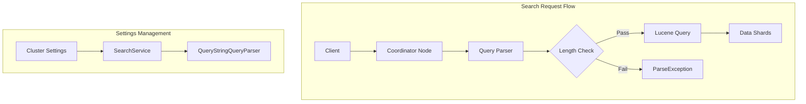

# Search Settings

## Summary

OpenSearch provides configurable search settings that control query behavior, resource limits, and performance characteristics. These cluster-level settings allow administrators to tune search operations for security, performance, and resource management. The `search.query.max_query_string_length` setting specifically limits the maximum length of query strings to prevent resource exhaustion from excessively long queries.

## Details

### Architecture



### Components

| Component | Description |
|-----------|-------------|
| `SearchService` | Manages search settings and registers setting update consumers |
| `QueryStringQueryParser` | Parses query strings and enforces length limits |
| `ClusterSettings` | Stores and propagates dynamic cluster settings |

### Configuration

| Setting | Description | Default | Dynamic |
|---------|-------------|---------|---------|
| `search.query.max_query_string_length` | Maximum allowed length for query strings | 32,000 | Yes |
| `search.max_buckets` | Maximum aggregation buckets per response | 65,535 | Yes |
| `search.default_search_timeout` | Default timeout for search requests | -1 (none) | Yes |
| `search.allow_expensive_queries` | Allow expensive query types | true | Yes |
| `search.low_level_cancellation` | Enable low-level request cancellation | true | Yes |

### Usage Example

#### Setting Query String Length Limit

```json
PUT _cluster/settings
{
  "persistent": {
    "search.query.max_query_string_length": 10000
  }
}
```

#### Query String Query Example

```json
GET my-index/_search
{
  "query": {
    "query_string": {
      "query": "status:active AND (title:opensearch OR content:search)"
    }
  }
}
```

If the query string exceeds the configured limit, the request fails with:

```json
{
  "error": {
    "type": "search_phase_execution_exception",
    "reason": "Query string length exceeds max allowed length 10000 (search.query.max_query_string_length); actual length: 15000"
  }
}
```

### Security Considerations

The query string length limit helps protect against:

1. **Denial of Service**: Extremely long query strings can consume excessive memory and CPU
2. **Resource Exhaustion**: Complex queries with many terms can overwhelm the query parser
3. **Untrusted Input**: User-provided search queries should be bounded to prevent abuse

### Best Practices

- Set limits appropriate for your use case (default 32,000 is generous)
- Monitor query patterns to identify appropriate thresholds
- Combine with other search settings for comprehensive protection
- Use `search.allow_expensive_queries: false` in production for additional safety

## Limitations

- Query string length limit only applies to `query_string` and `simple_query_string` queries
- Does not limit other query types or overall request body size
- Length check occurs at parse time, not at request receipt

## Related PRs

| Version | PR | Description |
|---------|-----|-------------|
| v3.3.0 | [#19491](https://github.com/opensearch-project/OpenSearch/pull/19491) | Introduced search.query.max_query_string_length setting |

## References

- [PR #19491](https://github.com/opensearch-project/OpenSearch/pull/19491): Initial implementation
- [Query String Query](https://docs.opensearch.org/latest/query-dsl/full-text/query-string/): Query string syntax documentation
- [Search Settings](https://docs.opensearch.org/latest/install-and-configure/configuring-opensearch/search-settings/): Search configuration reference

## Change History

- **v3.3.0** (2025-10-01): Added `search.query.max_query_string_length` setting to limit query string length
