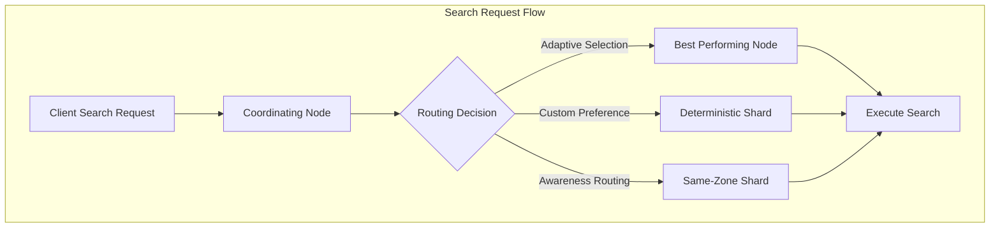
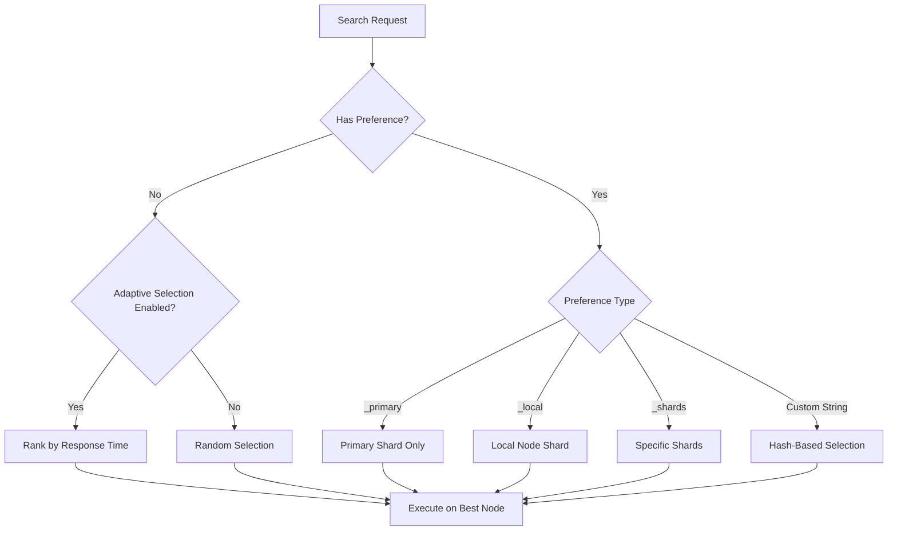

---
tags:
  - indexing
  - observability
  - performance
  - search
---

# Search Shard Routing

## Summary

Search shard routing controls how OpenSearch distributes search requests across primary and replica shards. It provides mechanisms for adaptive replica selection, custom routing preferences, and awareness-based routing to optimize search performance and ensure consistent query behavior.

## Details

### Architecture



### Data Flow



### Components

| Component | Description |
|-----------|-------------|
| `OperationRouting` | Core class handling shard routing decisions |
| `IndexShardRoutingTable` | Manages shard routing information for an index |
| `Preference` | Enum defining available preference types |
| `ResponseCollectorService` | Collects node response metrics for adaptive selection |

### Configuration

| Setting | Description | Default |
|---------|-------------|---------|
| `cluster.routing.use_adaptive_replica_selection` | Enable adaptive replica selection | `true` |
| `cluster.search.ignore_awareness_attributes` | Ignore awareness attributes for routing | `true` |
| `cluster.routing.weighted.default_weight` | Default weight for weighted routing | `1.0` |
| `cluster.routing.weighted.fail_open` | Enable fail-open for weighted routing | `true` |
| `cluster.routing.weighted.strict` | Enable strict weighted shard routing | `true` |

### Preference Types

| Preference | Description |
|------------|-------------|
| `_primary` | Execute only on primary shards |
| `_primary_first` | Prefer primary, fallback to replica |
| `_replica` | Execute only on replica shards |
| `_replica_first` | Prefer replica, fallback to primary |
| `_local` | Execute on local node if possible |
| `_only_nodes:<ids>` | Execute only on specified nodes |
| `_prefer_nodes:<ids>` | Prefer specified nodes |
| `_shards:<ids>` | Execute on specific shards |
| `<custom_string>` | Deterministic routing based on hash |

### Usage Example

```bash
# Use custom preference for consistent routing
GET /my-index/_search?preference=user_session_abc
{
  "query": {
    "match": {
      "title": "opensearch"
    }
  }
}

# Route to primary shards only
GET /my-index/_search?preference=_primary
{
  "query": {
    "match_all": {}
  }
}

# Route to local node
GET /my-index/_search?preference=_local
{
  "query": {
    "match_all": {}
  }
}
```

### Custom Routing During Indexing

```bash
# Index with custom routing value
POST /my-index/_doc/1?routing=user1
{
  "name": "John Doe",
  "age": 30
}

# Search with same routing for efficiency
GET /my-index/_search?routing=user1
{
  "query": {
    "match": {
      "name": "John Doe"
    }
  }
}
```

## Limitations

- Custom routing can cause hot spots if routing values are not evenly distributed
- Data skew may occur with unbalanced routing values
- `_only_nodes` and `_prefer_nodes` preferences are restricted when strict weighted routing is enabled
- Awareness-based routing may increase latency if preferred shards are overloaded

## Change History

- **v3.2.0** (2025-08-01): Fixed custom string preference to ignore awareness attributes for consistent routing

## Related Features
- [OpenSearch Dashboards](../opensearch-dashboards/ai-chat.md)

## References

### Documentation
- [Search Shard Routing Documentation](https://docs.opensearch.org/3.0/search-plugins/searching-data/search-shard-routing/): Official documentation

### Pull Requests
| Version | PR | Description | Related Issue |
|---------|-----|-------------|---------------|
| v3.2.0 | [#18848](https://github.com/opensearch-project/OpenSearch/pull/18848) | Fix: Ignore awareness attributes when custom preference is set | [#18817](https://github.com/opensearch-project/OpenSearch/issues/18817) |

### Issues (Design / RFC)
- [Issue #18817](https://github.com/opensearch-project/OpenSearch/issues/18817): Bug report for custom preference with awareness attributes
