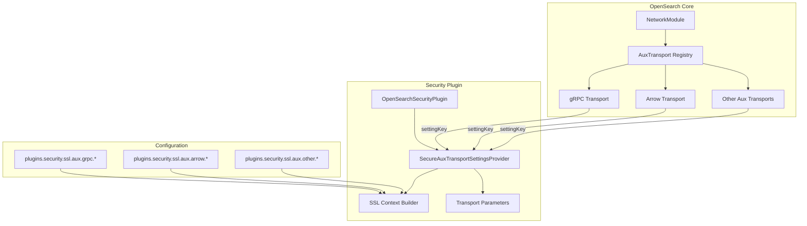
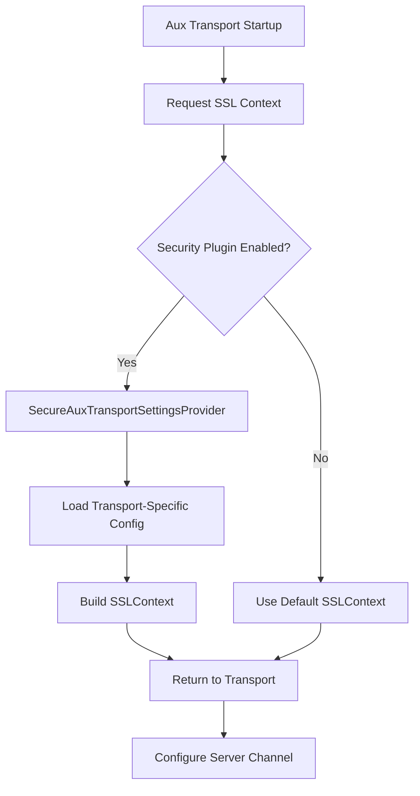

# Secure Aux Transport Settings

## Summary

The `SecureAuxTransportSettingsProvider` interface enables security plugins to provide SSL/TLS configuration for OpenSearch auxiliary transports. Auxiliary transports are pluggable communication channels (such as gRPC or Arrow Flight) that operate alongside the primary HTTP and transport layers. This interface allows each auxiliary transport to have its own independent security configuration.

## Details

### Architecture



### Data Flow



### Components

| Component | Description |
|-----------|-------------|
| `SecureAuxTransportSettingsProvider` | Interface for providing SSL/TLS settings to auxiliary transports |
| `SecureAuxTransportParameters` | Interface for ALPN configuration (client auth mode, cipher suites) |
| `SecureNetty4GrpcServerTransport` | Secure gRPC transport implementation using this interface |

### Configuration

Each auxiliary transport has its own configuration namespace under `plugins.security.ssl.aux.<transport-type>`:

| Setting | Description | Default |
|---------|-------------|---------|
| `plugins.security.ssl.aux.<type>.enabled` | Enable TLS for this auxiliary transport | `false` |
| `plugins.security.ssl.aux.<type>.pemcert_filepath` | Path to PEM certificate file | - |
| `plugins.security.ssl.aux.<type>.pemkey_filepath` | Path to PEM private key file | - |
| `plugins.security.ssl.aux.<type>.pemtrustedcas_filepath` | Path to trusted CA certificates | - |
| `plugins.security.ssl.aux.<type>.clientauth_mode` | Client authentication mode (`NONE`, `OPTIONAL`, `REQUIRE`) | `OPTIONAL` |

### Interface Definition

```java
@ExperimentalApi
public interface SecureAuxTransportSettingsProvider {
    /**
     * Build an SSLContext for the specified auxiliary transport.
     * @param settings OpenSearch settings
     * @param auxTransportType Key identifying the transport (e.g., "experimental-secure-transport-grpc")
     * @return SSLContext for the transport, or empty to use default
     */
    default Optional<SSLContext> buildSecureAuxServerTransportContext(
        Settings settings, String auxTransportType) throws SSLException {
        return Optional.empty();
    }

    /**
     * Get ALPN parameters for the specified auxiliary transport.
     * @param settings OpenSearch settings
     * @param auxTransportType Key identifying the transport
     * @return Transport parameters including client auth mode and cipher suites
     */
    default Optional<SecureAuxTransportParameters> parameters(
        Settings settings, String auxTransportType) throws SSLException {
        return Optional.empty();
    }

    @ExperimentalApi
    interface SecureAuxTransportParameters {
        Optional<String> clientAuth();
        Collection<String> cipherSuites();
    }
}
```

### Usage Example

Configure TLS for the gRPC auxiliary transport:

```yaml
# opensearch.yml

# Enable gRPC auxiliary transport
aux.transport.types: experimental-secure-transport-grpc
aux.transport.experimental-secure-transport-grpc.port: '9400-9500'

# Configure TLS for gRPC transport
plugins.security.ssl.aux.experimental-secure-transport-grpc.enabled: true
plugins.security.ssl.aux.experimental-secure-transport-grpc.pemcert_filepath: esnode.pem
plugins.security.ssl.aux.experimental-secure-transport-grpc.pemkey_filepath: esnode-key.pem
plugins.security.ssl.aux.experimental-secure-transport-grpc.pemtrustedcas_filepath: root-ca.pem
plugins.security.ssl.aux.experimental-secure-transport-grpc.clientauth_mode: REQUIRE
```

Test the secure connection:

```bash
# Test with client certificate (should succeed)
grpcurl -insecure \
  -cert config/esnode.pem \
  -key config/esnode-key.pem \
  localhost:9400 list

# Test without client certificate (should fail with REQUIRE mode)
grpcurl -insecure localhost:9400 list
```

## Limitations

- The interface is marked as `@ExperimentalApi` and may change in future versions
- Only provides TLS/SSL configuration; no authorization or authentication is enforced
- Users can configure `clientauth_mode` to allow/disallow certificates, but no permissions are checked
- Each transport type requires separate configuration; no inheritance from main transport settings

## Change History

- **v3.2.0** (2025-09-16): Updated interface to accept `auxTransportType` string parameter, enabling transport-specific SSL configurations

## References

### Documentation
- [gRPC APIs Documentation](https://docs.opensearch.org/3.0/api-reference/grpc-apis/index/): Official gRPC transport documentation
- [SecureAuxTransportSettingsProvider.java](https://github.com/opensearch-project/OpenSearch/blob/main/server/src/main/java/org/opensearch/plugins/SecureAuxTransportSettingsProvider.java): Interface source code

### Pull Requests
| Version | PR | Description | Related Issue |
|---------|-----|-------------|---------------|
| v3.2.0 | [#18616](https://github.com/opensearch-project/OpenSearch/pull/18616) | Update interface to distinguish between aux transport types |   |
| v3.2.0 | [security#5375](https://github.com/opensearch-project/security/pull/5375) | TLS support for auxiliary transports in security plugin | [#17795](https://github.com/opensearch-project/OpenSearch/issues/17795) |

### Issues (Design / RFC)
- [Issue #17795](https://github.com/opensearch-project/OpenSearch/issues/17795): Feature request for separation of auxiliary transport SSL configurations
