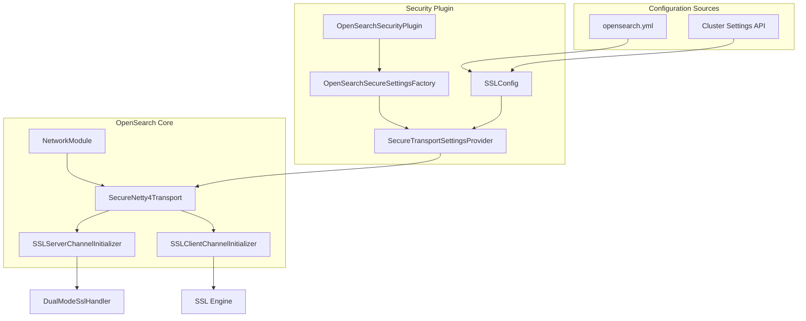

# Secure Transport Settings

## Summary

The `SecureTransportSettingsProvider` interface provides security-related settings for OpenSearch transport layer communication. It allows security plugins to configure SSL/TLS settings, exception handlers, and dynamic transport parameters for secure node-to-node and client-to-node communication.

## Details

### Architecture



### Data Flow


### Components

| Component | Description |
|-----------|-------------|
| `SecureTransportSettingsProvider` | Interface for providing security settings to transport layer |
| `SecureTransportParameters` | Interface for dynamic transport parameters (e.g., dual mode) |
| `DefaultSecureTransportParameters` | Default implementation reading from static settings |
| `SecureNetty4Transport` | Netty-based secure transport implementation |
| `DualModeSslHandler` | Handler for SSL dual mode (mixed SSL/non-SSL connections) |
| `SSLConfig` | Security plugin class managing SSL configuration with cluster settings listener |

### Configuration

| Setting | Description | Default |
|---------|-------------|---------|
| `plugins.security_config.ssl_dual_mode_enabled` | Enable SSL dual mode for mixed SSL/non-SSL transport | `false` |
| `plugins.security.ssl_only` | Run security plugin in SSL-only mode | `false` |

### Interface Definition

```java
@ExperimentalApi
public interface SecureTransportSettingsProvider {
    
    // Get transport adapter providers
    default Collection<TransportAdapterProvider<Transport>> getTransportAdapterProviders(Settings settings) {
        return Collections.emptyList();
    }
    
    // Get dynamic transport parameters
    default Optional<SecureTransportParameters> parameters(Settings settings) {
        return Optional.of(new DefaultSecureTransportParameters(settings));
    }
    
    // Build exception handler for transport errors
    Optional<TransportExceptionHandler> buildServerTransportExceptionHandler(
        Settings settings, Transport transport);
    
    // Build SSL engine for server transport
    Optional<SSLEngine> buildSecureServerTransportEngine(
        Settings settings, Transport transport) throws SSLException;
    
    // Build SSL engine for client transport
    Optional<SSLEngine> buildSecureClientTransportEngine(
        Settings settings, String hostname, int port) throws SSLException;
    
    @ExperimentalApi
    interface SecureTransportParameters {
        boolean dualModeEnabled();
    }
}
```

### Usage Example

Dynamically toggle SSL dual mode via cluster settings:

```bash
# Enable dual mode (allow mixed SSL/non-SSL connections)
curl -XPUT https://localhost:9200/_cluster/settings \
  -k -H "Content-Type: application/json" \
  -d '{"persistent": {"plugins.security_config.ssl_dual_mode_enabled": true}}'

# Disable dual mode (require SSL for all connections)
curl -XPUT https://localhost:9200/_cluster/settings \
  -k -H "Content-Type: application/json" \
  -d '{"persistent": {"plugins.security_config.ssl_dual_mode_enabled": false}}'
```

## Limitations

- `SecureTransportParameters` interface is marked as `@ExperimentalApi` and may change
- Currently only exposes `dualModeEnabled()` parameter
- Dynamic updates only affect new connections; existing connections are not affected

## Related PRs

| Version | PR | Description |
|---------|-----|-------------|
| v2.18.0 | [#16387](https://github.com/opensearch-project/OpenSearch/pull/16387) | Add method to return dynamic SecureTransportParameters |
| v2.18.0 | [#4820](https://github.com/opensearch-project/security/pull/4820) | Security plugin: propagate dual mode from cluster settings |

## References

- [PR #16387](https://github.com/opensearch-project/OpenSearch/pull/16387): Core implementation
- [Security PR #4820](https://github.com/opensearch-project/security/pull/4820): Security plugin implementation
- [TLS Configuration](https://docs.opensearch.org/2.18/security/configuration/tls/): Official TLS documentation

## Change History

- **v2.18.0** (2024-10-29): Added `parameters()` method and `SecureTransportParameters` interface to support dynamic SSL dual mode settings
