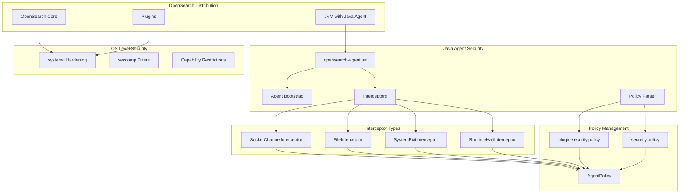
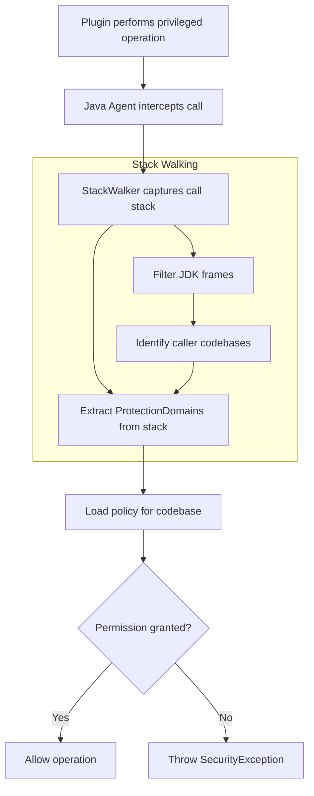

---
tags:
  - ml
  - security
---

# Security Manager Replacement

## Summary

OpenSearch replaces the deprecated Java Security Manager (JSM) with a custom Java agent-based security model. This change ensures OpenSearch remains compatible with JDK 24+ where JSM will be fully removed, while maintaining plugin sandboxing capabilities and enabling future adoption of virtual threads. The replacement uses a two-pronged approach: a Java agent for plugin-level access control and systemd hardening for operating system-level protection.

## Details

### Background

Java Security Manager (JSM) has been deprecated since JDK 17 (JEP 411) and is scheduled for full removal in JDK 24 (JEP 486). OpenSearch historically relied on JSM to sandbox plugins and prevent them from performing privileged actions without explicit administrator approval. The deprecation of JSM required OpenSearch to find alternative security mechanisms.

### Architecture



### Data Flow



### Components

| Component | Location | Description |
|-----------|----------|-------------|
| `Agent` | `libs/agent-sm/agent` | Main Java agent with ByteBuddy instrumentation |
| `AgentPolicy` | `libs/agent-sm/bootstrap` | Central policy management and permission checking |
| `SocketChannelInterceptor` | `libs/agent-sm/agent` | Intercepts socket connection attempts |
| `FileInterceptor` | `libs/agent-sm/agent` | Intercepts file system operations |
| `SystemExitInterceptor` | `libs/agent-sm/agent` | Intercepts `System.exit()` calls |
| `RuntimeHaltInterceptor` | `libs/agent-sm/agent` | Intercepts `Runtime.halt()` calls |
| `PolicyFile` | `libs/secure-sm` | Custom policy parser compatible with JDK 24+ |
| `StackCallerChainExtractor` | `libs/agent-sm/agent` | Extracts ProtectionDomains from call stack |
| `AccessController` | `libs/agent-sm/agent-policy` | Replacement for `java.security.AccessController` |

### Configuration

| Setting | Description | Default |
|---------|-------------|---------|
| `-javaagent:agent/opensearch-agent.jar` | JVM argument to attach the Java agent | Enabled for JDK 21+ |
| `plugin-security.policy` | Per-plugin permission definitions | Plugin-specific |
| `security.policy` | Core OpenSearch permissions | Bundled with distribution |

### Intercepted Operations

| Operation | Interceptor | Permission Required |
|-----------|-------------|---------------------|
| Socket connect | `SocketChannelInterceptor` | `java.net.SocketPermission "host:port", "connect,resolve"` |
| Unix domain socket | `SocketChannelInterceptor` | `java.net.NetPermission "accessUnixDomainSocket"` |
| File read/write | `FileInterceptor` | `java.io.FilePermission "path", "read,write"` |
| System.exit() | `SystemExitInterceptor` | Allowed only for whitelisted classes |
| Runtime.halt() | `RuntimeHaltInterceptor` | Allowed only for whitelisted classes |

### Usage Example

#### Plugin Security Policy

```java
// plugin-security.policy
grant {
  // Network permissions
  permission java.net.SocketPermission "*", "connect,resolve";
  permission java.net.NetPermission "accessUnixDomainSocket";
  
  // File permissions
  permission java.io.FilePermission "${user.home}/-", "read";
  permission java.io.FilePermission "/tmp/-", "read,write,delete";
  
  // Runtime permissions
  permission java.lang.RuntimePermission "getClassLoader";
  permission java.lang.RuntimePermission "setContextClassLoader";
}
```

#### Privileged Action in Plugin Code

```java
import org.opensearch.secure_sm.AccessController;

// Execute privileged file operation
byte[] content = AccessController.doPrivileged(() -> {
    return Files.readAllBytes(Path.of("/tmp/myfile"));
});

// Execute privileged network operation
AccessController.doPrivileged(() -> {
    HttpClient client = HttpClient.newHttpClient();
    client.send(request, HttpResponse.BodyHandlers.ofString());
});
```

### systemd Hardening

For Linux distributions using systemd, OpenSearch applies additional OS-level protections:

| Directive | Purpose |
|-----------|---------|
| `SystemCallFilter` | Restricts kernel interfaces via seccomp |
| `ReadOnlyPaths` | Protects critical system files |
| `ReadWritePaths` | Limits write access to necessary directories |
| `InaccessiblePaths` | Blocks access to sensitive paths |
| `CapabilityBoundingSet` | Blocks dangerous Linux capabilities |
| `PrivateTmp` | Isolates temporary files |
| `NoNewPrivileges` | Prevents privilege escalation |
| `ProtectSystem` | Protects system directories |

## Limitations

- The Java agent focuses on high-risk operations (file I/O, network, process termination)
- Not all JSM permission types are covered (e.g., reflection permissions)
- systemd hardening is only available on Linux distributions using systemd
- Virtual threads do not carry permissions (by JDK design)
- systemd rules apply at process level, not per-plugin

## Change History

- **v3.0.0** (2025-04-09): Initial implementation replacing Java Security Manager with Java agent

## References

### Documentation
- [JEP 411](https://openjdk.org/jeps/411): Deprecate the Security Manager for Removal
- [JEP 486](https://openjdk.org/jeps/486): Permanently Disable the Security Manager
- [JEP 444](https://openjdk.org/jeps/444): Virtual Threads

### Blog Posts
- [Blog: Finding a replacement for JSM in OpenSearch 3.0](https://opensearch.org/blog/finding-a-replacement-for-jsm-in-opensearch-3-0/)

### Pull Requests
| Version | PR | Description | Related Issue |
|---------|-----|-------------|---------------|
| v3.0.0 | [#17724](https://github.com/opensearch-project/OpenSearch/pull/17724) | Create initial Java Agent to intercept Socket::connect calls | [#17660](https://github.com/opensearch-project/OpenSearch/issues/17660) |
| v3.0.0 | [#17746](https://github.com/opensearch-project/OpenSearch/pull/17746) | Enhance Java Agent to intercept System::exit | [#17723](https://github.com/opensearch-project/OpenSearch/issues/17723) |
| v3.0.0 | [#17753](https://github.com/opensearch-project/OpenSearch/pull/17753) | Add a policy parser for Java agent security policies | [#17659](https://github.com/opensearch-project/OpenSearch/issues/17659) |
| v3.0.0 | [#17757](https://github.com/opensearch-project/OpenSearch/pull/17757) | Enhance Java Agent to intercept Runtime::halt | [#17755](https://github.com/opensearch-project/OpenSearch/issues/17755) |
| v3.0.0 | [#17760](https://github.com/opensearch-project/OpenSearch/pull/17760) | Implement File Interceptor and add integration tests | [#17662](https://github.com/opensearch-project/OpenSearch/issues/17662) |
| v3.0.0 | [#17861](https://github.com/opensearch-project/OpenSearch/pull/17861) | Phase off SecurityManager usage in favor of Java Agent | [#17662](https://github.com/opensearch-project/OpenSearch/issues/17662) |

### Issues (Design / RFC)
- [Issue #1687](https://github.com/opensearch-project/OpenSearch/issues/1687): Original JSM replacement discussion
- [Issue #17658](https://github.com/opensearch-project/OpenSearch/issues/17658): Parent issue for Security Manager replacement
- [Issue #17659](https://github.com/opensearch-project/OpenSearch/issues/17659): Add support of Java policies
- [Issue #17660](https://github.com/opensearch-project/OpenSearch/issues/17660): Create initial Java Agent to intercept Socket::connect calls
- [Issue #17662](https://github.com/opensearch-project/OpenSearch/issues/17662): Phase off SecurityManager usage in favor of Java Agent
