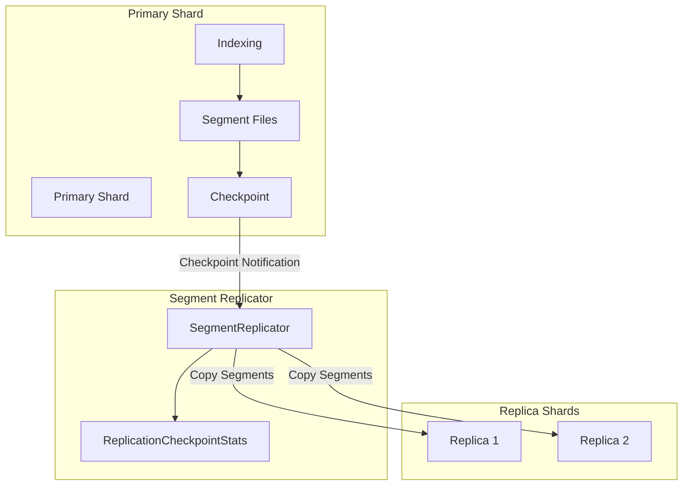
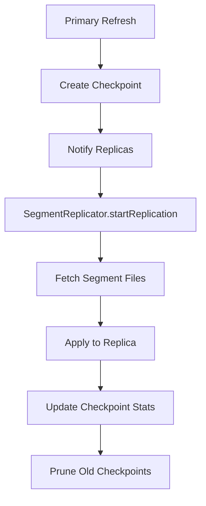

# Segment Replication

## Summary

Segment replication is an alternative replication strategy in OpenSearch that copies Lucene segment files directly from primary shards to replica shards, instead of re-indexing documents on each replica. This approach significantly improves indexing throughput (up to 40% higher) and reduces CPU/memory utilization on replica nodes, at the cost of increased network bandwidth usage. Segment replication is particularly beneficial for write-heavy workloads with lower search requirements.

## Details

### Architecture



### Data Flow



### Components

| Component | Description |
|-----------|-------------|
| `SegmentReplicator` | Manages segment replication events on replicas, tracks checkpoint stats |
| `ReplicationCheckpoint` | Represents a point-in-time state of segments on primary shard |
| `ReplicationCheckpointStats` | Tracks bytes behind and timestamp for each checkpoint |
| `SegmentReplicationTarget` | Orchestrates a single replication event |
| `SegmentReplicationSource` | Source for fetching segment files (node-to-node or remote store) |

### Configuration

| Setting | Description | Default |
|---------|-------------|---------|
| `index.replication.type` | Replication type: `SEGMENT` or `DOCUMENT` | `DOCUMENT` |
| `cluster.indices.replication.strategy` | Default replication type for new indexes | `DOCUMENT` |
| `cluster.index.restrict.replication.type` | Enforce cluster-level replication type | `false` |
| `segrep.pressure.enabled` | Enable segment replication backpressure | `false` |
| `cluster.routing.allocation.balance.prefer_primary` | Balance primary shards across nodes | `false` |

### Replication Metrics

| Metric | Description |
|--------|-------------|
| `max_bytes_behind` | Maximum bytes replica is behind primary |
| `total_bytes_behind` | Total bytes behind across all replicas |
| `max_replication_lag` | Maximum time (ms) replica is behind primary |

### Usage Example

Create an index with segment replication:

```json
PUT /my-index
{
  "settings": {
    "index": {
      "replication.type": "SEGMENT",
      "number_of_replicas": 1
    }
  }
}
```

Enable recommended settings for segment replication:

```json
PUT /_cluster/settings
{
  "persistent": {
    "cluster.routing.allocation.balance.prefer_primary": true,
    "segrep.pressure.enabled": true
  }
}
```

Check segment replication status:

```
GET _cat/segment_replication?v
```

## Limitations

- Requires reindexing to enable on existing indexes
- Does not support `refresh=wait_for` or `refresh=true` policies
- Cross-cluster replication does not use segment replication
- Increased network bandwidth usage on primary shards (node-to-node mode)
- Get/MultiGet/TermVector operations route to primary for strong reads

## Related PRs

| Version | PR | Description |
|---------|-----|-------------|
| v3.2.0 | [#18602](https://github.com/opensearch-project/OpenSearch/pull/18602) | Fix bugs in replication lag computation |

## References

- [Segment Replication Documentation](https://docs.opensearch.org/3.0/tuning-your-cluster/availability-and-recovery/segment-replication/index/): Official documentation
- [Segment Replication Backpressure](https://docs.opensearch.org/3.0/tuning-your-cluster/availability-and-recovery/segment-replication/backpressure/): Backpressure mechanism
- [CAT Segment Replication API](https://docs.opensearch.org/3.0/api-reference/cat/cat-segment-replication/): API for viewing metrics
- [Issue #18437](https://github.com/opensearch-project/OpenSearch/issues/18437): Bug report for lag metric issue
- [Segment Replication Blog](https://opensearch.org/blog/segment-replication/): Introduction blog post

## Change History

- **v3.2.0** (2025-07-01): Fixed replication lag computation to use epoch-based timestamps and corrected checkpoint pruning logic
