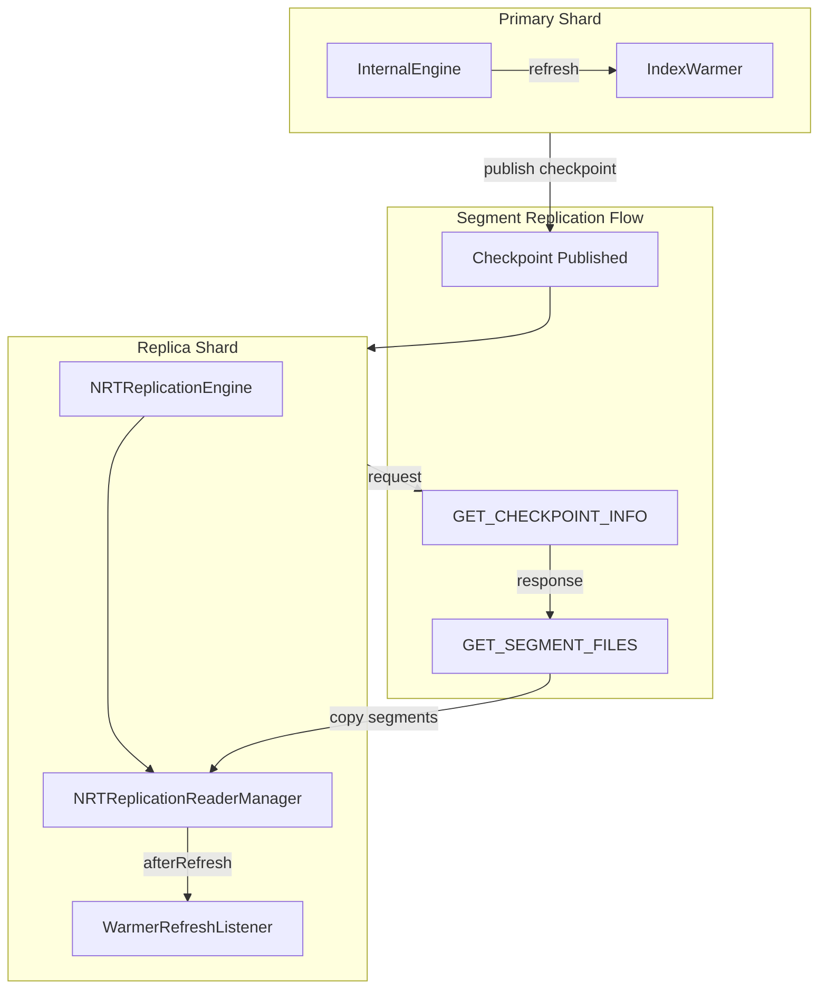

---
tags:
  - opensearch
---
# Segment Replication

## Summary

Segment replication is an alternative to document replication in OpenSearch where only the primary shard performs indexing operations, creating segment files that are then copied to replica shards. This approach enhances indexing throughput and reduces CPU/memory utilization on replicas at the cost of increased network usage.

## Details

### Architecture

```mermaid
graph TB
    subgraph Primary["Primary Shard"]
        IE[InternalEngine]
        IW[IndexWarmer]
        IE -->|refresh| IW
    end
    subgraph Replica["Replica Shard"]
        NRT[NRTReplicationEngine]
        NRM[NRTReplicationReaderManager]
        WRL[WarmerRefreshListener]
        NRT --> NRM
        NRM -->|afterRefresh| WRL
    end
    subgraph Replication["Segment Replication Flow"]
        CKP[Checkpoint Published]
        GCI[GET_CHECKPOINT_INFO]
        GSF[GET_SEGMENT_FILES]
    end
    Primary -->|publish checkpoint| CKP
    CKP --> Replica
    Replica -->|request| GCI
    GCI -->|response| GSF
    GSF -->|copy segments| NRM
```

### Components

| Component | Description |
|-----------|-------------|
| `NRTReplicationEngine` | Engine used by replica shards with segment replication; manages segment updates from primary |
| `NRTReplicationReaderManager` | Reader manager for NRT replicas; handles `refreshIfNeeded` when segments are updated |
| `WarmerRefreshListener` | Refresh listener added in v3.6.0 that triggers `Engine.Warmer` on replica shards after segment replication |
| `SegmentReplicationTargetService` | Orchestrates replication on the replica side; handles checkpoint processing and retry logic |
| `SegmentReplicationTarget` | Represents a single replication event; manages the replication lifecycle |
| `AbstractSegmentReplicationTarget` | Base class for replication targets; handles checkpoint validation and replication phases |
| `OngoingSegmentReplications` | Tracks active replication events on the primary shard |

### Configuration

| Setting | Description | Default |
|---------|-------------|---------|
| `index.replication.type` | Replication strategy: `DOCUMENT` or `SEGMENT` | `DOCUMENT` |
| `index.refresh_interval` | Controls how often segments are created and replicated | `1s` |
| `eager_global_ordinals` | Pre-loads global ordinals on refresh (now works on replicas with segment replication) | `false` |

## Limitations

- Segment replication does not support mixed replication types within a single index
- Network utilization increases compared to document replication due to segment file transfers
- The IndexWarmer on replicas (v3.6.0) applies only to local segment replication, not remote-backed

## Change History

- **v3.6.0**: Added `WarmerRefreshListener` to `NRTReplicationEngine` so that `IndexWarmer` runs on replica shards after segment replication, eliminating cold start latency for eager global ordinals. Fixed infinite retry loop caused by stale metadata checkpoint during failure recovery by introducing an `isRetry` flag that skips checkpoint staleness validation on retries.

## References

### Documentation
- https://opensearch.org/docs/latest/tuning-your-cluster/availability-and-recovery/segment-replication/index/
- https://opensearch.org/blog/segment-replication/

### Pull Requests
| Version | PR | Description |
|---------|-----|-------------|
| v3.6.0 | `https://github.com/opensearch-project/OpenSearch/pull/20650` | Add IndexWarmer support for replica shards with segment replication |
| v3.6.0 | `https://github.com/opensearch-project/OpenSearch/pull/20551` | Fix segment replication infinite retry due to stale metadata checkpoint |
