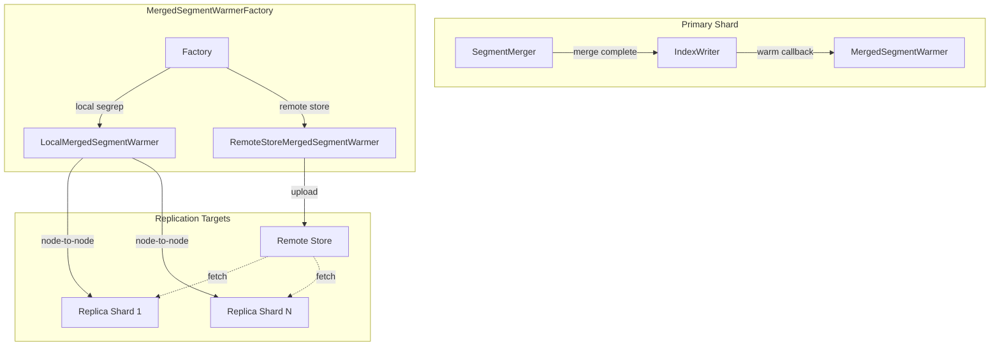
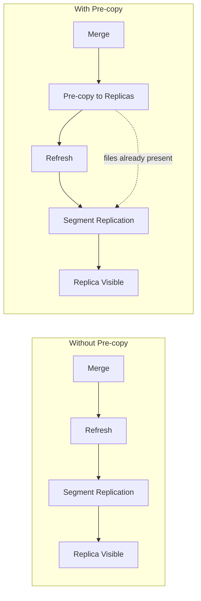

# Segment Warmer

## Summary

Segment Warmer is an optimization feature for segment replication that pre-copies merged segments to replica shards before the primary shard's refresh completes. By leveraging Lucene's `IndexWriter.IndexReaderWarmer` interface, this feature significantly reduces the visibility delay between primary and replica shards, improving data consistency and search freshness in segment replication deployments.

## Details

### Architecture



### Data Flow



### Components

| Component | Description |
|-----------|-------------|
| `MergedSegmentWarmerFactory` | Factory that creates appropriate `IndexReaderWarmer` implementations based on index replication settings |
| `MergedSegmentWarmer` | Unified implementation handling both local and remote segment warming |
| `LocalMergedSegmentWarmer` | Handles node-to-node segment transfer for local segment replication |
| `RemoteStoreMergedSegmentWarmer` | Handles segment upload to remote store for remote-backed indexes |

### Configuration

| Setting | Description | Default |
|---------|-------------|---------|
| `opensearch.experimental.feature.merged_segment_warmer.enabled` | Feature flag to enable merged segment warmer | `false` |
| `index.replication.type` | Must be set to `SEGMENT` for segment warmer to activate | `DOCUMENT` |

### Usage Example

Enable the feature flag in `opensearch.yml`:

```yaml
opensearch.experimental.feature.merged_segment_warmer.enabled: true
```

Create an index with segment replication:

```json
PUT /my-index
{
  "settings": {
    "index": {
      "replication.type": "SEGMENT",
      "number_of_replicas": 1
    }
  }
}
```

### How Pre-copy Works

1. **Standard Segment Replication Flow**: Without pre-copy, merged segments wait for the next refresh cycle before being replicated to replicas, causing visibility delays proportional to segment size

2. **Pre-copy Flow**:
   - Primary shard completes segment merge
   - `IndexWriter` invokes `IndexReaderWarmer.warm()` callback
   - `MergedSegmentWarmer` initiates segment transfer to replicas
   - Replicas receive segment files before primary refresh
   - On refresh, segment replication finds files already present on replicas
   - Replication completes with minimal network transfer

3. **Failover**: If pre-copy fails or times out, the system falls back to standard segment replication behavior

## Limitations

- Requires segment replication (`replication.type: SEGMENT`)
- Experimental feature requiring explicit feature flag enablement
- Increases network utilization during merge operations
- Not applicable to document replication indexes

## Related PRs

| Version | PR | Description |
|---------|-----|-------------|
| v3.0.0 | [#17881](https://github.com/opensearch-project/OpenSearch/pull/17881) | Initial implementation - MergedSegmentWarmerFactory infrastructure |

## References

- [Issue #17528](https://github.com/opensearch-project/OpenSearch/issues/17528): RFC - Introduce Pre-copy Merged Segment into Segment Replication
- [Issue #1694](https://github.com/opensearch-project/OpenSearch/issues/1694): Original Segment Replication feature request
- [Segment Replication Documentation](https://docs.opensearch.org/3.0/tuning-your-cluster/availability-and-recovery/segment-replication/index/): Official docs

## Change History

- **v3.0.0** (2025-04-15): Initial implementation - introduced `MergedSegmentWarmerFactory` with `LocalMergedSegmentWarmer` and `RemoteStoreMergedSegmentWarmer` infrastructure
