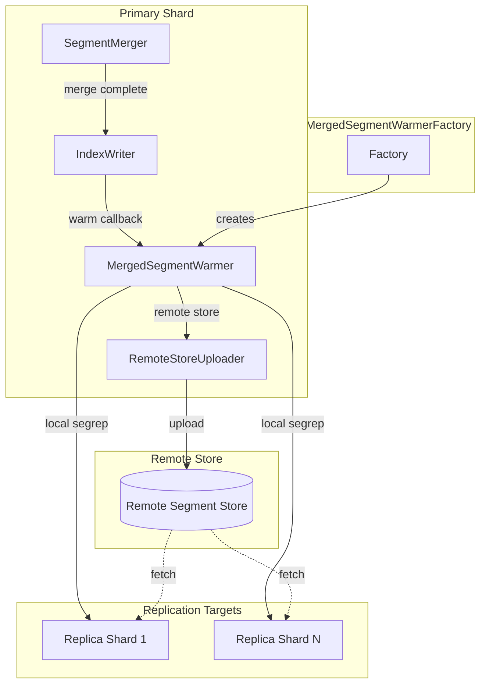
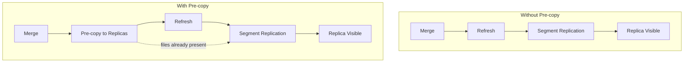

# Segment Warmer

## Summary

Segment Warmer is an optimization feature for segment replication that pre-copies merged segments to replica shards before the primary shard's refresh completes. By leveraging Lucene's `IndexWriter.IndexReaderWarmer` interface, this feature significantly reduces the visibility delay between primary and replica shards, improving data consistency and search freshness in segment replication deployments. The feature supports both local segment replication (node-to-node transfer) and remote-store-enabled clusters (via remote storage).

## Details

### Architecture



### Data Flow



### Components

| Component | Description |
|-----------|-------------|
| `MergedSegmentWarmerFactory` | Factory that creates appropriate `IndexReaderWarmer` implementations based on index replication settings |
| `MergedSegmentWarmer` | Unified implementation handling both local and remote segment warming |
| `ClusterMergeSchedulerConfig` | Manages cluster-level merge scheduler settings with three-level hierarchy (v3.4.0+) |
| `MergedSegmentTransferTracker` | Tracks transfer metrics for warming operations (v3.3.0+) |
| `MergedSegmentWarmerStats` | Exposes warmer statistics via stats APIs (v3.3.0+) |
| `RemoteStorePublishMergedSegmentAction` | Replication action for uploading merged segments to remote store and publishing checkpoints |
| `RemoteStoreMergedSegmentCheckpoint` | Checkpoint containing local-to-remote filename mappings for merged segments |
| `PublishMergedSegmentAction` | Replication action for local segment replication pre-copy |
| `MergedSegmentCheckpoint` | Checkpoint representing merged segment information |

### Configuration

#### Warmer Settings (v3.4.0+)

| Setting | Description | Default |
|---------|-------------|---------|
| `indices.replication.merges.warmer.enabled` | Enable/disable merged segment warmer (cluster setting) | `false` |
| `indices.replication.merges.warmer.min_segment_size_threshold` | Minimum segment size to trigger warming | `500mb` |
| `indices.replication.merges.warmer.max_bytes_per_sec` | Rate limit for segment transfer | - |
| `indices.replication.merges.warmer.timeout` | Timeout for warming operations | - |
| `index.replication.type` | Must be set to `SEGMENT` for segment warmer to activate | `DOCUMENT` |

#### Cluster Merge Scheduler Settings (v3.4.0+)

| Setting | Description | Default |
|---------|-------------|---------|
| `cluster.index.merge.scheduler.max_thread_count` | Cluster default for merge threads | `Math.max(1, cores/2)` |
| `cluster.index.merge.scheduler.max_merge_count` | Cluster default for concurrent merges | `max_thread_count + 5` |
| `cluster.index.merge.scheduler.auto_throttle` | Cluster default for auto-throttle | `true` |

#### Legacy Settings (v3.0.0-v3.3.0)

| Setting | Description | Default |
|---------|-------------|---------|
| `opensearch.experimental.feature.merged_segment_warmer.enabled` | Experimental feature flag (removed in v3.4.0) | `false` |
| `max_remote_low_priority_download_bytes_per_sec` | Rate limit for low-priority downloads | `0` (unlimited) |

### Metrics (v3.3.0+)

The segment warmer exposes comprehensive metrics under `merges.warmer` in stats APIs:

| Metric | Type | Description |
|--------|------|-------------|
| `total_invocations_count` | Cumulative | Total number of warm operations invoked |
| `total_time_millis` | Cumulative | Total wallclock time spent in warming operations |
| `total_failure_count` | Cumulative | Number of failed warming attempts |
| `total_bytes_sent` | Cumulative | Total data volume uploaded by primary shards |
| `total_bytes_received` | Cumulative | Total data volume downloaded by replica shards |
| `total_send_time_millis` | Cumulative | Time spent uploading segments |
| `total_receive_time_millis` | Cumulative | Time spent downloading segments |
| `ongoing_count` | Point-in-time | Current number of active warming operations |

Access metrics via:
- Node Stats: `GET /_nodes/stats/indices/merge`
- Index Stats: `GET /_stats/merge`
- CAT Shards: `GET /_cat/shards?h=merges.warmer.*`
- CAT Nodes: `GET /_cat/nodes?h=merges.warmer.*`

### Usage Example

Enable the feature via cluster setting (v3.4.0+):

```json
PUT /_cluster/settings
{
  "persistent": {
    "indices.replication.merges.warmer.enabled": true,
    "indices.replication.merges.warmer.min_segment_size_threshold": "256mb"
  }
}
```

Create an index with segment replication:

```json
PUT /my-index
{
  "settings": {
    "index": {
      "replication.type": "SEGMENT",
      "number_of_replicas": 1
    }
  }
}
```

<details>
<summary>Legacy: Enable via feature flag (v3.0.0-v3.3.0)</summary>

Add to `opensearch.yml`:

```yaml
opensearch.experimental.feature.merged_segment_warmer.enabled: true
```

</details>

### How Pre-copy Works

1. **Standard Segment Replication Flow**: Without pre-copy, merged segments wait for the next refresh cycle before being replicated to replicas, causing visibility delays proportional to segment size

2. **Pre-copy Flow**:
   - Primary shard completes segment merge
   - `IndexWriter` invokes `IndexReaderWarmer.warm()` callback
   - `MergedSegmentWarmer` initiates segment transfer to replicas
   - Replicas receive segment files before primary refresh
   - On refresh, segment replication finds files already present on replicas
   - Replication completes with minimal network transfer

3. **Failover**: If pre-copy fails or times out, the system falls back to standard segment replication behavior

## Limitations

- Requires segment replication (`replication.type: SEGMENT`)
- Feature disabled by default - must be explicitly enabled via cluster setting
- Only segments larger than threshold are warmed (default 500MB in v3.4.0+)
- Warming only occurs when all cluster nodes are v3.4.0+ (version check added in v3.4.0)
- Increases network utilization during merge operations
- Not applicable to document replication indexes
- Failures during warming are logged but do not block merge operations

## Change History

- **v3.4.0** (2025-12-09): GA graduation - Removed experimental feature flag; feature now controlled by dynamic cluster setting `indices.replication.merges.warmer.enabled`; Added segment size threshold filtering (`min_segment_size_threshold`, default 500MB); Added cluster-level merge scheduler settings (`ClusterMergeSchedulerConfig`); Added min node version check (V_3_4_0); Bugfixes for exception handling and EngineConfig builder
- **v3.3.0** (2025-10-14): Added comprehensive metrics for monitoring segment warmer operations - `MergedSegmentTransferTracker` and `MergedSegmentWarmerStats` expose invocation counts, timing, bytes transferred, and failure counts via stats APIs
- **v3.2.0** (2025-08-05): Added remote store support - merged segments are uploaded to remote store and replicated to replicas via `RemoteStorePublishMergedSegmentAction`
- **v3.0.0** (2025-05-06): Initial implementation - introduced `MergedSegmentWarmerFactory` with `LocalMergedSegmentWarmer` and `RemoteStoreMergedSegmentWarmer` infrastructure

## References

### Documentation
- [Segment Replication Documentation](https://docs.opensearch.org/3.0/tuning-your-cluster/availability-and-recovery/segment-replication/index/): Official docs
- [Remote-backed Storage Documentation](https://docs.opensearch.org/3.0/tuning-your-cluster/availability-and-recovery/remote-store/index/): Official docs

### Pull Requests
| Version | PR | Description | Related Issue |
|---------|-----|-------------|---------------|
| v3.4.0 | [#19715](https://github.com/opensearch-project/OpenSearch/pull/19715) | Remove experimental feature flag - GA graduation |   |
| v3.4.0 | [#19629](https://github.com/opensearch-project/OpenSearch/pull/19629) | Add configurable resiliency features and cluster merge scheduler settings | [#11410](https://github.com/opensearch-project/documentation-website/issues/11410) |
| v3.4.0 | [#18929](https://github.com/opensearch-project/OpenSearch/pull/18929) | Add metrics for merged segment warmer operations | [#17528](https://github.com/opensearch-project/OpenSearch/issues/17528) |
| v3.4.0 | [#19436](https://github.com/opensearch-project/OpenSearch/pull/19436) | Exception handling to prevent shard failures during warming | [#19435](https://github.com/opensearch-project/OpenSearch/issues/19435) |
| v3.4.0 | [#20105](https://github.com/opensearch-project/OpenSearch/pull/20105) | Fix EngineConfig.toBuilder() to include mergedSegmentTransferTracker |   |
| v3.2.0 | [#18683](https://github.com/opensearch-project/OpenSearch/pull/18683) | Remote store support for merged segment warming |   |
| v3.0.0 | [#18255](https://github.com/opensearch-project/OpenSearch/pull/18255) | Local merged segment warmer implementation | [#17528](https://github.com/opensearch-project/OpenSearch/issues/17528) |
| v3.0.0 | [#17881](https://github.com/opensearch-project/OpenSearch/pull/17881) | Initial implementation - MergedSegmentWarmerFactory infrastructure | [#1694](https://github.com/opensearch-project/OpenSearch/issues/1694) |

### Issues (Design / RFC)
- [Issue #17528](https://github.com/opensearch-project/OpenSearch/issues/17528): RFC - Introduce Pre-copy Merged Segment into Segment Replication
- [Issue #18625](https://github.com/opensearch-project/OpenSearch/issues/18625): META - Merged segment pre-copy tracking issue
- [Issue #1694](https://github.com/opensearch-project/OpenSearch/issues/1694): Original Segment Replication feature request
