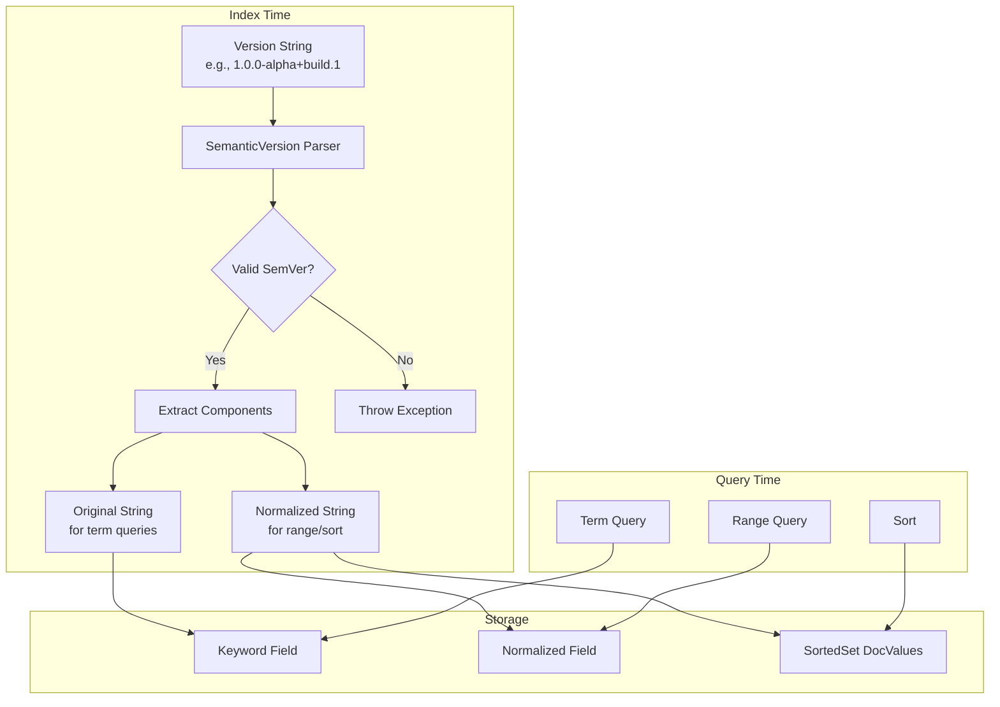
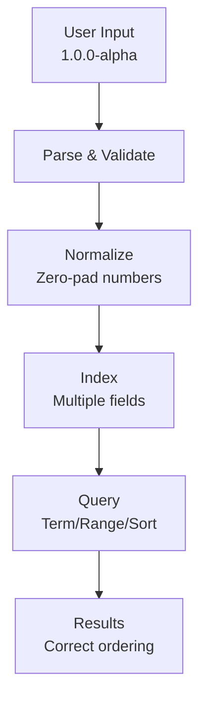

---
tags:
  - indexing
  - ml
  - neural-search
  - search
---

# Semantic Version Field Type

## Summary

The `version` field type in OpenSearch provides native support for indexing and querying semantic version strings following the [SemVer 2.0.0 specification](https://semver.org/). This enables proper version-aware sorting, range queries, and filtering for software version tracking, package management, and release management use cases.

## Details

### Architecture



### Data Flow



### Components

| Component | Description |
|-----------|-------------|
| `SemanticVersion` | Core model class representing a parsed semantic version with major, minor, patch, pre-release, and build metadata |
| `SemanticVersionFieldMapper` | Field mapper that handles document parsing and field creation |
| `SemanticVersionFieldType` | Field type that generates queries for term, range, prefix, wildcard, regex, and fuzzy operations |
| `SemanticVersionFieldMapper.Builder` | Builder for configuring field mapper parameters |

### Configuration

| Setting | Description | Default |
|---------|-------------|---------|
| `type` | Field type identifier | `version` (required) |
| `index` | Whether the field is searchable | `true` |
| `doc_values` | Enable doc values for sorting and aggregations | `true` |
| `store` | Store original value separately for retrieval | `false` |

### Usage Example

**Index Mapping:**
```json
PUT software_releases
{
  "mappings": {
    "properties": {
      "name": { "type": "keyword" },
      "version": { "type": "version" },
      "release_date": { "type": "date" },
      "description": { "type": "text" }
    }
  }
}
```

**Index Documents:**
```json
POST software_releases/_bulk
{ "index": {} }
{ "name": "OpenSearch", "version": "2.0.0", "release_date": "2024-01-01" }
{ "index": {} }
{ "name": "OpenSearch", "version": "2.0.0-rc.1", "release_date": "2023-12-15" }
{ "index": {} }
{ "name": "OpenSearch", "version": "2.0.0-beta", "release_date": "2023-12-01" }
{ "index": {} }
{ "name": "OpenSearch", "version": "2.0.0-alpha", "release_date": "2023-11-15" }
{ "index": {} }
{ "name": "OpenSearch", "version": "1.3.0", "release_date": "2023-06-01" }
```

**Range Query - Find versions between 1.0.0 and 2.0.0:**
```json
GET software_releases/_search
{
  "query": {
    "range": {
      "version": {
        "gte": "1.0.0",
        "lt": "2.0.0"
      }
    }
  }
}
```

**Sort by Version (ascending):**
```json
GET software_releases/_search
{
  "query": { "match_all": {} },
  "sort": [{ "version": { "order": "asc" }}]
}
```

**Result Order:**
```
1.3.0
2.0.0-alpha
2.0.0-beta
2.0.0-rc.1
2.0.0
```

**Term Query - Exact Match:**
```json
GET software_releases/_search
{
  "query": {
    "term": { "version": "2.0.0-beta" }
  }
}
```

**Prefix Query - All 2.x versions:**
```json
GET software_releases/_search
{
  "query": {
    "prefix": { "version": "2." }
  }
}
```

**Wildcard Query:**
```json
GET software_releases/_search
{
  "query": {
    "wildcard": { "version": "2.0.0-*" }
  }
}
```

### Version Format

The field accepts version strings following SemVer 2.0.0:

```
MAJOR.MINOR.PATCH[-PRERELEASE][+BUILD]
```

| Component | Description | Example |
|-----------|-------------|---------|
| MAJOR | Breaking changes | `2` in `2.0.0` |
| MINOR | Backward-compatible features | `1` in `1.1.0` |
| PATCH | Backward-compatible fixes | `3` in `1.0.3` |
| PRERELEASE | Pre-release identifier (optional) | `alpha.1` in `1.0.0-alpha.1` |
| BUILD | Build metadata (optional, ignored for ordering) | `build.123` in `1.0.0+build.123` |

### Version Precedence Rules

1. Compare major, minor, patch as integers
2. Pre-release versions have lower precedence than release versions
3. Pre-release identifiers compared left-to-right:
   - Numeric identifiers compared as integers
   - Alphanumeric identifiers compared lexically
   - Numeric < Alphanumeric
   - Shorter < Longer (when all preceding are equal)
4. Build metadata is ignored for precedence

**Example Ordering (lowest to highest):**
```
1.0.0-alpha
1.0.0-alpha.1
1.0.0-alpha.beta
1.0.0-beta
1.0.0-beta.2
1.0.0-beta.11
1.0.0-rc.1
1.0.0
1.0.0+build.1  (equal to 1.0.0)
1.0.1
1.1.0
2.0.0
```

### Internal Normalization

For correct lexicographical sorting, version numbers are internally normalized:

- Major, minor, patch are zero-padded to 20 digits
- Pre-release versions append `-prerelease` (lowercase)
- Release versions append `~` (sorts after any pre-release)

Example: `1.0.0-alpha` → `00000000000000000001.00000000000000000000.00000000000000000000-alpha`

## Limitations

- Aggregations on version fields are not yet fully supported
- Version strings must strictly conform to SemVer 2.0.0 format
- Leading zeros in numeric identifiers are invalid (e.g., `01.0.0`)
- Maximum version number is limited by integer range

## Change History

- **v3.2.0**: Initial implementation with support for term, range, prefix, wildcard, regex, and fuzzy queries

## Related Features
- [OpenSearch Dashboards](../opensearch-dashboards/ai-chat.md)

## References

### Documentation
- [Semantic Versioning 2.0.0](https://semver.org/): Official SemVer specification
- [SemVer Regex](https://semver.org/#is-there-a-suggested-regular-expression-regex-to-check-a-semver-string): Official regex for validation

### Pull Requests
| Version | PR | Description | Related Issue |
|---------|-----|-------------|---------------|
| v3.2.0 | [#18454](https://github.com/opensearch-project/OpenSearch/pull/18454) | Initial implementation of Semantic Version field type |   |

### Issues (Design / RFC)
- [Issue #16814](https://github.com/opensearch-project/OpenSearch/issues/16814): Original feature request
