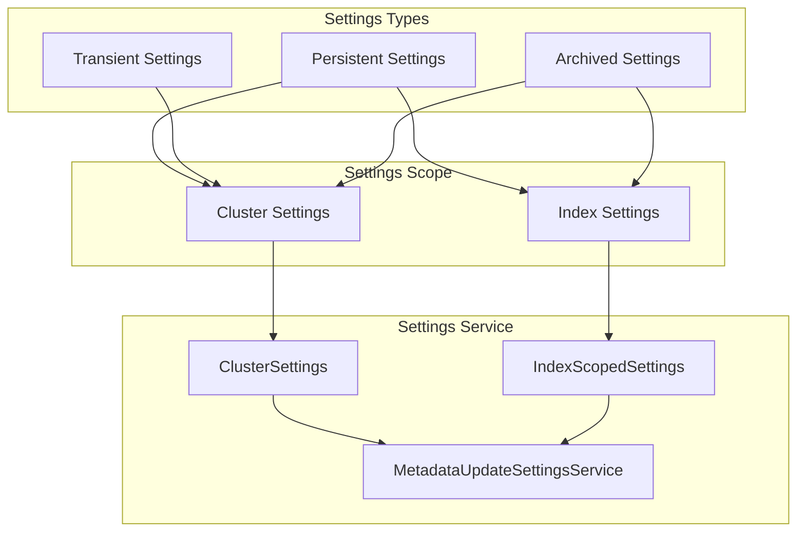
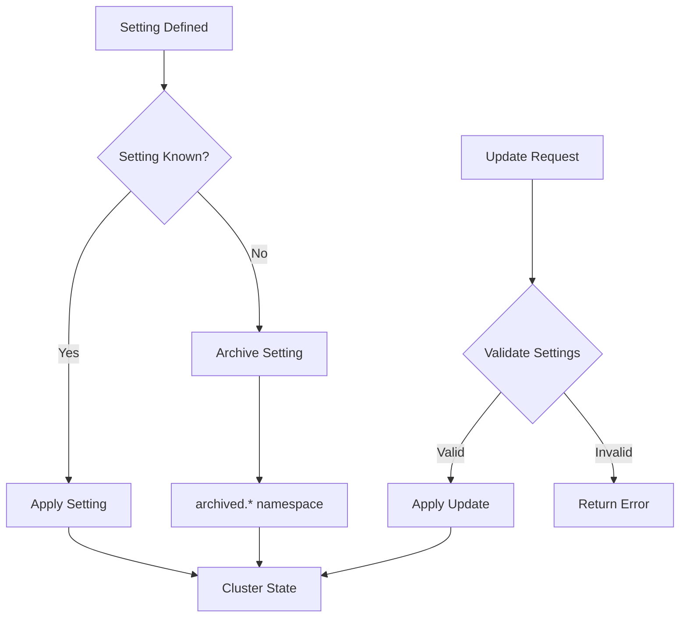

# Settings Management

## Summary

OpenSearch provides a comprehensive settings management system that allows configuration of cluster-level and index-level settings. Settings can be persistent (survive cluster restarts) or transient (reset on restart). When settings become unknown (e.g., after plugin removal), they are moved to an "archived" namespace to preserve data while preventing conflicts.

## Details

### Architecture



### Settings Lifecycle



### Components

| Component | Description |
|-----------|-------------|
| `ClusterSettings` | Manages cluster-level settings validation and updates |
| `IndexScopedSettings` | Manages index-level settings validation and updates |
| `MetadataUpdateSettingsService` | Coordinates settings updates across the cluster |
| `SettingsModule` | Registers and initializes all settings |

### Configuration

| Setting | Description | Default |
|---------|-------------|---------|
| `cluster.max_shards_per_node` | Maximum shards per node | 1000 |
| `cluster.routing.allocation.enable` | Shard allocation mode | `all` |

### Archived Settings

When OpenSearch encounters an unknown setting (e.g., from a removed plugin), it archives the setting by prefixing it with `archived.`. This preserves the setting value while preventing validation errors.

#### Clearing Archived Settings

For cluster settings:
```bash
PUT /_cluster/settings
{
  "persistent": {
    "archived.plugins.some_plugin.setting": null
  }
}
```

For index settings (requires closing the index):
```bash
POST /my-index/_close

PUT /my-index/_settings
{
  "archived.index.some_setting": null
}

POST /my-index/_open
```

### Usage Example

```bash
# Get current cluster settings
GET /_cluster/settings?include_defaults=true

# Update a persistent setting
PUT /_cluster/settings
{
  "persistent": {
    "cluster.max_shards_per_node": 500
  }
}

# Update a transient setting
PUT /_cluster/settings
{
  "transient": {
    "cluster.routing.allocation.enable": "primaries"
  }
}
```

## Limitations

- Some settings are not dynamically updateable and require a node restart
- Archived index settings can only be cleared on closed indices
- Transient settings are lost on cluster restart

## Change History

- **v3.4.0** (2026-01): Fixed duplicate registration of dynamic settings (FieldDataCache, QueryCache) that caused memory issues on cluster manager nodes
- **v3.2.0** (2026-01): Fixed issue where archived settings blocked all settings updates
- **v2.10.0** (2023-08): Added support to clear archived index settings on closed indices

## References

### Documentation
- [Cluster Settings API](https://docs.opensearch.org/3.0/api-reference/cluster-api/cluster-settings/): Official API documentation
- [Configuring OpenSearch](https://docs.opensearch.org/3.0/install-and-configure/configuring-opensearch/): Configuration guide

### Pull Requests
| Version | PR | Description | Related Issue |
|---------|-----|-------------|---------------|
| v3.4.0 | [#20140](https://github.com/opensearch-project/OpenSearch/pull/20140) | Fix duplicate registration of FieldDataCache dynamic setting |   |
| v3.2.0 | [#18885](https://github.com/opensearch-project/OpenSearch/pull/18885) | Ignore archived settings on update | [#8714](https://github.com/opensearch-project/OpenSearch/issues/8714) |
| v2.10.0 | [#9019](https://github.com/opensearch-project/OpenSearch/pull/9019) | Add support to clear archived index settings | [#2803](https://github.com/opensearch-project/OpenSearch/issues/2803) |

### Issues (Design / RFC)
- [Issue #8714](https://github.com/opensearch-project/OpenSearch/issues/8714): Unable to change any cluster setting with archived settings
- [Issue #18515](https://github.com/opensearch-project/OpenSearch/issues/18515): Cannot update cluster settings after upgrading to 3.0.0
