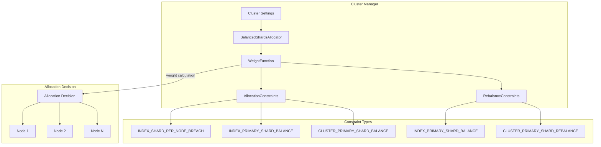

# Shard Allocation

## Summary

Shard allocation in OpenSearch determines how shards are distributed across cluster nodes. The `BalancedShardsAllocator` uses a `WeightFunction` to calculate optimal node weights based on configurable balance factors. This feature includes settings for primary shard balancing, which helps distribute primary shards evenly across nodes for better performance and fault tolerance.

## Details

### Architecture



### Weight Calculation

The `WeightFunction` calculates node weights using the formula:

```
weight(node, index) = θ₀ × (node.numShards - avgShardsPerNode) 
                    + θ₁ × (node.numShards(index) - avgShardsPerNode(index))
```

Where:
- `θ₀ = shardBalance / (indexBalance + shardBalance)`
- `θ₁ = indexBalance / (indexBalance + shardBalance)`

### Components

| Component | Description |
|-----------|-------------|
| `BalancedShardsAllocator` | Main allocator that orchestrates shard distribution |
| `WeightFunction` | Calculates node weights for allocation decisions |
| `AllocationConstraints` | Constraints applied during initial shard allocation |
| `RebalanceConstraints` | Constraints applied during shard rebalancing |
| `LocalShardsBalancer` | Performs actual allocation and rebalancing operations |

### Configuration

| Setting | Description | Default |
|---------|-------------|---------|
| `cluster.routing.allocation.balance.shard` | Weight factor for total shards per node | `0.45` |
| `cluster.routing.allocation.balance.index` | Weight factor for shards per index per node | `0.55` |
| `cluster.routing.allocation.balance.threshold` | Minimum optimization value for operations | `1.0` |
| `cluster.routing.allocation.balance.prefer_primary` | Enable primary shard balancing | `false` |
| `cluster.routing.allocation.rebalance.primary.enable` | Enable primary shard rebalancing | `false` |
| `cluster.routing.allocation.rebalance.primary.buffer` | Buffer for primary shard rebalancing | `0.10` |
| `cluster.routing.allocation.primary_constraint.threshold` | Threshold for primary constraint | `10` |

### Usage Example

Enable primary shard balancing for segment replication workloads:

```json
PUT /_cluster/settings
{
  "persistent": {
    "cluster.routing.allocation.balance.prefer_primary": true,
    "cluster.routing.allocation.rebalance.primary.enable": true,
    "cluster.routing.allocation.rebalance.primary.buffer": 0.10
  }
}
```

Adjust balance factors for specific workloads:

```json
PUT /_cluster/settings
{
  "persistent": {
    "cluster.routing.allocation.balance.shard": 0.50,
    "cluster.routing.allocation.balance.index": 0.50
  }
}
```

## Limitations

- Primary shard balancing is best-effort and may not achieve perfect distribution in all scenarios
- Enabling primary shard balance does not guarantee equal primary shards on each node, especially during failover
- Changing `prefer_primary` to `false` after enabling does not trigger redistribution

## Related PRs

| Version | PR | Description |
|---------|-----|-------------|
| v3.4.0 | [#19012](https://github.com/opensearch-project/OpenSearch/pull/19012) | Fix WeightFunction constraint reset bug |

## References

- [Issue #13429](https://github.com/opensearch-project/OpenSearch/issues/13429): Bug report for constraint reset issue
- [Cluster Settings Documentation](https://docs.opensearch.org/3.0/install-and-configure/configuring-opensearch/cluster-settings/): Official cluster routing allocation settings
- [Segment Replication Documentation](https://docs.opensearch.org/3.0/tuning-your-cluster/availability-and-recovery/segment-replication/index/): Recommended settings for segment replication

## Change History

- **v3.4.0** (2025-10-10): Fixed bug where allocation and rebalance constraints were incorrectly reset when updating balance factors
