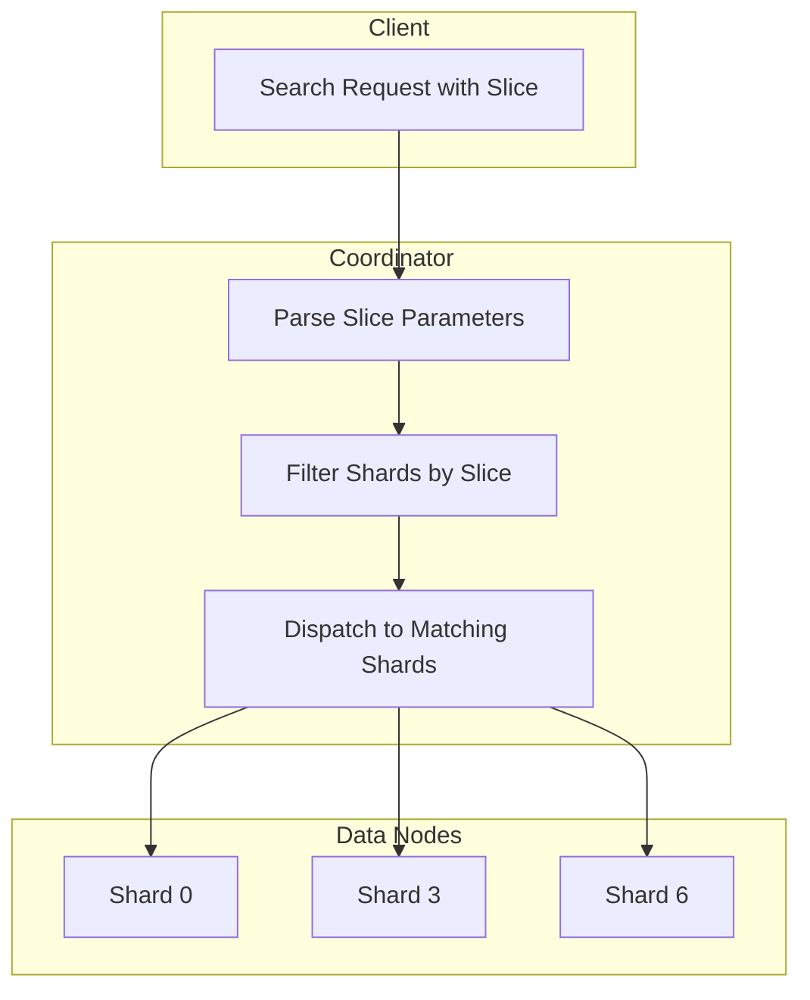

---
tags:
  - opensearch
---
# Sliced Search Optimization

## Summary

Sliced search optimization improves the efficiency of parallel scroll operations by filtering shards at the coordinator level before fanning out requests. This reduces the number of open scroll contexts and prevents resource exhaustion during large-scale data operations like `delete_by_query` or `update_by_query` with multiple slices.

## Details

### Architecture



### How Sliced Search Works

Sliced scroll allows parallel processing of large result sets by dividing the work across multiple slices. Each slice targets a subset of shards based on a deterministic mapping:

```json
GET index/_search?scroll=10m
{
  "slice": {
    "id": 0,
    "max": 3
  },
  "query": {
    "match_all": {}
  }
}
```

### Slice-to-Shard Mapping

The mapping between slices and shards depends on the relationship between `max` (number of slices) and `numShards`:

| Condition | Mapping Logic |
|-----------|---------------|
| `max >= numShards` | Slices distributed over shards: `id % numShards == shardOrdinal` |
| `max < numShards` | Shards distributed over slices: `shardOrdinal % max == id` |

### Configuration

No additional configuration is required. The optimization is automatically applied when using sliced scroll searches.

### Usage Example

Preview which shards will be targeted for a slice:

```json
GET test_index/_search_shards
{
  "slice": {
    "id": 0,
    "max": 3
  }
}
```

Response shows only the shards that will be queried:

```json
{
  "shards": [
    [{"index": "test_index", "shard": 0, ...}],
    [{"index": "test_index", "shard": 3, ...}],
    [{"index": "test_index", "shard": 6, ...}]
  ]
}
```

### Components

| Component | Description |
|-----------|-------------|
| `SliceBuilder` | Builds slice configuration and determines shard matching |
| `OperationRouting` | Routes search operations to appropriate shards with slice filtering |
| `ClusterSearchShardsRequest` | Extended to support slice parameters |
| `RestClusterSearchShardsAction` | Parses slice from request body |

## Limitations

- Sliced scroll is designed for batch processing, not real-time user queries
- The default limit of 500 open scroll contexts per node still applies
- Custom routing may affect slice-to-shard distribution
- Sliced scroll maintains approximate point-in-time consistency across shards

## Change History

- **v2.19.0** (2025-01-14): Coordinator-level shard filtering to reduce scroll contexts ([#16771](https://github.com/opensearch-project/OpenSearch/pull/16771))

## References

### Documentation

- [Scroll API](https://docs.opensearch.org/latest/api-reference/scroll/)
- [Paginate Results](https://docs.opensearch.org/latest/search-plugins/searching-data/paginate/)

### Pull Requests

| Version | PR | Description |
|---------|-----|-------------|
| v2.19.0 | [#16771](https://github.com/opensearch-project/OpenSearch/pull/16771) | Filter shards for sliced search at coordinator |

### Related Issues

- [#16289](https://github.com/opensearch-project/OpenSearch/issues/16289) - delete_by_query with slices creates too many scroll contexts
