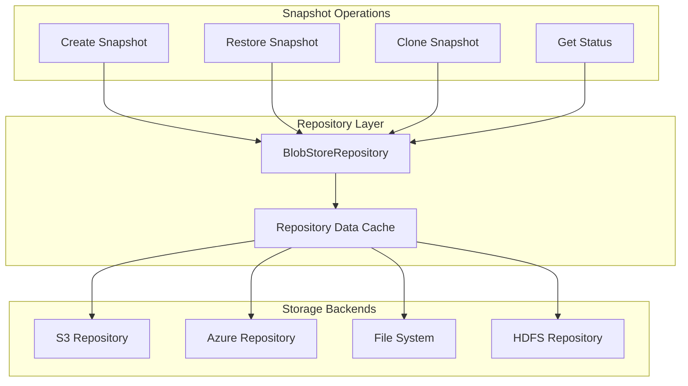

---
tags:
  - opensearch
---
# Snapshot Repository

## Summary

Snapshot repositories in OpenSearch provide storage locations for snapshots, supporting various backends including S3, Azure, GCS, HDFS, and shared file systems. The repository system includes caching mechanisms for repository metadata and supports both full remote store configurations and remote publication-only setups.

## Details

### Architecture



### Repository Data Cache

The repository data cache stores compressed repository metadata to avoid repeated downloads during snapshot operations.

#### Configuration

| Setting | Description | Default | Type |
|---------|-------------|---------|------|
| `snapshot.repository_data.cache.threshold` | Maximum cache size as absolute value or heap percentage | 1% of heap (min 500KB) | Static |

#### Cache Behavior

- Data is compressed using DEFLATE before caching
- Cache uses `SoftReference` for automatic memory management under heap pressure
- Cache is bypassed when data exceeds the configured threshold
- Warning logged when repository metadata exceeds 10x the threshold

### Remote Repository Configuration

OpenSearch supports two configuration prefixes for remote repositories:

| Prefix | Purpose | Required Repositories |
|--------|---------|----------------------|
| `remote_store` | Full remote store | Segment, Translog, Cluster State |
| `remote_publication` | Remote publication only | Cluster State, Routing Table |

#### Node Attributes

```yaml
# Full remote store configuration
node.attr.remote_store.segment.repository: my-segment-repo
node.attr.remote_store.translog.repository: my-translog-repo
node.attr.remote_store.state.repository: my-state-repo

# Remote publication only configuration
node.attr.remote_publication.state.repository: my-state-repo
node.attr.remote_publication.routing_table.repository: my-routing-repo
```

### Repository Types

| Type | Plugin | Use Case |
|------|--------|----------|
| `fs` | Built-in | Shared file system |
| `s3` | repository-s3 | Amazon S3 |
| `azure` | repository-azure | Azure Blob Storage |
| `gcs` | repository-gcs | Google Cloud Storage |
| `hdfs` | repository-hdfs | Hadoop HDFS |

## Limitations

- Cache threshold setting is static (requires node restart)
- SoftReference eviction timing depends on JVM garbage collection
- Repository metadata size grows with number of snapshots
- Large repositories (>5MB metadata) may experience performance degradation

## Change History

- **v2.19.0** (2025-01-14): Added vertical scaling with configurable cache threshold and SoftReference; introduced `remote_publication` prefix for remote repository attributes
- **v1.0.0**: Initial snapshot repository implementation

## References

### Documentation

- [Register Snapshot Repository](https://docs.opensearch.org/latest/api-reference/snapshots/create-repository/)
- [Get Snapshot Repository](https://docs.opensearch.org/latest/api-reference/snapshots/get-snapshot-repository/)
- [Cleanup Snapshot Repository](https://docs.opensearch.org/latest/api-reference/snapshots/cleanup-snapshot-repository/)

### Pull Requests

| Version | PR | Description |
|---------|-----|-------------|
| v2.19.0 | [#16489](https://github.com/opensearch-project/OpenSearch/pull/16489) | Add vertical scaling and SoftReference for snapshot repository data cache |
| v2.19.0 | [#16271](https://github.com/opensearch-project/OpenSearch/pull/16271) | Support prefix list for remote repository attributes |

### Related Issues

- [#16298](https://github.com/opensearch-project/OpenSearch/issues/16298) - Support vertical scaling for snapshot repository data cache limit
- [#16390](https://github.com/opensearch-project/OpenSearch/issues/16390) - Introduce a new prefix for configuring remote publication repositories
