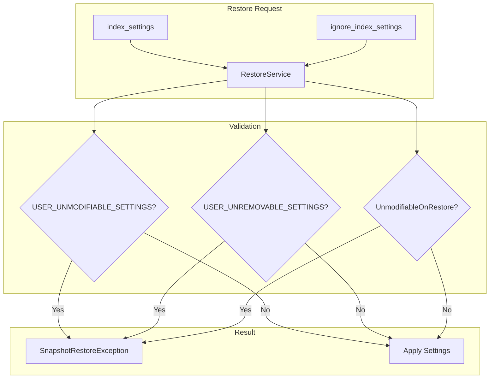

---
tags:
  - opensearch
---
# Snapshot Restore Settings

## Summary

OpenSearch provides mechanisms to control which index settings can be modified or removed during snapshot restore operations. This includes built-in protection for critical settings and an extensible `UnmodifiableOnRestore` property that plugins can use to protect their own settings.

## Details

### Architecture



### Setting Protection Categories

| Category | Can Modify | Can Remove | Examples |
|----------|-----------|------------|----------|
| `USER_UNMODIFIABLE_SETTINGS` | No | No | `index.uuid`, `index.creation_date`, `index.remote_store.enabled` |
| `USER_UNREMOVABLE_SETTINGS` | Yes | No | `index.number_of_replicas`, `index.auto_expand_replicas` |
| `UnmodifiableOnRestore` | No | No | `index.number_of_shards`, `index.version.created` |

### UnmodifiableOnRestore Property

The `UnmodifiableOnRestore` property can be applied to any index-scoped setting to prevent modification during restore:

```java
Setting.intSetting(
    SETTING_NUMBER_OF_SHARDS,
    defaultNumShards,
    1,
    maxNumShards,
    Property.IndexScope,
    Property.Final,
    Property.UnmodifiableOnRestore
);
```

#### Constraints

- Must have `Property.IndexScope`
- Cannot have `Property.Dynamic`
- Validated at setting registration time

### Configuration

#### Restore API Parameters

| Parameter | Description |
|-----------|-------------|
| `index_settings` | Settings to override during restore |
| `ignore_index_settings` | Settings to ignore (use cluster defaults) |

#### Example Restore Request

```json
POST /_snapshot/my-repository/snapshot-1/_restore
{
  "indices": "my-index",
  "index_settings": {
    "index.number_of_replicas": 2
  },
  "ignore_index_settings": [
    "index.refresh_interval"
  ]
}
```

### Protected Settings Reference

#### Always Protected (Cannot Modify or Remove)

- `index.uuid`
- `index.creation_date`
- `index.history_uuid`
- `index.remote_store.enabled`
- `index.remote_store.segment.repository`
- `index.remote_store.translog.repository`
- `index.number_of_shards` (UnmodifiableOnRestore)
- `index.version.created` (UnmodifiableOnRestore)

#### Cannot Remove Only

- `index.number_of_replicas`
- `index.auto_expand_replicas`
- `index.number_of_search_only_replicas`

## Limitations

- Settings protection only applies during snapshot restore operations
- Does not affect index creation or update settings API
- Plugin settings must explicitly add `UnmodifiableOnRestore` property

## Change History

- **v2.19.0** (2025-01-24): Added `UnmodifiableOnRestore` setting property for extensible setting protection during restore

## References

### Documentation

- [Snapshot Restore Documentation](https://docs.opensearch.org/latest/tuning-your-cluster/availability-and-recovery/snapshots/snapshot-restore/)
- [Restore Snapshot API](https://docs.opensearch.org/latest/api-reference/snapshots/restore-snapshot/)

### Pull Requests

| Version | PR | Description |
|---------|-----|-------------|
| v2.19.0 | [#16957](https://github.com/opensearch-project/OpenSearch/pull/16957) | Added new Setting property UnmodifiableOnRestore to prevent updating settings on restore snapshot |
