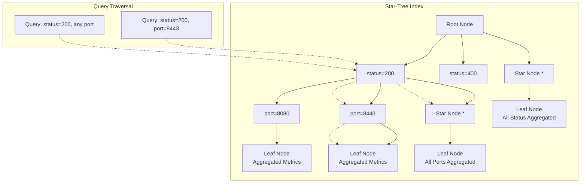
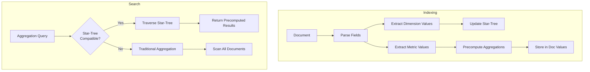

# Star Tree Index

## Summary

Star-tree index is a multi-field index in OpenSearch designed to accelerate aggregation queries. Inspired by Apache Pinot, it precomputes aggregations during indexing, storing results in a tree structure that enables sub-millisecond query latency even on datasets with hundreds of millions of documents. Star-tree index is particularly beneficial for dashboards, real-time analytics, and observability use cases where aggregation performance is critical.

## Details

### Architecture



### Data Flow



### Components

| Component | Description |
|-----------|-------------|
| Star-Tree Structure | Hierarchical tree organizing dimension values with star nodes for aggregation |
| Leaf Nodes | Store precomputed aggregation results for dimension combinations |
| Star Nodes | Represent aggregated values across all values of a dimension |
| Doc Values | Columnar storage for preaggregated metrics |
| Filter Providers | Convert queries to star-tree traversal filters |
| Aggregators | Resolve aggregations using star-tree data |

### Configuration

| Setting | Description | Default |
|---------|-------------|---------|
| `index.composite_index` | Enable composite index support | `false` |
| `index.append_only.enabled` | Required for star-tree (immutable data) | `false` |
| `indices.composite_index.star_tree.enabled` | Enable star-tree search optimization | `true` |
| `max_leaf_docs` | Maximum documents per leaf node | `10000` |
| `skip_star_node_creation_for_dimensions` | Dimensions to skip star node creation | `[]` |

### Supported Features

#### Queries (as of v3.0.0)
- Term query
- Terms query
- Range query
- Match all docs query
- Boolean query (MUST, FILTER, SHOULD clauses)

#### Aggregations (as of v3.0.0)
- Metric aggregations: sum, min, max, avg, value_count
- Date histogram with metric sub-aggregations
- Terms aggregations (keyword and numeric)
- Range aggregations with metric sub-aggregations

### Usage Example

```yaml
# Index mapping with star-tree configuration
PUT logs
{
  "settings": {
    "index.number_of_shards": 1,
    "index.composite_index": true,
    "index.append_only.enabled": true
  },
  "mappings": {
    "composite": {
      "request_aggs": {
        "type": "star_tree",
        "config": {
          "date_dimension": {
            "name": "@timestamp",
            "calendar_intervals": ["month", "day"]
          },
          "ordered_dimensions": [
            { "name": "status" },
            { "name": "port" },
            { "name": "method" }
          ],
          "metrics": [
            { "name": "size", "stats": ["sum", "avg"] },
            { "name": "latency", "stats": ["avg", "max", "min"] }
          ]
        }
      }
    },
    "properties": {
      "status": { "type": "integer" },
      "port": { "type": "integer" },
      "method": { "type": "keyword" },
      "size": { "type": "integer" },
      "latency": { "type": "scaled_float", "scaling_factor": 10 }
    }
  }
}
```

```json
// Query automatically uses star-tree when eligible
POST /logs/_search
{
  "size": 0,
  "query": {
    "term": { "status": 200 }
  },
  "aggs": {
    "avg_latency": { "avg": { "field": "latency" } },
    "total_size": { "sum": { "field": "size" } }
  }
}
```

## Limitations

- Only suitable for immutable datasets (updates/deletions not reflected)
- Cannot be removed once created; requires reindex to disable
- High cardinality dimensions increase storage and query latency
- Multi-values/array values not supported
- Date field queries not yet supported
- Boolean `must_not` clauses not supported
- `minimum_should_match` parameter not supported

## Related PRs

| Version | PR | Description |
|---------|-----|-------------|
| v3.0.0 | [#17941](https://github.com/opensearch-project/OpenSearch/pull/17941) | Boolean query support |
| v3.0.0 | [#17275](https://github.com/opensearch-project/OpenSearch/pull/17275) | Unsigned-long query support |
| v3.0.0 | [#17273](https://github.com/opensearch-project/OpenSearch/pull/17273) | Range aggregations |
| v3.0.0 | [#17165](https://github.com/opensearch-project/OpenSearch/pull/17165) | Terms aggregations (keyword/numeric) |
| v2.18 | Initial | Experimental release with metric aggregations |

## References

- [Issue #16551](https://github.com/opensearch-project/OpenSearch/issues/16551): Bucket terms aggregation feature request
- [Issue #16553](https://github.com/opensearch-project/OpenSearch/issues/16553): Range aggregations feature request
- [Issue #15231](https://github.com/opensearch-project/OpenSearch/issues/15231): Unsigned long support
- [Issue #17267](https://github.com/opensearch-project/OpenSearch/issues/17267): Boolean query support
- [Issue #15257](https://github.com/opensearch-project/OpenSearch/issues/15257): Star-tree tracking issue
- [Documentation](https://docs.opensearch.org/3.0/search-plugins/star-tree-index/): Official star-tree index documentation
- [Field Type Documentation](https://docs.opensearch.org/3.0/field-types/supported-field-types/star-tree/): Star-tree field type reference
- [Blog: The power of star-tree indexes](https://opensearch.org/blog/the-power-of-star-tree-indexes-supercharging-opensearch-aggregations/): Performance analysis and use cases

## Change History

- **v3.0.0** (2025-05-12): Added boolean query support, terms aggregations, range aggregations, unsigned-long support
- **v2.19** (2024-12-10): Added date histogram aggregations, term/terms/range query support
- **v2.18** (2024-10-22): Initial experimental release with metric aggregations (sum, min, max, avg, value_count)
