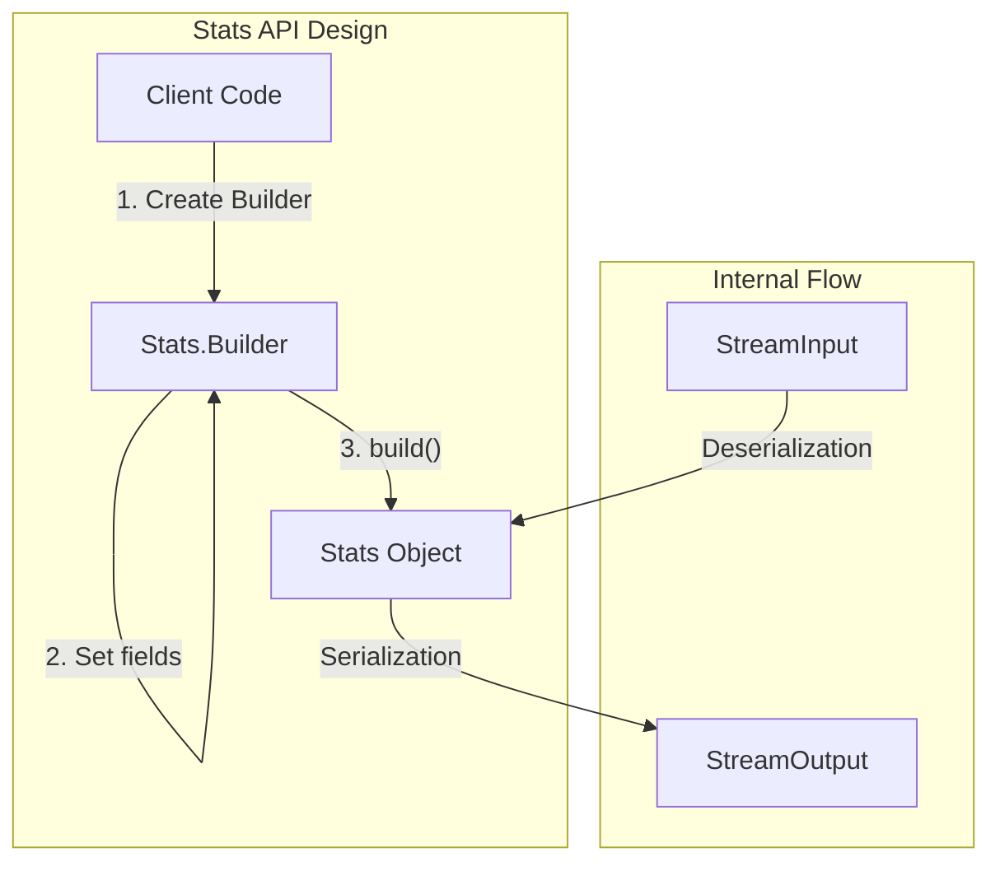
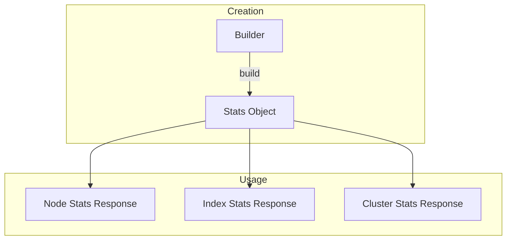

# Stats Builder Pattern

## Summary

OpenSearch Stats API classes use the Builder pattern for object construction, replacing traditional multi-parameter constructors. This design pattern improves API evolvability by allowing new metrics to be added without breaking backward compatibility, and provides a more readable, fluent API for creating stats objects.

## Details

### Architecture



### Data Flow



### Components

| Component | Description |
|-----------|-------------|
| `Stats` | Immutable data class holding metric values |
| `Stats.Builder` | Fluent builder for constructing Stats objects |
| `StreamInput/Output` | Serialization for cluster communication |

### Affected Stats Classes

| Category | Classes |
|----------|---------|
| Index Stats | `IndexingStats.Stats`, `RefreshStats`, `DocStats`, `StoreStats`, `GetStats`, `FlushStats` |
| Cache Stats | `QueryCacheStats`, `FieldDataStats`, `CompletionStats`, `RequestCacheStats`, `Cache.CacheStats` |
| Thread/Transport | `ThreadPoolStats.Stats`, `TransportStats`, `HttpStats` |
| Remote Store | `RemoteTranslogTransferTracker.Stats`, `RemoteSegmentTransferTracker.Stats` |
| System Stats | `OsStats`, `ScriptStats`, `AdaptiveSelectionStats` |
| Shard Stats | `ShardStats`, `WarmerStats`, `IndexingPressureStats`, `IndexPressureStats` |
| Other | `TranslogStats`, `Condition.Stats`, `DirectoryFileTransferTracker.Stats`, `DeviceStats` |

### Usage Example

```java
// Create IndexingStats using Builder pattern
IndexingStats.Stats stats = new IndexingStats.Stats.Builder()
    .indexCount(1000)
    .indexTimeInMillis(5000)
    .indexCurrent(5)
    .indexFailedCount(2)
    .deleteCount(100)
    .deleteTimeInMillis(500)
    .deleteCurrent(1)
    .noopUpdateCount(10)
    .isThrottled(false)
    .throttleTimeInMillis(0)
    .docStatusStats(new DocStatusStats())
    .maxLastIndexRequestTimestamp(System.currentTimeMillis())
    .build();

// Create ThreadPoolStats using Builder pattern
ThreadPoolStats.Stats threadStats = new ThreadPoolStats.Stats.Builder()
    .name("search")
    .threads(10)
    .queue(5)
    .active(3)
    .rejected(0)
    .largest(15)
    .completed(1000)
    .build();
```

### Benefits

1. **Backward Compatibility**: New fields can be added with default values without breaking existing code
2. **Readability**: Named parameters make code self-documenting
3. **Flexibility**: Optional fields can be omitted, using defaults
4. **Immutability**: Stats objects remain immutable after construction
5. **Validation**: Builder can validate field combinations before construction

## Limitations

- Slightly more verbose than constructor calls for simple cases
- Requires migration from deprecated constructors before next major version

## Change History

- **v3.4.0** (2026-01-11): Initial implementation - deprecated constructors in 30+ Stats classes in favor of Builder pattern

## References

### Pull Requests
| Version | PR | Description | Related Issue |
|---------|-----|-------------|---------------|
| v3.4.0 | [#19317](https://github.com/opensearch-project/OpenSearch/pull/19317) | ThreadPoolStats.Stats Builder | [#19225](https://github.com/opensearch-project/OpenSearch/issues/19225) |
| v3.4.0 | [#19306](https://github.com/opensearch-project/OpenSearch/pull/19306) | IndexingStats.Stats Builder | [#19225](https://github.com/opensearch-project/OpenSearch/issues/19225) |
| v3.4.0 | [#19835](https://github.com/opensearch-project/OpenSearch/pull/19835) | RefreshStats Builder |   |
| v3.4.0 | [#19863](https://github.com/opensearch-project/OpenSearch/pull/19863) | DocStats and StoreStats Builder |   |
| v3.4.0 | [#19862](https://github.com/opensearch-project/OpenSearch/pull/19862) | Condition.Stats and DirectoryFileTransferTracker.Stats Builder |   |
| v3.4.0 | [#19837](https://github.com/opensearch-project/OpenSearch/pull/19837) | RemoteTranslogTransferTracker.Stats and RemoteSegmentTransferTracker.Stats Builder |   |
| v3.4.0 | [#19935](https://github.com/opensearch-project/OpenSearch/pull/19935) | GetStats, FlushStats and QueryCacheStats Builder |   |
| v3.4.0 | [#19936](https://github.com/opensearch-project/OpenSearch/pull/19936) | FieldDataStats and CompletionStats Builder |   |
| v3.4.0 | [#19961](https://github.com/opensearch-project/OpenSearch/pull/19961) | TranslogStats and RequestCacheStats Builder |   |
| v3.4.0 | [#19991](https://github.com/opensearch-project/OpenSearch/pull/19991) | IndexPressureStats, DeviceStats and TransportStats Builder |   |
| v3.4.0 | [#20015](https://github.com/opensearch-project/OpenSearch/pull/20015) | Cache.CacheStats Builder |   |
| v3.4.0 | [#20014](https://github.com/opensearch-project/OpenSearch/pull/20014) | HttpStats, ScriptStats, AdaptiveSelectionStats and OsStats Builder |   |
| v3.4.0 | [#19966](https://github.com/opensearch-project/OpenSearch/pull/19966) | ShardStats, WarmerStats and IndexingPressureStats Builder |   |

### Issues (Design / RFC)
- [Issue #19225](https://github.com/opensearch-project/OpenSearch/issues/19225): Use Builder pattern instead of constructors for Stats API classes
- [Issue #18723](https://github.com/opensearch-project/OpenSearch/issues/18723): Related SearchStats refactoring
