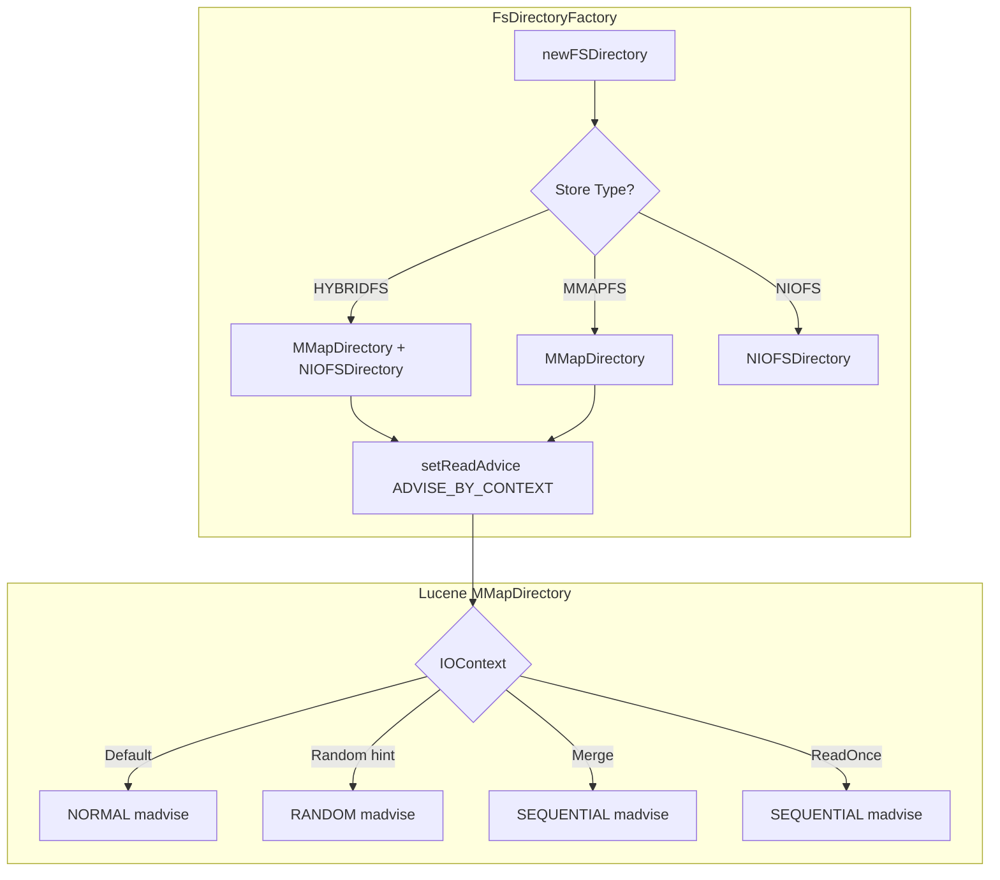

---
tags:
  - opensearch
---
# Storage & I/O Optimization

## Summary

OpenSearch configures Lucene's `MMapDirectory` to use context-aware read advice (`ADVISE_BY_CONTEXT`), ensuring that memory-mapped file I/O operations use the appropriate `madvise` hint based on the access pattern described by the `IOContext`. This improves performance for workloads with mixed access patterns, such as vector search (random access) and merges (sequential access).

## Details

### Architecture

### Components

| Component | Description |
|-----------|-------------|
| `FsDirectoryFactory` | Factory class that creates filesystem-backed Lucene directories for OpenSearch index shards |
| `MMapDirectory` | Lucene directory implementation using memory-mapped files (`mmap`) |
| `ADVISE_BY_CONTEXT` | A `BiFunction<String, IOContext, Optional<ReadAdvice>>` that extracts read advice from the `IOContext` |
| `IOContext` | Lucene context object carrying hints about the intended access pattern for a file operation |

### How It Works

By default, Lucene's `MMapDirectory` (since 10.3.0) uses a fixed read advice for all files, ignoring the `IOContext`. When `ADVISE_BY_CONTEXT` is set via `setReadAdvice()`, the directory delegates read advice selection to the `IOContext` provided at file open time. This translates to appropriate `madvise` system calls on Linux:

| IOContext | Read Advice | madvise | Use Case |
|-----------|-------------|---------|----------|
| `DEFAULT` | `NORMAL` | `MADV_NORMAL` | General reads |
| `READONCE` | `SEQUENTIAL` | `MADV_SEQUENTIAL` | One-time sequential reads |
| `merge(...)` | `SEQUENTIAL` | `MADV_SEQUENTIAL` | Segment merges |
| `withHints(RANDOM)` | `RANDOM` | `MADV_RANDOM` | Vector files, stored fields |

## Limitations

- Only applies to `mmapfs` and `hybridfs` store types
- No user-facing configuration — the behavior is always enabled
- Effectiveness depends on the OS kernel's `madvise` implementation

## Change History

- **v3.6.0**: Configured `MMapDirectory` to use `ADVISE_BY_CONTEXT`, restoring context-aware read advice lost after the Lucene 10.3.0 upgrade

## References

### Pull Requests
| Version | PR | Description |
|---------|-----|-------------|
| v3.6.0 | `https://github.com/opensearch-project/OpenSearch/pull/21031` | Updated MMapDirectory to use ReadAdviseByContext |
| v3.6.0 | `https://github.com/opensearch-project/OpenSearch/pull/21062` | Backport to 3.6 branch |

### Issues
| Issue | Description |
|-------|-------------|
| `https://github.com/opensearch-project/OpenSearch/issues/21012` | Discussion: Use Advise by Context to ensure IOContext is honored during file read in MMapDirectory |

### Related
- Lucene change: `https://github.com/apache/lucene/pull/15040`
