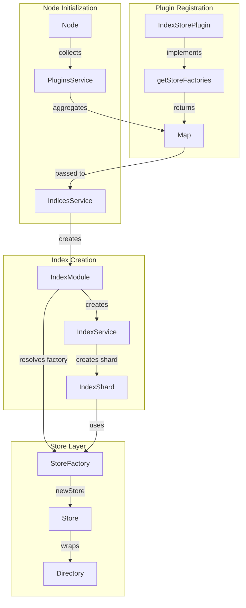
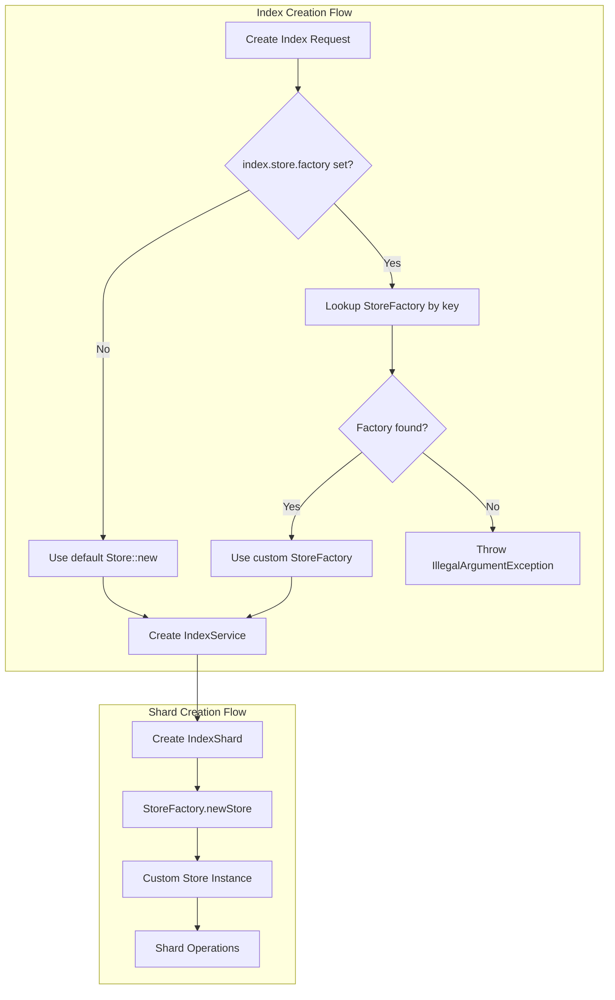

# Store Factory

## Summary

Store Factory is an extensibility feature that enables OpenSearch plugins to provide custom `Store` implementations per index. The `Store` class is responsible for managing the Lucene directory and file operations for each shard. By making Store pluggable, plugins can customize how shard data is stored, managed, and recovered.

This feature addresses the limitation that OpenSearch's Store assumes all files are in a flat `index` directory. With Store Factory, plugins can implement stores that handle files in subdirectories, use custom storage backends, or add specialized file handling logic.

## Details

### Architecture



### Data Flow



### Components

| Component | Description |
|-----------|-------------|
| `IndexStorePlugin` | Plugin interface extended with store factory support |
| `IndexStorePlugin.StoreFactory` | Functional interface for creating Store instances |
| `IndexModule` | Resolves and passes store factory to IndexService |
| `IndexService` | Uses store factory when creating shards |
| `IndicesService` | Aggregates store factories from all plugins |
| `Node` | Collects store factories during initialization |

### Configuration

| Setting | Description | Default | Scope |
|---------|-------------|---------|-------|
| `index.store.factory` | Key identifying the StoreFactory to use | `""` (empty) | Index, Node |

When empty or not set, the default `Store` implementation is used.

### StoreFactory Interface

```java
@FunctionalInterface
@ExperimentalApi
interface StoreFactory {
    Store newStore(
        ShardId shardId,
        IndexSettings indexSettings,
        Directory directory,
        ShardLock shardLock,
        Store.OnClose onClose,
        ShardPath shardPath
    ) throws IOException;
}
```

### Public APIs for Plugin Developers

| Class | Description |
|-------|-------------|
| `Store.MetadataSnapshot.LoadedMetadata` | Container for file metadata, user data, and document count |
| `Store.OnClose` | Callback interface invoked when store is closed |

### Usage Example

#### Plugin Implementation

```java
public class CustomStorePlugin extends Plugin implements IndexStorePlugin {
    
    @Override
    public Map<String, StoreFactory> getStoreFactories() {
        return Collections.singletonMap("custom_store", 
            (shardId, indexSettings, directory, shardLock, onClose, shardPath) -> 
                new CustomStore(shardId, indexSettings, directory, shardLock, onClose, shardPath)
        );
    }
}
```

#### Index Configuration

```json
PUT /my-index
{
  "settings": {
    "index.store.factory": "custom_store"
  }
}
```

### Built-in Implementations

| Factory Key | Module | Description |
|-------------|--------|-------------|
| `subdirectory_store` | store-subdirectory | Handles files in subdirectories with peer recovery support |

## Limitations

- The `StoreFactory` interface is marked as `@ExperimentalApi` and may change in future versions
- Store factory selection is immutable after index creation
- Custom stores must implement all Store methods correctly for proper operation
- Recovery operations depend on correct metadata handling in custom stores
- Only one store factory can be active per index

## Related PRs

| Version | PR | Description |
|---------|-----|-------------|
| v3.3.0 | [#19091](https://github.com/opensearch-project/OpenSearch/pull/19091) | Add StoreFactory plugin interface for custom Store implementations |
| v3.3.0 | [#19132](https://github.com/opensearch-project/OpenSearch/pull/19132) | Add subdirectory-aware store module (first implementation using StoreFactory) |

## References

- [Issue #19090](https://github.com/opensearch-project/OpenSearch/issues/19090): Feature request for custom Store implementations through plugin
- [Issue #19131](https://github.com/opensearch-project/OpenSearch/issues/19131): Store module/plugin to handle subdirectory copying during recovery
- [Store Subdirectory Module](store-subdirectory-module.md): First implementation using StoreFactory

## Change History

- **v3.3.0** (2026-01-11): Initial implementation with StoreFactory interface, index.store.factory setting, and public API exposure for Store.LoadedMetadata and Store.OnClose
