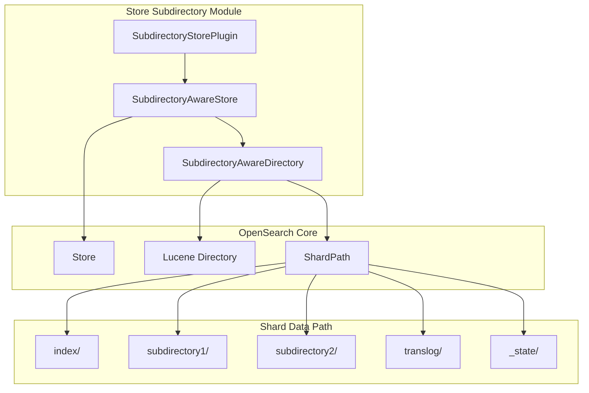
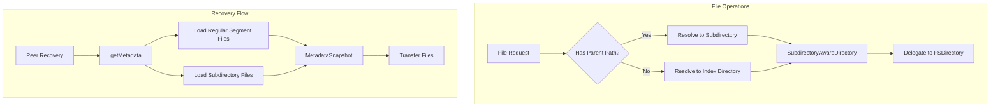

# Store Subdirectory Module

## Summary

The Store Subdirectory Module (`store-subdirectory`) is an OpenSearch module that enables handling files organized in subdirectories within shard data paths. It extends the standard OpenSearch Store to support peer recovery operations for files located in nested directories, ensuring subdirectory files are properly transferred between nodes during recovery.

This module is useful for plugins or features that need to store additional data files in subdirectories alongside the standard Lucene index files.

## Details

### Architecture



### Data Flow



### Components

| Component | Description |
|-----------|-------------|
| `SubdirectoryStorePlugin` | Plugin entry point that registers the custom store factory |
| `SubdirectoryAwareStore` | Extended Store implementation that handles subdirectory file operations |
| `SubdirectoryAwareDirectory` | FilterDirectory wrapper that routes file operations to appropriate paths |
| `SubdirectoryStoreFactory` | Factory for creating SubdirectoryAwareStore instances |

### Configuration

The module is enabled by setting the index store type:

| Setting | Description | Default |
|---------|-------------|---------|
| `index.store.type` | Set to `subdirectory` to enable the module | `fs` |

### Usage Example

```json
PUT /my-index
{
  "settings": {
    "index": {
      "store": {
        "type": "subdirectory"
      }
    }
  }
}
```

### Key Features

1. **Subdirectory File Handling**: Files with paths like `subdir/file.dat` are automatically resolved to the correct location within the shard data path.

2. **Peer Recovery Support**: The module ensures subdirectory files are included in peer recovery operations through custom `IndexCommit` and metadata handling.

3. **Metadata Snapshot**: Extended metadata snapshot includes both regular segment files and files in subdirectories.

4. **Excluded Directories**: The module automatically excludes `index/`, `translog/`, and `_state/` directories from subdirectory scanning to avoid conflicts.

### File Path Resolution

```java
// Files with parent path → resolved to shard data path
"subdirectory/segments_1" → shardPath.getDataPath().resolve("subdirectory/segments_1")

// Simple filenames → resolved to index directory  
"segments_1" → shardPath.resolveIndex().resolve("segments_1")
```

## Limitations

- Only works with local filesystem-based directories (FSDirectory)
- Subdirectory files must follow Lucene file naming conventions for proper metadata handling
- The `index/`, `translog/`, and `_state/` directories are excluded from subdirectory scanning

## Change History

- **v3.3.0** (2026-01-11): Fixed stats API to correctly report store size by passing wrapped directory to base class
- **v3.0.0** (2025-09-02): Added support for custom metadata files in subdirectory-store recovery
- **v3.0.0** (2025-09-02): Initial implementation with SubdirectoryStorePlugin, SubdirectoryAwareStore, and peer recovery support

## References

### Pull Requests
| Version | PR | Description | Related Issue |
|---------|-----|-------------|---------------|
| v3.0.0 | [#19132](https://github.com/opensearch-project/OpenSearch/pull/19132) | Initial implementation with recovery support | [#19131](https://github.com/opensearch-project/OpenSearch/issues/19131) |
| v3.0.0 | [#20157](https://github.com/opensearch-project/OpenSearch/pull/20157) | Handle custom metadata files in subdirectory-store |   |
| v3.3.0 | [#19470](https://github.com/opensearch-project/OpenSearch/pull/19470) | Fix stats API for SubdirectoryAwareStore | [#19468](https://github.com/opensearch-project/OpenSearch/issues/19468) |

### Issues (Design / RFC)
- [Issue #19131](https://github.com/opensearch-project/OpenSearch/issues/19131): Original feature request
- [Issue #19468](https://github.com/opensearch-project/OpenSearch/issues/19468): Stats API bug report
