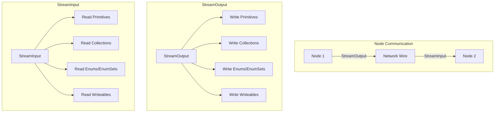
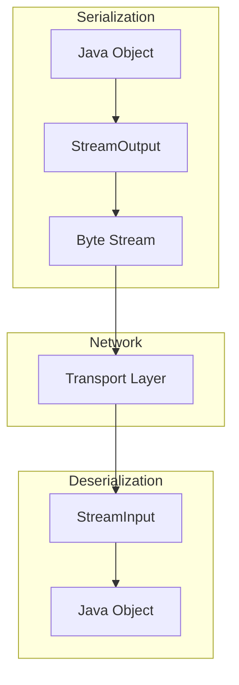

---
tags:
  - search
---

# Stream Input/Output

## Summary

`StreamInput` and `StreamOutput` are core OpenSearch classes that handle binary serialization and deserialization of data for inter-node communication. These classes provide methods to read and write various data types efficiently across the cluster, including primitives, collections, enums, and custom `Writeable` objects.

## Details

### Architecture



### Data Flow



### Components

| Component | Description |
|-----------|-------------|
| `StreamInput` | Abstract class for reading binary data from a stream |
| `StreamOutput` | Abstract class for writing binary data to a stream |
| `BytesStreamOutput` | Concrete implementation writing to a byte array |
| `InputStreamStreamInput` | Concrete implementation reading from an InputStream |
| `Writeable` | Interface for objects that can serialize themselves |
| `NamedWriteable` | Extension of Writeable with a name for registry lookup |

### Configuration

Stream classes are internal infrastructure and do not have user-configurable settings. They are used automatically by OpenSearch for all inter-node communication.

### Key Methods

#### Primitive Types

| StreamOutput | StreamInput | Description |
|--------------|-------------|-------------|
| `writeByte(byte)` | `readByte()` | Single byte |
| `writeInt(int)` | `readInt()` | 4-byte integer |
| `writeVInt(int)` | `readVInt()` | Variable-length integer |
| `writeLong(long)` | `readLong()` | 8-byte long |
| `writeString(String)` | `readString()` | UTF-8 string |
| `writeBoolean(boolean)` | `readBoolean()` | Boolean value |

#### Collections

| StreamOutput | StreamInput | Description |
|--------------|-------------|-------------|
| `writeStringCollection(Collection)` | `readStringList()` | String collection |
| `writeList(List)` | `readList(Reader)` | Generic list |
| `writeMap(Map, Writer, Writer)` | `readMap(Reader, Reader)` | Generic map |
| `writeEnumSet(EnumSet)` | `readEnumSet(Class)` | EnumSet |
| `writeOptionalEnumSet(EnumSet)` | `readOptionalEnumSet(Class)` | Optional EnumSet (v3.0.0+) |

#### Optional Values

| StreamOutput | StreamInput | Description |
|--------------|-------------|-------------|
| `writeOptionalString(String)` | `readOptionalString()` | Nullable string |
| `writeOptionalInt(Integer)` | `readOptionalInt()` | Nullable integer |
| `writeOptionalWriteable(Writeable)` | `readOptionalWriteable(Reader)` | Nullable writeable |
| `writeOptionalEnumSet(EnumSet)` | `readOptionalEnumSet(Class)` | Nullable EnumSet (v3.0.0+) |

### Usage Example

```java
// Implementing Writeable interface
public class MyRequest implements Writeable {
    private final String name;
    private final EnumSet<MyOption> options;
    
    public MyRequest(StreamInput in) throws IOException {
        this.name = in.readString();
        this.options = in.readOptionalEnumSet(MyOption.class);
    }
    
    @Override
    public void writeTo(StreamOutput out) throws IOException {
        out.writeString(name);
        out.writeOptionalEnumSet(options);
    }
}

// Using BytesStreamOutput for testing
BytesStreamOutput out = new BytesStreamOutput();
out.writeString("test");
out.writeOptionalEnumSet(EnumSet.of(MyOption.A, MyOption.B));

StreamInput in = out.bytes().streamInput();
String name = in.readString();
EnumSet<MyOption> options = in.readOptionalEnumSet(MyOption.class);
```

## Limitations

- Stream classes are designed for internal use and are not part of the public REST API
- Version compatibility must be maintained when adding new serialization methods
- The `readOptionalEnumSet` method returns an empty EnumSet (not null) when null/empty was written
- Enum class must be provided at read time due to Java type erasure

## Change History

- **v3.0.0** (2025-05-06): Added `writeOptionalEnumSet` and `readOptionalEnumSet` methods for optional EnumSet serialization

## Related Features
- [OpenSearch Dashboards](../opensearch-dashboards/ai-chat.md)

## References

### Documentation
- [StreamInput.java](https://github.com/opensearch-project/OpenSearch/blob/main/libs/core/src/main/java/org/opensearch/core/common/io/stream/StreamInput.java): Source code
- [StreamOutput.java](https://github.com/opensearch-project/OpenSearch/blob/main/libs/core/src/main/java/org/opensearch/core/common/io/stream/StreamOutput.java): Source code
- [ml-commons MLStatsInput](https://github.com/opensearch-project/ml-commons/blob/main/plugin/src/main/java/org/opensearch/ml/stats/MLStatsInput.java): Example usage in plugin

### Pull Requests
| Version | PR | Description | Related Issue |
|---------|-----|-------------|---------------|
| v3.0.0 | [#17556](https://github.com/opensearch-project/OpenSearch/pull/17556) | Add optional enum set read/write functionality |   |
