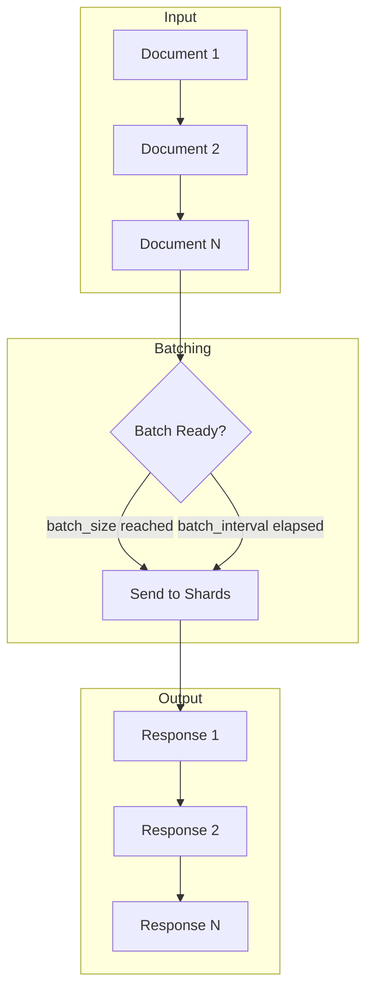

# Streaming Indexing

## Summary

Streaming Indexing is an experimental feature that provides a streaming variant of the Bulk API (`/_bulk/stream`). It enables continuous document ingestion with immediate per-document responses, eliminating the need to estimate optimal batch sizes and naturally applying backpressure between clients and the cluster.

The feature was introduced in OpenSearch 2.17.0 and requires the `transport-reactor-netty4` HTTP transport plugin.

## Details

### Architecture

```mermaid
graph TB
    subgraph Client
        A[HTTP Client] -->|HTTP/2 or HTTP/1.1 Chunked| B[/_bulk/stream Endpoint]
    end
    subgraph "OpenSearch Server"
        B --> C[ReactorNetty4HttpServerTransport]
        C --> D[RestController]
        D --> E[RestBulkStreamingAction]
        E --> F[BulkStreamingRestHandler]
    end
    subgraph "Document Processing"
        F --> G[Request Parser]
        G --> H[Batch Accumulator]
        H --> I[Index/Update/Delete Operations]
        I --> J[Streaming Response Writer]
    end
    J -->|Per-batch Response| A
```

### Data Flow



### Components

| Component | Description |
|-----------|-------------|
| `transport-reactor-netty4` | HTTP transport plugin providing reactive streaming support |
| `RestBulkStreamingAction` | REST handler for the `/_bulk/stream` endpoint |
| `BulkStreamingRestHandler` | Processes streaming requests and produces streaming responses |
| `ReactorNetty4HttpServerTransport` | Netty-based HTTP server with streaming capabilities |

### Configuration

| Setting | Description | Default |
|---------|-------------|---------|
| `http.type` | Must be set to `reactor-netty4` to enable streaming | `netty4` |
| `batch_interval` | Time to accumulate operations before sending to data nodes | - |
| `batch_size` | Number of operations to accumulate before sending | `1` |

### API Endpoints

```
POST /_bulk/stream
POST /<index>/_bulk/stream
```

### Query Parameters

| Parameter | Type | Description |
|-----------|------|-------------|
| `pipeline` | String | Pipeline ID for preprocessing documents |
| `refresh` | Enum | Whether to refresh affected shards (`true`, `false`, `wait_for`) |
| `require_alias` | Boolean | Require all actions target an index alias |
| `routing` | String | Route request to specified shard |
| `timeout` | Time | Request timeout (default: `1m`) |
| `batch_interval` | Time | Batch accumulation interval |
| `batch_size` | Integer | Batch size threshold |

### Usage Example

```bash
# Enable reactor-netty4 transport in opensearch.yml
# http.type: reactor-netty4

# Stream bulk operations
curl -X POST "http://localhost:9200/_bulk/stream" \
  -H "Transfer-Encoding: chunked" \
  -H "Content-Type: application/json" -d'
{ "index": { "_index": "movies", "_id": "1" } }
{ "title": "The Matrix", "year": 1999 }
{ "index": { "_index": "movies", "_id": "2" } }
{ "title": "Inception", "year": 2010 }
'
```

### Response Format

Each batch returns a separate JSON response:

```json
{"took": 11, "errors": false, "items": [{"index": {"_index": "movies", "_id": "1", "_version": 1, "result": "created", "status": 201}}]}
{"took": 5, "errors": false, "items": [{"index": {"_index": "movies", "_id": "2", "_version": 1, "result": "created", "status": 201}}]}
```

## Limitations

- Requires `transport-reactor-netty4` plugin installation
- Experimental feature - not recommended for production use
- Requires HTTP/2 or HTTP/1.1 with chunked transfer encoding
- Default HTTP transport (`netty4`) does not support streaming

## Change History

- **v3.2.0** (2025-07-15): Fix HTTP/2 communication when reactor-netty-secure is enabled
- **v2.18.0** (2024-11-05): Bug fixes for request hangs and newline termination errors
- **v2.17.0** (2024-09-17): Initial release of Streaming Bulk API
- **v2.15.0** (2024-06-25): RestAction streaming support foundation

## References

### Documentation
- [Streaming Bulk API Documentation](https://docs.opensearch.org/latest/api-reference/document-apis/bulk-streaming/)

### Pull Requests
| Version | PR | Description | Related Issue |
|---------|-----|-------------|---------------|
| v3.2.0 | [#18599](https://github.com/opensearch-project/OpenSearch/pull/18599) | Fix HTTP/2 communication when reactor-netty is enabled | [#18559](https://github.com/opensearch-project/OpenSearch/issues/18559) |
| v2.18.0 | [#16337](https://github.com/opensearch-project/OpenSearch/pull/16337) | Fix intermittent newline termination failures | [#16214](https://github.com/opensearch-project/OpenSearch/issues/16214) |
| v2.18.0 | [#16158](https://github.com/opensearch-project/OpenSearch/pull/16158) | Fix streaming bulk request hangs | [#16035](https://github.com/opensearch-project/OpenSearch/issues/16035) |
| v2.17.0 | [#15381](https://github.com/opensearch-project/OpenSearch/pull/15381) | Introduce bulk HTTP API streaming flavor | [#9070](https://github.com/opensearch-project/OpenSearch/issues/9070) |
| v2.15.0 | [#13772](https://github.com/opensearch-project/OpenSearch/pull/13772) | Enhance RestAction with request/response streaming support | [#9071](https://github.com/opensearch-project/OpenSearch/issues/9071) |

### Issues (Design / RFC)
- [Issue #9065](https://github.com/opensearch-project/OpenSearch/issues/9065): Streaming Bulk API tracking issue
- [Issue #9070](https://github.com/opensearch-project/OpenSearch/issues/9070): Bulk HTTP API streaming flavor
- [Issue #9071](https://github.com/opensearch-project/OpenSearch/issues/9071): RestAction streaming support
