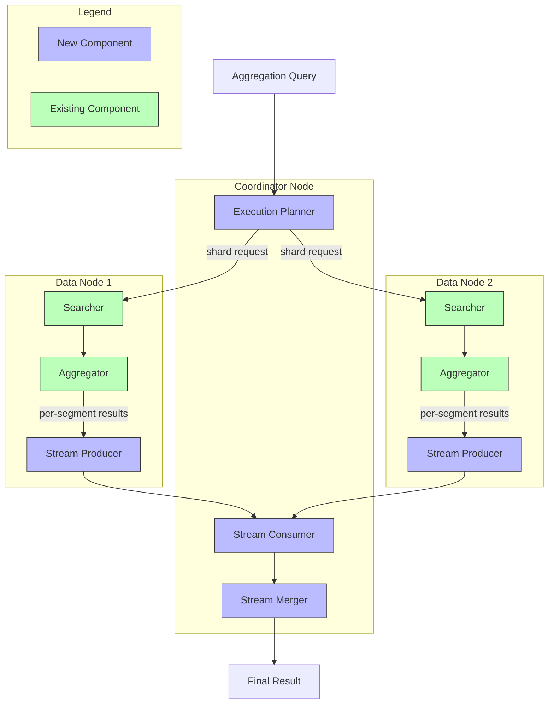
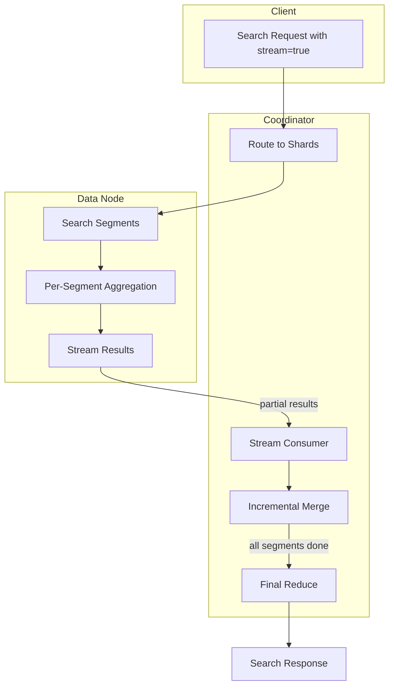

# Streaming Transport & Aggregation

## Summary

Streaming Transport & Aggregation is a memory-efficient approach to aggregation processing in OpenSearch. Instead of accumulating all partial aggregation results on data nodes before sending them to the coordinator, this feature streams partial results per segment immediately. This redistributes memory load from data nodes to coordinator nodes, improving cluster stability and enabling better resource utilization for high-cardinality aggregation workloads.

## Details

### Architecture



### Data Flow



### Components

| Component | Description |
|-----------|-------------|
| `StreamTransportService` | Transport service handling streaming requests with connection management |
| `StreamSearchTransportService` | Search-specific streaming transport for query/fetch phases |
| `StreamTransportResponseHandler` | Interface for handling streaming responses with `handleStreamResponse()` |
| `StreamQueryPhaseResultConsumer` | Consumes and merges streaming aggregation results |
| `StreamSearchQueryThenFetchAsyncAction` | Coordinates streaming search execution across shards |
| `StreamStringTermsAggregator` | Per-segment terms aggregator that resets after each batch |
| `StreamSearchChannelListener` | Sends streaming responses back to coordinator |
| `StreamSearchActionListener` | Handles intermediate and final streaming responses |

### Configuration

| Setting | Description | Default |
|---------|-------------|---------|
| `transport.stream.request_timeout` | Timeout for streaming transport requests | 5 minutes |
| `opensearch.experimental.feature.transport.stream.enabled` | Feature flag to enable stream transport | false |

### Usage Example

Enable the feature flag in `opensearch.yml`:

```yaml
opensearch.experimental.feature.transport.stream.enabled: true
```

Use the `stream` parameter in search requests:

```bash
GET /my-index/_search?stream=true
{
  "size": 0,
  "aggs": {
    "categories": {
      "terms": {
        "field": "category.keyword"
      },
      "aggs": {
        "max_price": {
          "max": { "field": "price" }
        }
      }
    }
  }
}
```

Java client usage:

```java
// Using streaming search
SearchRequestBuilder builder = client.prepareStreamSearch("my-index")
    .addAggregation(
        AggregationBuilders.terms("categories")
            .field("category.keyword")
            .subAggregation(AggregationBuilders.max("max_price").field("price"))
    )
    .setSize(0);

SearchResponse response = builder.execute().actionGet();
```

## Limitations

- Currently supports only `terms` bucket aggregation and `max` metric aggregation
- Requires the Arrow Flight RPC plugin for stream transport implementation
- Feature is experimental and behind a feature flag
- Does not support concurrent segment search mode
- Only `QUERY_THEN_FETCH` search type is supported
- Pre-filter (can_match) phase is not supported in streaming mode

## Related PRs

| Version | PR | Description |
|---------|-----|-------------|
| v3.2.0 | [#18722](https://github.com/opensearch-project/OpenSearch/pull/18722) | APIs for stream transport and stream-based search action |
| v3.2.0 | [#18874](https://github.com/opensearch-project/OpenSearch/pull/18874) | Streaming aggregation implementation |

## References

- [RFC #16774](https://github.com/opensearch-project/OpenSearch/issues/16774): Streaming Aggregation - A Memory-Efficient Approach
- [RFC #18425](https://github.com/opensearch-project/OpenSearch/issues/18425): Alternate Stream Transport in OpenSearch
- [Apache Arrow Flight](https://arrow.apache.org/blog/2019/10/13/introducing-arrow-flight/): Underlying transport technology

## Change History

- **v3.2.0** (2025-08): Initial implementation with stream transport framework and streaming terms aggregation with max sub-aggregation support
