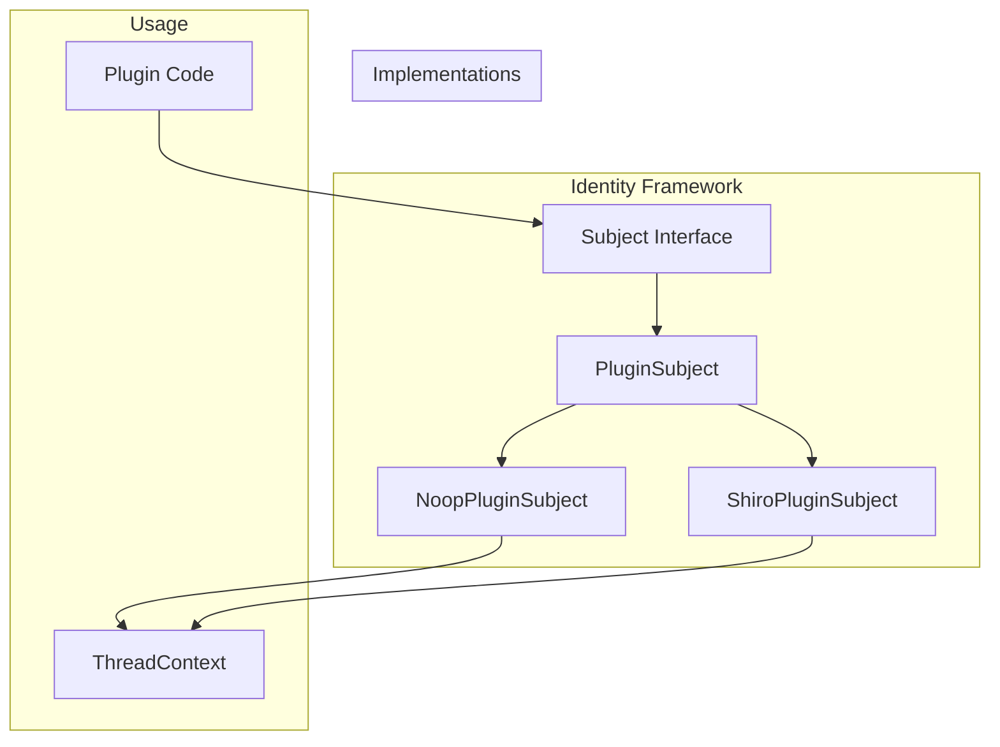

# Subject Interface

## Summary

The `Subject` interface is a core component of OpenSearch's identity framework. It represents an individual, process, or device that causes information to flow among objects or changes the system state. The interface provides a `runAs` method that allows code to execute in the context of a specific subject, enabling secure operations with proper identity context.

## Details

### Architecture



### Components

| Component | Description |
|-----------|-------------|
| `Subject` | Core interface defining identity operations |
| `PluginSubject` | Extension of Subject for plugin-specific identity |
| `NoopPluginSubject` | Default implementation that stashes thread context |
| `ShiroPluginSubject` | Apache Shiro-based implementation |
| `CheckedRunnable` | Functional interface for runnable code with checked exceptions |

### Configuration

The Subject interface is part of the experimental identity framework. No specific configuration is required for basic usage.

### API

#### Subject Interface

```java
@ExperimentalApi
public interface Subject {
    /**
     * Get the application-wide uniquely identifying principal
     */
    Principal getPrincipal();

    /**
     * runAs allows the caller to run a CheckedRunnable as this subject
     */
    default <E extends Exception> void runAs(CheckedRunnable<E> r) throws E {
        r.run();
    }
}
```

### Usage Example

```java
// Execute code in the context of a subject
subject.runAs(() -> {
    // Code here runs with the subject's identity context
    // ThreadContext is stashed, allowing privileged operations
    performPrivilegedOperation();
});
```

### Integration with IdentityAwarePlugin

Plugins implementing `IdentityAwarePlugin` receive a `PluginSubject` during initialization:

```java
public class MyPlugin implements IdentityAwarePlugin {
    private PluginSubject pluginSubject;
    
    @Override
    public void initializeIdentity(PluginSubject subject) {
        this.pluginSubject = subject;
    }
    
    public void doPrivilegedWork() {
        pluginSubject.runAs(() -> {
            // Perform operations with plugin identity
        });
    }
}
```

## Limitations

- The Subject interface is marked as `@ExperimentalApi` and may change in future versions
- Custom implementations must properly handle thread context stashing
- The `runAs` method does not return a value (changed in v3.2.0)

## Change History

- **v3.2.0** (2026-01-10): Updated `runAs` method to use `CheckedRunnable` instead of `Callable`, changed return type from `T` to `void`, and added `@PublicApi` annotation to `CheckedRunnable`
- **v3.0.0** (2024-08-28): Initial implementation - added `runAs` method to Subject interface and introduced `IdentityAwarePlugin` extension point

## References

### Documentation
- [PR #18570](https://github.com/opensearch-project/OpenSearch/pull/18570): Subject interface update
- [PR #14630](https://github.com/opensearch-project/OpenSearch/pull/14630): Original Subject.runAs implementation

### Pull Requests
| Version | PR | Description | Related Issue |
|---------|-----|-------------|---------------|
| v3.2.0 | [#18570](https://github.com/opensearch-project/OpenSearch/pull/18570) | Update Subject interface to use CheckedRunnable |   |
| v3.0.0 | [#14630](https://github.com/opensearch-project/OpenSearch/pull/14630) | Add runAs to Subject interface and introduce IdentityAwarePlugin |   |

### Issues (Design / RFC)
- [Security Issue #4439](https://github.com/opensearch-project/security/issues/4439): Related security feature request
