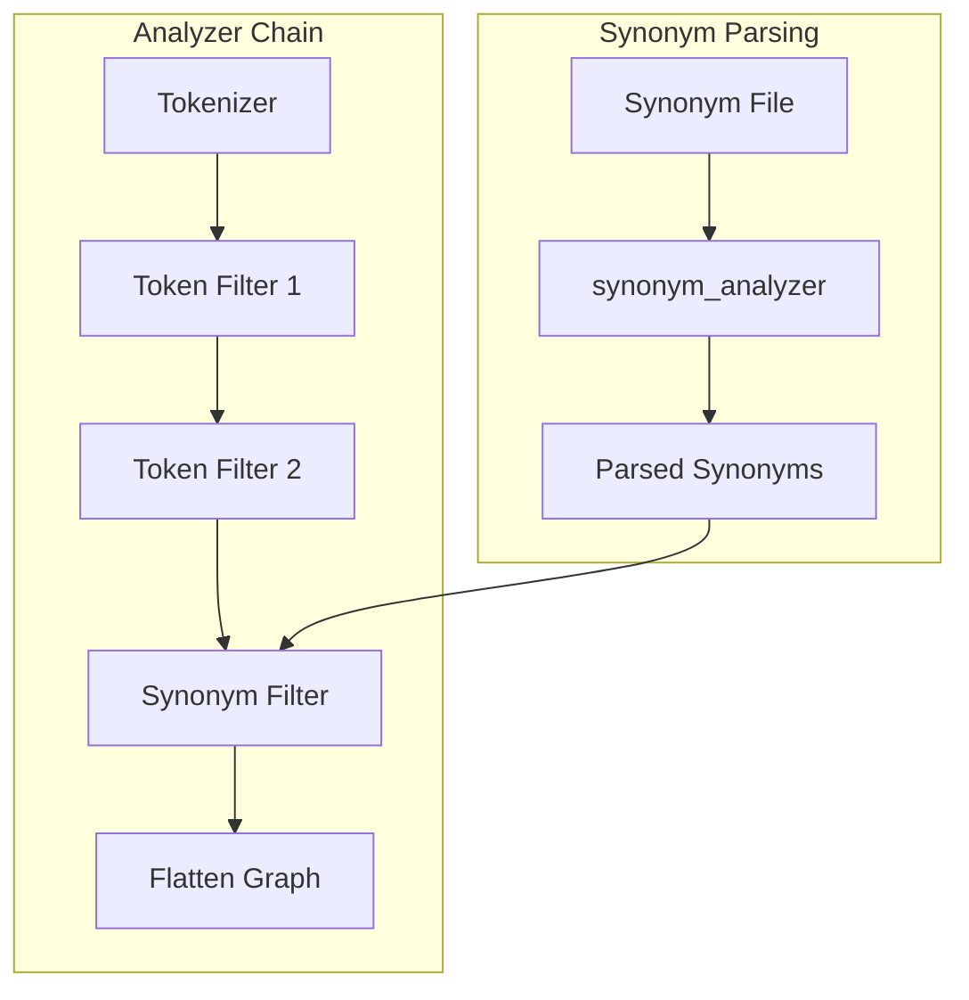

---
tags:
  - opensearch
---
# Synonym Analyzer Configuration

## Summary

The `synonym_analyzer` setting allows users to specify a custom analyzer for parsing synonym files in the `synonym` and `synonym_graph` token filters. This enables complex analyzer chains that include filters incompatible with synonym parsing (such as `word_delimiter_graph` or `hunspell`) to work correctly with synonym expansion.

## Details

### Architecture



### Configuration

| Setting | Description | Default |
|---------|-------------|---------|
| `synonym_analyzer` | Name of the analyzer to use for parsing synonym rules | Uses preceding filters in chain |
| `synonyms` | Inline synonym rules | - |
| `synonyms_path` | Path to synonym file | - |
| `format` | Synonym format (`solr` or `wordnet`) | `solr` |
| `expand` | Whether to expand equivalent synonyms | `true` |
| `lenient` | Ignore exceptions when loading rules | `false` |

### Usage Example

```json
PUT /my-index
{
  "settings": {
    "analysis": {
      "filter": {
        "custom_word_delimiter": {
          "type": "word_delimiter_graph",
          "generate_word_parts": true,
          "catenate_all": true,
          "split_on_numerics": false,
          "split_on_case_change": false
        },
        "custom_hunspell_stemmer": {
          "type": "hunspell",
          "locale": "en_US"
        },
        "custom_synonym_graph_filter": {
          "type": "synonym_graph",
          "synonyms": [
            "laptop => notebook",
            "smartphone, mobile phone, cell phone => smartphone"
          ],
          "synonym_analyzer": "standard"
        }
      },
      "analyzer": {
        "text_analyzer": {
          "type": "custom",
          "tokenizer": "whitespace",
          "filter": [
            "lowercase",
            "custom_word_delimiter",
            "custom_hunspell_stemmer",
            "custom_synonym_graph_filter",
            "flatten_graph"
          ]
        }
      }
    }
  }
}
```

### How It Works

1. Without `synonym_analyzer`: OpenSearch builds a temporary analyzer from the tokenizer and all token filters preceding the synonym filter to parse synonym rules
2. With `synonym_analyzer`: OpenSearch uses the specified analyzer directly to parse synonym rules, bypassing the preceding filters

This separation allows incompatible filters (those that produce token graphs or modify positions) to be used before synonym filters without causing parsing errors.

### Supported Filters

The following filters are known to cause issues when placed before synonym filters without using `synonym_analyzer`:

| Filter | Issue |
|--------|-------|
| `word_delimiter_graph` | Produces token graphs |
| `hunspell` | Modifies token positions |
| `common_grams` | Produces token graphs |
| `ngram` | Produces multiple tokens |
| `edge_ngram` | Produces multiple tokens |
| `shingle` | Produces token graphs |
| `fingerprint` | Modifies token stream |

## Limitations

- The `synonym_analyzer` must reference a valid, pre-defined analyzer
- Built-in analyzers (`standard`, `simple`, `whitespace`, etc.) can be used
- Custom analyzers must be defined in the same index settings
- The analyzer should produce tokens compatible with the synonym format

## Change History

- **v2.19.0** (2024-11-12): Added `synonym_analyzer` configuration setting for `synonym` and `synonym_graph` filters

## References

### Documentation

- [Synonym Token Filter](https://docs.opensearch.org/latest/analyzers/token-filters/synonym/)
- [Synonym Graph Token Filter](https://docs.opensearch.org/latest/analyzers/token-filters/synonym-graph/)

### Pull Requests

| Version | PR | Description |
|---------|-----|-------------|
| v2.19.0 | [#16488](https://github.com/opensearch-project/OpenSearch/pull/16488) | Add new configuration setting `synonym_analyzer` for `synonym` and `synonym_graph` filters |

### Related Issues

- [#16263](https://github.com/opensearch-project/OpenSearch/issues/16263) - Token Filter Order: word_delimiter_graph and synonym_graph
- [#16530](https://github.com/opensearch-project/OpenSearch/issues/16530) - Using synonym filter after hunspell
