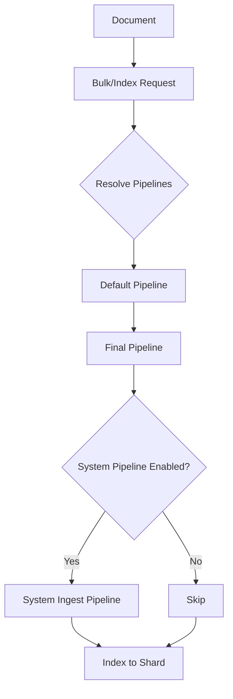

# System Ingest Pipeline

## Summary

System Ingest Pipeline is a feature that enables plugin developers to automatically process documents during ingestion based on index mappings. Unlike standard ingest pipelines that require manual user configuration, system ingest pipelines are automatically generated by OpenSearch based on registered system ingest processor factories. This simplifies the user experience for features like semantic field embedding generation by removing the need for manual pipeline setup.

## Details

### Architecture

```mermaid
graph TB
    subgraph "Ingest Pipeline Resolution"
        A[Index/Bulk Request] --> B[TransportBulkAction]
        B --> C[IngestService.resolvePipelines]
        C --> D{Has Index Metadata?}
        D -->|Yes| E[Get from Index Settings]
        D -->|No| F[Match Index Templates]
        E --> G[Resolve System Pipeline]
        F --> G
        G --> H[SystemIngestPipelineCache]
    end
    
    subgraph "Pipeline Execution"
        I[Default Pipeline] --> J[Final Pipeline]
        J --> K[System Ingest Pipeline]
        K --> L[Index Document]
    end
    
    subgraph "System Pipeline Generation"
        M[Index Mapping] --> N[System Processor Factories]
        N --> O[Pipeline.createSystemIngestPipeline]
        O --> P[CompoundProcessor]
    end
```



### Data Flow



### Components

| Component | Description |
|-----------|-------------|
| `AbstractBatchingSystemProcessor` | Abstract base class for batch system processors with `isSystemGenerated()` returning true |
| `AbstractBatchingSystemProcessor.Factory` | Factory base class for creating system processors from index configuration |
| `SystemIngestPipelineCache` | LRU cache (max 100 entries, 60 min TTL) for system pipelines per index |
| `IngestPipelineType` | Enum defining pipeline types: DEFAULT, FINAL, SYSTEM_FINAL |
| `IngestPipelineInfo` | Holds pipeline ID and type for execution tracking |
| `IndexRequestWrapper` | Wraps index requests with slot, childSlot, and pipeline info for batch processing |
| `IngestDocumentWrapper` | Wraps ingest documents with slot tracking for result mapping |

### Configuration

| Setting | Description | Default |
|---------|-------------|---------|
| `cluster.ingest.system_pipeline_enabled` | Enable/disable system ingest pipeline feature cluster-wide | `true` |
| `cluster.ingest.max_number_processors` | Maximum number of processors allowed in a pipeline | `Integer.MAX_VALUE` |

### Pipeline Types and Execution Order

| Order | Pipeline Type | Source | Can Change Target Index |
|-------|--------------|--------|------------------------|
| 1 | DEFAULT | User-defined or index setting | Yes |
| 2 | FINAL | Index setting | No |
| 3 | SYSTEM_FINAL | Auto-generated from mapping | No |

### Update Operation Behavior

System ingest pipelines have special behavior for update operations:

| Operation | Default/Final Pipeline | System Pipeline |
|-----------|------------------------|-----------------|
| Index | Triggered | Triggered |
| Single Update | Triggered | Triggered |
| Bulk Update (doc) | Not triggered | Triggered |
| Bulk Update (doc_as_upsert=true) | Triggered | Triggered |
| Bulk Update (upsert) | Triggered on upsert | Triggered |

### Usage Example

#### Creating a System Ingest Processor

```java
public class SemanticFieldProcessor extends AbstractBatchingSystemProcessor {
    public static final String TYPE = "semantic_field_processor";
    
    protected SemanticFieldProcessor(String tag, String description, int batchSize) {
        super(tag, description, batchSize);
    }
    
    @Override
    protected void subBatchExecute(List<IngestDocumentWrapper> docs, 
                                   Consumer<List<IngestDocumentWrapper>> handler) {
        // Generate embeddings for semantic fields
        for (IngestDocumentWrapper wrapper : docs) {
            IngestDocument doc = wrapper.getIngestDocument();
            // Check if field exists before processing (important for partial updates)
            if (doc.hasField("text_field")) {
                String text = doc.getFieldValue("text_field", String.class);
                float[] embedding = generateEmbedding(text);
                doc.setFieldValue("embedding_field", embedding);
            }
        }
        handler.accept(docs);
    }
    
    @Override
    public IngestDocument execute(IngestDocument doc) {
        // Single document processing
        return doc;
    }
    
    @Override
    public String getType() { return TYPE; }
}
```

#### Creating a System Processor Factory

```java
public class SemanticFieldProcessorFactory extends AbstractBatchingSystemProcessor.Factory {
    public static final String TYPE = "semantic_field_factory";
    
    protected SemanticFieldProcessorFactory() {
        super(TYPE);
    }
    
    @Override
    protected AbstractBatchingSystemProcessor newProcessor(String tag, 
                                                           String description, 
                                                           Map<String, Object> config) {
        // Get index mapping from config
        Map<String, Object> mapping = (Map<String, Object>) config.get(INDEX_MAPPINGS);
        
        // Check if mapping contains semantic fields
        if (hasSemanticFields(mapping)) {
            return new SemanticFieldProcessor(tag, description, 10);
        }
        return null; // No processor needed for this index
    }
}
```

#### Registering in Plugin

```java
public class NeuralSearchPlugin extends Plugin implements IngestPlugin {
    @Override
    public Map<String, Processor.Factory> getSystemIngestProcessors(
            Processor.Parameters parameters) {
        return Map.of(
            SemanticFieldProcessorFactory.TYPE, 
            new SemanticFieldProcessorFactory()
        );
    }
}
```

#### Disabling System Pipelines

```json
PUT _cluster/settings
{
  "persistent": {
    "cluster.ingest.system_pipeline_enabled": false
  }
}
```

## Limitations

- System processors receive partial documents during bulk updates, not full documents
- Processors must validate field existence before accessing to handle partial updates
- No simulation API support for testing system pipelines (planned)
- No explain API to view generated pipelines (planned)
- Cache invalidation occurs on any index mapping change
- Maximum 100 cached pipelines with 60-minute TTL

## Related PRs

| Version | PR | Description |
|---------|-----|-------------|
| v3.1.0 | [#17817](https://github.com/opensearch-project/OpenSearch/pull/17817) | Introduce system generated ingest pipeline |
| v3.1.0 | [#18277](https://github.com/opensearch-project/OpenSearch/pull/18277) | Support system ingest pipelines for bulk update operations |

## References

- [Issue #17509](https://github.com/opensearch-project/OpenSearch/issues/17509): RFC - Support System Generated Ingest Pipeline/Processor
- [Issue #18276](https://github.com/opensearch-project/OpenSearch/issues/18276): Support system ingest pipelines for bulk update operations
- [Issue #17742](https://github.com/opensearch-project/OpenSearch/issues/17742): Add configurability to run ingest pipelines during document update operations
- [Issue #18151](https://github.com/opensearch-project/OpenSearch/issues/18151): Related issue resolved by #17817
- [Issue #17819](https://github.com/opensearch-project/OpenSearch/issues/17819): Partially resolved by #17817
- [Blog: Making ingestion smarter](https://opensearch.org/blog/making-ingestion-smarter-system-ingest-pipelines-in-opensearch/): Official announcement blog
- [Neural Search Semantic Field RFC](https://github.com/opensearch-project/neural-search/issues/1211): Primary use case for system ingest pipelines

## Change History

- **v3.1.0** (2025-05-09): Initial implementation of system ingest pipeline (#17817)
- **v3.1.0** (2025-06-11): Added bulk update operation support (#18277)
