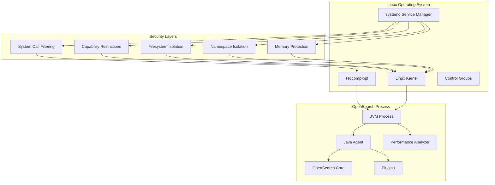
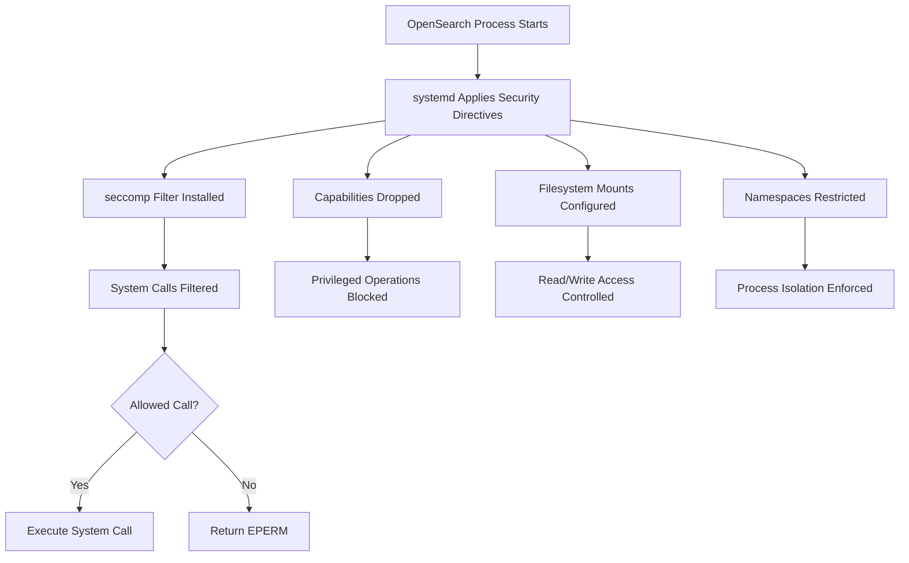

---
tags:
  - ml
  - performance
  - security
---

# Systemd Security Configurations

## Summary

OpenSearch provides systemd security configurations to strengthen operating system-level security on Linux distributions. These configurations use native Linux security mechanisms including seccomp system call filtering, capability restrictions, filesystem isolation, and namespace controls to sandbox the OpenSearch process. This feature is part of the broader Java Security Manager (JSM) replacement strategy, working alongside the Java agent to provide comprehensive security.

## Details

### Architecture



### Data Flow



### Components

| Component | Location | Description |
|-----------|----------|-------------|
| `opensearch.service` | `distribution/packages/src/common/systemd/` | Main systemd unit file with security directives |
| `SystemdIntegTests.java` | `qa/systemd-test/` | Integration tests for systemd security configurations |
| `terminate.sh` | `qa/systemd-test/src/test/resources/scripts/` | Test script for process termination protection |

### Configuration

#### System Call Filtering

| Directive | Value | Purpose |
|-----------|-------|---------|
| `SystemCallFilter` | `@system-service` | Allow standard service system calls |
| `SystemCallFilter` | `~@reboot` | Block reboot-related calls |
| `SystemCallFilter` | `~@swap` | Block swap management calls |
| `SystemCallFilter` | `seccomp mincore madvise mlock mlock2 munlock` | Allow memory management for JVM |
| `SystemCallFilter` | `get_mempolicy sched_getaffinity sched_setaffinity fcntl` | Allow scheduling and file control |
| `SystemCallErrorNumber` | `EPERM` | Return permission denied for blocked calls |
| `SystemCallArchitectures` | `native` | Allow only native architecture calls |

#### Capability Restrictions

| Capability Removed | Reason |
|--------------------|--------|
| `CAP_SYS_ADMIN` | Prevents various privileged system operations |
| `CAP_SYS_PTRACE` | Prevents process tracing/debugging |
| `CAP_NET_ADMIN` | Prevents network configuration changes |
| `CAP_BLOCK_SUSPEND` | Prevents blocking system suspend |
| `CAP_LEASE` | Prevents file lease establishment |
| `CAP_SYS_PACCT` | Prevents process accounting configuration |
| `CAP_SYS_TTY_CONFIG` | Prevents TTY configuration |

#### Filesystem Access

| Directive | Paths | Purpose |
|-----------|-------|---------|
| `ReadWritePaths` | `/var/log/opensearch` | Log file storage |
| `ReadWritePaths` | `/var/lib/opensearch` | Data storage |
| `ReadWritePaths` | `/dev/shm/` | Shared memory for Performance Analyzer |
| `ReadWritePaths` | `/etc/opensearch` | Configuration files |
| `ReadWritePaths` | `/mnt/snapshots` | Snapshot storage |
| `ReadOnlyPaths` | `/etc/os-release`, `/proc/self/mountinfo` | System information |
| `ReadOnlyPaths` | `/sys/fs/cgroup/*` | Control group statistics |

#### Process Protection

| Directive | Value | Purpose |
|-----------|-------|---------|
| `ProtectSystem` | `full` | Make `/usr`, `/boot`, `/etc` read-only |
| `PrivateTmp` | `true` | Isolate `/tmp` and `/var/tmp` |
| `NoNewPrivileges` | `true` | Prevent privilege escalation |
| `ProtectKernelModules` | `true` | Prevent kernel module loading |
| `ProtectKernelTunables` | `true` | Prevent sysctl modifications |
| `ProtectKernelLogs` | `true` | Prevent kernel log access |
| `ProtectControlGroups` | `true` | Prevent cgroup modifications |
| `ProtectHostname` | `true` | Prevent hostname changes |
| `ProtectClock` | `true` | Prevent system clock changes |
| `ProtectProc` | `invisible` | Hide other processes in /proc |
| `RestrictNamespaces` | `true` | Prevent namespace creation |
| `RestrictSUIDSGID` | `true` | Prevent SUID/SGID file creation |
| `RestrictRealtime` | `true` | Prevent realtime scheduling |
| `LockPersonality` | `true` | Prevent ABI personality changes |
| `KeyringMode` | `private` | Isolate kernel keyring |

#### Network Restrictions

| Directive | Value | Purpose |
|-----------|-------|---------|
| `RestrictAddressFamilies` | `AF_INET AF_INET6 AF_UNIX` | Allow only IPv4, IPv6, and Unix sockets |

### Usage Example

#### Viewing Active Security Settings

```bash
# Check systemd security settings
systemctl show opensearch --property=ProtectSystem,PrivateTmp,NoNewPrivileges,RestrictNamespaces

# Verify seccomp is enabled for the process
PID=$(systemctl show --property=MainPID opensearch | cut -d= -f2)
grep Seccomp /proc/$PID/status
# Output: Seccomp: 2 (filter mode)

# Check process limits
cat /proc/$PID/limits | grep -E "Max processes|Max open files"
```

#### Customizing Security Settings

```bash
# Create override directory
sudo mkdir -p /etc/systemd/system/opensearch.service.d/

# Add custom paths for snapshots
cat << EOF | sudo tee /etc/systemd/system/opensearch.service.d/custom-paths.conf
[Service]
ReadWritePaths=/custom/snapshot/path
EOF

# Reload and restart
sudo systemctl daemon-reload
sudo systemctl restart opensearch
```

#### Integration Test Validation

```java
// Test that seccomp is enabled
public void testSeccompEnabled() throws IOException, InterruptedException {
    String seccomp = executeCommand("grep \"^Seccomp:\" /proc/" + opensearchPid + "/status");
    int seccompValue = Integer.parseInt(seccomp.split(":\\s*")[1].trim());
    assertNotEquals("Seccomp should be enabled", 0, seccompValue);
}

// Test that reboot syscall is blocked
public void testRebootSysCall() throws IOException, InterruptedException {
    String result = executeCommand("sudo su opensearch -c 'kill -s SIGHUP 1' 2>&1 || echo 'Operation not permitted'");
    assertTrue("Reboot system call should be blocked", result.contains("Operation not permitted"));
}
```

## Limitations

- Only available on Linux distributions using systemd as the init system
- Security rules apply at process level, not per-plugin
- Custom data paths require manual systemd override configuration
- Some monitoring and debugging tools may require additional capabilities
- Container deployments may need different security configurations
- Not applicable to Windows or macOS deployments

## Change History

- **v3.0.0** (2025-04-09): Initial implementation with comprehensive systemd hardening

## References

### Documentation
- [systemd.exec documentation](https://www.freedesktop.org/software/systemd/man/systemd.exec.html)
- [seccomp documentation](https://man7.org/linux/man-pages/man2/seccomp.2.html)
- [Linux Capabilities](https://man7.org/linux/man-pages/man7/capabilities.7.html)

### Blog Posts
- [Blog: Finding a replacement for JSM in OpenSearch 3.0](https://opensearch.org/blog/finding-a-replacement-for-jsm-in-opensearch-3-0/)

### Pull Requests
| Version | PR | Description | Related Issue |
|---------|-----|-------------|---------------|
| v3.0.0 | [#17107](https://github.com/opensearch-project/security/pull/17107) | Add systemd configurations to strengthen OS core security |   |
| v3.0.0 | [#17410](https://github.com/opensearch-project/OpenSearch/pull/17410) | Added integ tests for systemd configs |   |
| v3.0.0 | [#17641](https://github.com/opensearch-project/OpenSearch/pull/17641) | Fix systemd integTest on deb regarding path ownership check | [#17614](https://github.com/opensearch-project/OpenSearch/issues/17614) |

### Issues (Design / RFC)
- [Issue #17614](https://github.com/opensearch-project/OpenSearch/issues/17614): Bug fix for deb package ownership check
- [Issue #1687](https://github.com/opensearch-project/OpenSearch/issues/1687): Original JSM replacement discussion
