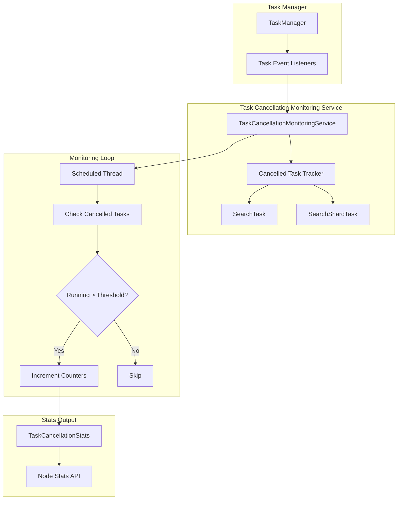
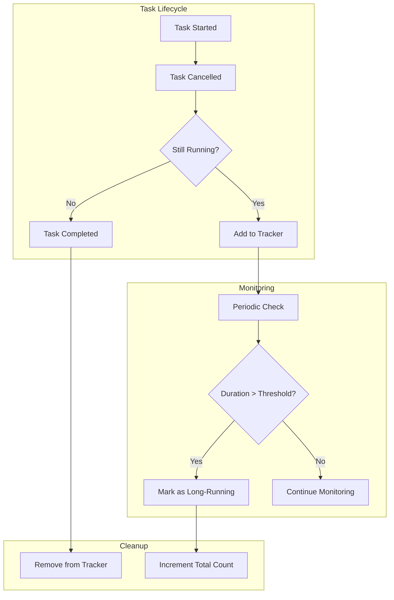

# Task Cancellation Monitoring

## Summary

Task Cancellation Monitoring is a service that tracks search tasks that have been cancelled but continue running beyond a configurable threshold. It provides visibility into "rogue queries" that consume resources after cancellation, helping operators identify and diagnose problematic search patterns. The service monitors both coordinator-level (`SearchTask`) and shard-level (`SearchShardTask`) tasks.

## Details

### Architecture



### Data Flow



### Components

| Component | Description |
|-----------|-------------|
| `TaskCancellationMonitoringService` | Main service that monitors cancelled tasks and collects statistics |
| `TaskCancellationStats` | Container for all task cancellation statistics |
| `SearchTaskCancellationStats` | Statistics for coordinator-level search tasks |
| `SearchShardTaskCancellationStats` | Statistics for shard-level search tasks |
| `BaseSearchTaskCancellationStats` | Abstract base class with common statistics fields |

### Configuration

| Setting | Description | Default |
|---------|-------------|---------|
| `task.cancellation.monitoring.enabled` | Enable/disable the monitoring service | `true` |
| `task.cancellation.monitoring.interval` | Interval between monitoring checks | `1s` |
| `task.cancellation.monitoring.duration_millis` | Duration threshold for considering a cancelled task as long-running | `10000` (10s) |

### Statistics Fields

| Field | Description |
|-------|-------------|
| `current_count_post_cancel` | Number of cancelled tasks currently still running beyond the threshold |
| `total_count_post_cancel` | Total number of tasks that ran beyond the threshold after cancellation since node restart |

### Usage Example

```bash
# Get task cancellation monitoring stats
GET _nodes/stats

# Response includes task_cancellation section
{
  "nodes": {
    "node_id": {
      "task_cancellation": {
        "search_task": {
          "current_count_post_cancel": 2,
          "total_count_post_cancel": 15
        },
        "search_shard_task": {
          "current_count_post_cancel": 5,
          "total_count_post_cancel": 42
        }
      }
    }
  }
}
```

### Interpreting Statistics

- **High `current_count_post_cancel`**: Indicates active queries that are not responding to cancellation signals
- **High `total_count_post_cancel`**: Suggests a pattern of problematic queries that may need investigation
- **Ratio of search_task to search_shard_task**: Can help identify whether issues are at coordinator or shard level

## Limitations

- Statistics are reset when the node restarts
- Only tracks `SearchTask` and `SearchShardTask` types (not other cancellable tasks)
- Mixed-version clusters may have inconsistent statistics reporting
- The service adds minimal overhead but does consume some resources for tracking

## Related PRs

| Version | PR | Description |
|---------|-----|-------------|
| v3.0.0 | [#17726](https://github.com/opensearch-project/OpenSearch/pull/17726) | Add tracking for long-running SearchTask post cancellation |

## References

- [Issue #17719](https://github.com/opensearch-project/OpenSearch/issues/17719): Track long running SearchTask post cancellation
- [Search Backpressure Documentation](https://docs.opensearch.org/3.0/tuning-your-cluster/availability-and-recovery/search-backpressure/): Related feature for search task management

## Change History

- **v3.0.0** (2025-05-06): Added SearchTask (coordinator-level) tracking alongside existing SearchShardTask tracking
