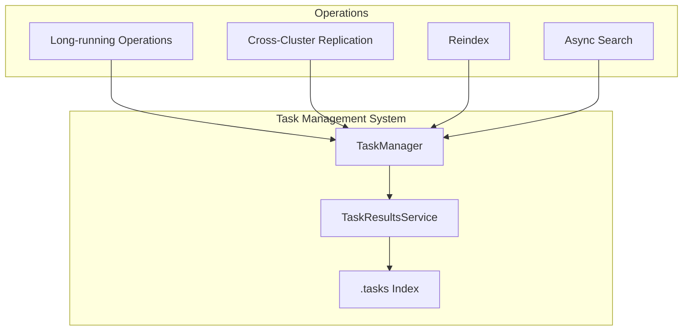
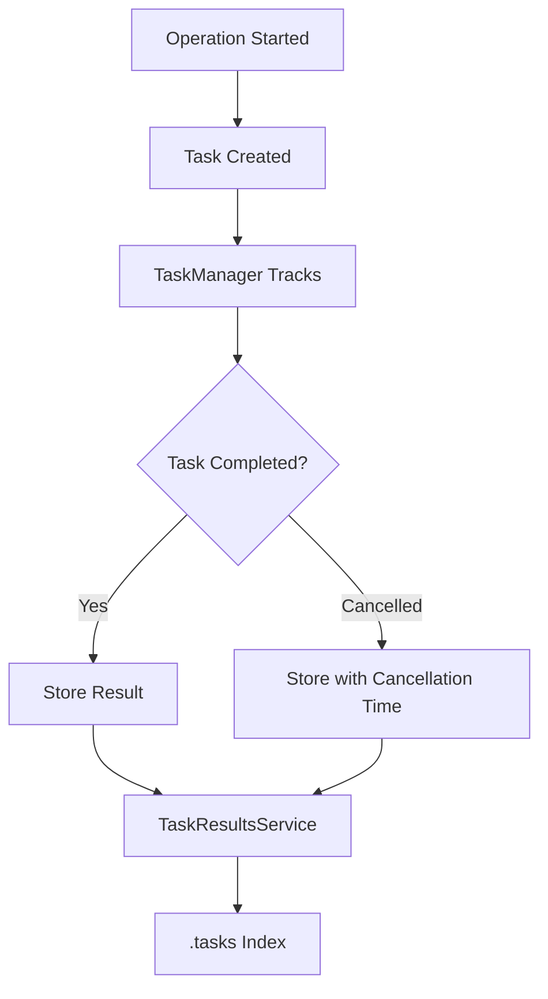

# Task Management

## Summary

OpenSearch's Task Management system tracks and manages long-running operations within the cluster. Tasks are stored in the `.tasks` system index, which uses strict dynamic mapping to ensure data integrity. The system provides APIs to list, monitor, and cancel running tasks.

## Details

### Architecture



### Data Flow



### Components

| Component | Description |
|-----------|-------------|
| `TaskManager` | Central component that tracks all running tasks in the cluster |
| `TaskResultsService` | Service responsible for storing task results to the `.tasks` index |
| `TaskInfo` | Data structure containing task metadata and status |
| `TaskResult` | Wrapper containing task info and response/error |
| `.tasks` Index | System index storing completed task results |

### Configuration

| Setting | Description | Default |
|---------|-------------|---------|
| `task_result_index.mapping.version` | Internal mapping version for `.tasks` index | 5 |
| `dynamic` | Mapping mode for `.tasks` index | `strict` |

### Task Index Mapping

The `.tasks` index stores task results with the following key fields:

```json
{
  "_doc": {
    "_meta": {
      "version": 5
    },
    "dynamic": "strict",
    "properties": {
      "completed": { "type": "boolean" },
      "task": {
        "properties": {
          "action": { "type": "keyword" },
          "cancellable": { "type": "boolean" },
          "cancelled": { "type": "boolean" },
          "id": { "type": "long" },
          "node": { "type": "keyword" },
          "parent_task_id": { "type": "keyword" },
          "running_time_in_nanos": { "type": "long" },
          "start_time_in_millis": { "type": "long" },
          "cancellation_time_millis": { "type": "long" },
          "type": { "type": "keyword" },
          "status": { "type": "object", "enabled": false },
          "description": { "type": "text" },
          "headers": { "type": "object", "enabled": false },
          "resource_stats": { "type": "object", "enabled": false }
        }
      },
      "response": { "type": "object", "enabled": false },
      "error": { "type": "object", "enabled": false }
    }
  }
}
```

### Usage Example

```bash
# List all running tasks
GET _tasks

# Get task by ID
GET _tasks/<task_id>

# Cancel a task
POST _tasks/<task_id>/_cancel

# List tasks with details
GET _tasks?detailed=true

# Filter tasks by action
GET _tasks?actions=*search&detailed=true

# View stored task results
GET .tasks/_search
{
  "query": {
    "match_all": {}
  }
}
```

### Resource Stats

The `resource_stats` object tracks resource usage for tasks that support resource tracking:

| Field | Description |
|-------|-------------|
| `average` | Average resource usage across thread executions |
| `total` | Sum of resource usages across thread executions |
| `min` | Minimum resource usage |
| `max` | Maximum resource usage |
| `thread_info.active_threads` | Number of threads currently working on the task |
| `thread_info.thread_executions` | Number of threads scheduled to work on the task |

## Limitations

- Not all tasks are cancellable (check `cancellable` field)
- `resource_stats` is stored as disabled object (not searchable)
- Task results are only stored for completed/cancelled tasks
- The `.tasks` index uses strict mapping - all fields must be predefined

## Change History

- **v2.18.0** (2024-11-05): Fixed missing `cancellation_time_millis` and `resource_stats` fields in task index mapping

## References

### Documentation
- [Tasks API Documentation](https://docs.opensearch.org/2.18/api-reference/tasks/): Official Tasks API docs
- [task-index-mapping.json](https://github.com/opensearch-project/OpenSearch/blob/main/server/src/main/resources/org/opensearch/tasks/task-index-mapping.json): Source mapping file

### Pull Requests
| Version | PR | Description | Related Issue |
|---------|-----|-------------|---------------|
| v2.18.0 | [#16201](https://github.com/opensearch-project/OpenSearch/pull/16201) | Fix missing fields in task index mapping | [#16060](https://github.com/opensearch-project/OpenSearch/issues/16060) |

### Issues (Design / RFC)
- [Issue #16060](https://github.com/opensearch-project/OpenSearch/issues/16060): Bug report for missing mapping fields
