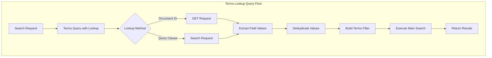
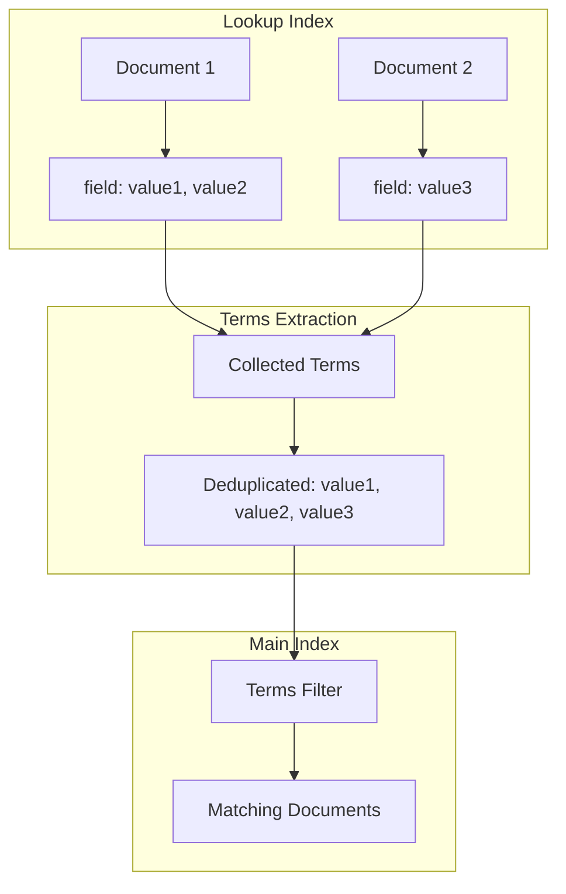

# Terms Lookup Query

## Summary

The Terms Lookup Query is a powerful feature in OpenSearch that allows filtering documents based on terms stored in another index. Instead of specifying filter values directly in the query, you can reference field values from documents in a separate index. This enables dynamic filtering scenarios where filter criteria are maintained separately from the search logic.

## Details

### Architecture



### Data Flow



### Components

| Component | Description |
|-----------|-------------|
| `TermsQueryBuilder` | Main query builder that handles both direct values and lookup-based terms |
| `TermsLookup` | Encapsulates lookup parameters (index, id/query, path, routing, store) |
| Fetch Logic | Retrieves terms via GET (single doc) or Search (query-based) |

### Configuration

| Setting | Description | Default |
|---------|-------------|---------|
| `index.max_terms_count` | Maximum number of terms allowed in a terms query | 65536 |
| `index.max_result_window` | Maximum number of results for search-based lookup | 10000 |
| `indices.query.max_clause_count` | Maximum clauses in a boolean query | 1024 |

### Lookup Parameters

| Parameter | Type | Required | Description |
|-----------|------|----------|-------------|
| `index` | String | Yes | Index containing the lookup document(s) |
| `id` | String | Conditional | Document ID for single-document lookup |
| `query` | Object | Conditional | Query clause for multi-document lookup |
| `path` | String | Yes | Field path to extract values from |
| `routing` | String | No | Custom routing value |
| `store` | Boolean | No | Use stored fields instead of `_source` |

### Usage Examples

**Basic Terms Lookup (by ID):**
```json
GET /students/_search
{
  "query": {
    "terms": {
      "student_id": {
        "index": "classes",
        "id": "101",
        "path": "enrolled"
      }
    }
  }
}
```

**Terms Lookup by Query (v3.2.0+):**
```json
GET /students/_search
{
  "query": {
    "terms": {
      "student_id": {
        "index": "classes",
        "path": "enrolled",
        "query": {
          "term": { "department": "engineering" }
        }
      }
    }
  }
}
```

**Nested Field Lookup:**
```json
GET /students/_search
{
  "query": {
    "terms": {
      "student_id": {
        "index": "classes",
        "id": "102",
        "path": "enrolled_students.id_list"
      }
    }
  }
}
```

## Limitations

- The `_source` mapping field must be enabled for terms lookup
- Query-based lookup results are limited by index settings
- Large term lists may impact query performance
- Cannot use both `id` and `query` parameters simultaneously

## Change History

- **v3.2.0** (2025-08-01): Added support for query clause in terms lookup, enabling multi-document value extraction

## References

### Documentation
- [Terms Query Documentation](https://docs.opensearch.org/3.2/query-dsl/term/terms/): Official documentation

### Pull Requests
| Version | PR | Description | Related Issue |
|---------|-----|-------------|---------------|
| v3.2.0 | [#18195](https://github.com/opensearch-project/OpenSearch/pull/18195) | Add query clause support for terms lookup |   |

### Issues (Design / RFC)
- [Issue #17599](https://github.com/opensearch-project/OpenSearch/issues/17599): Feature request for query-based lookup
