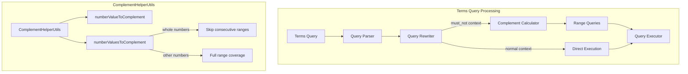
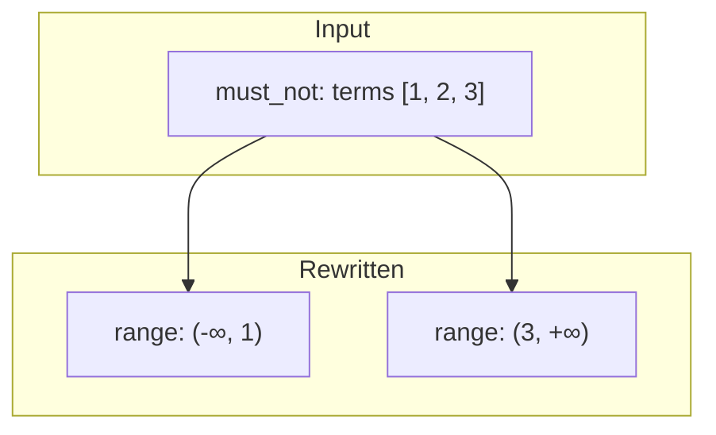

# Terms Query

## Summary

The `terms` query searches for documents containing one or more exact terms in a specified field. It supports multiple values, terms lookup from other documents, and bitmap filtering for efficient large-scale filtering. OpenSearch optimizes `terms` queries by rewriting them into complement range queries when used in `must_not` clauses.

## Details

### Architecture



### Components

| Component | Description |
|-----------|-------------|
| `TermsQueryBuilder` | Builds and executes terms queries |
| `ComplementHelperUtils` | Calculates complement ranges for query rewriting |
| `numberValuesToComplement()` | Converts sorted values to complement range queries |
| `numberValueToComplement()` | Converts single value to complement ranges |

### Configuration

| Setting | Description | Default |
|---------|-------------|---------|
| `index.max_terms_count` | Maximum number of terms allowed in a terms query | 65,536 |

### Query Parameters

| Parameter | Type | Description |
|-----------|------|-------------|
| `<field>` | String | Field to search in |
| `boost` | Float | Relevance score weight (default: 1.0) |
| `_name` | String | Query name for tagging |
| `value_type` | String | Value type: `default` or `bitmap` |

### Usage Examples

#### Basic Terms Query

```json
GET index/_search
{
  "query": {
    "terms": {
      "status": ["active", "pending", "review"]
    }
  }
}
```

#### Terms Lookup

```json
GET products/_search
{
  "query": {
    "terms": {
      "product_id": {
        "index": "customers",
        "id": "customer123",
        "path": "purchased_products"
      }
    }
  }
}
```

#### Bitmap Filtering (v2.17+)

```json
POST products/_search
{
  "query": {
    "terms": {
      "product_id": ["<base64-encoded-bitmap>"],
      "value_type": "bitmap"
    }
  }
}
```

#### Must Not with Terms

```json
GET index/_search
{
  "query": {
    "bool": {
      "must_not": [
        {
          "terms": {
            "status": [0, 1, 2]
          }
        }
      ]
    }
  }
}
```

### Query Rewriting Optimization

When a `terms` query is used in a `must_not` clause, OpenSearch rewrites it into complement range queries for better performance. For whole number fields with consecutive values, intermediate ranges are skipped since no values can exist between consecutive integers.



## Limitations

- Maximum 65,536 terms by default (configurable via `index.max_terms_count`)
- Highlighting may not be guaranteed depending on highlighter type and term count
- Terms lookup requires `_source` to be enabled
- Bitmap filtering requires encoding terms as roaring bitmaps

## Related PRs

| Version | PR | Description |
|---------|-----|-------------|
| v3.4.0 | [#19350](https://github.com/opensearch-project/OpenSearch/pull/19350) | Pack terms once for keyword fields with index and docValues |
| v3.4.0 | [#17714](https://github.com/opensearch-project/OpenSearch/pull/17714) | Pass in-order terms as sorted to TermInSetQuery |
| v3.3.0 | [#19587](https://github.com/opensearch-project/OpenSearch/pull/19587) | Fix rewriting terms query with consecutive whole numbers |
| v3.0.0 | [#17714](https://github.com/opensearch-project/OpenSearch/pull/17714) | Pass in-order terms as sorted to TermInSetQuery |
| v2.17.0 | - | Added bitmap filtering support |

## References

- [Issue #19566](https://github.com/opensearch-project/OpenSearch/issues/19566): Bug report for must_not terms query issue
- [Forum Discussion](https://forum.opensearch.org/t/avoid-re-sorting-when-initializing-terminsetquery/23865): Performance issue with TermInSetQuery sorting
- [Lucene PR #14435](https://github.com/apache/lucene/pull/14435): Lucene enhancement for shared packed terms
- [Terms Query Documentation](https://docs.opensearch.org/3.0/query-dsl/term/terms/): Official documentation
- [Roaring Bitmap](https://github.com/RoaringBitmap/RoaringBitmap): Bitmap encoding library

## Change History

- **v3.4.0** (2025-10-09): Optimized terms query creation for keyword fields with both index and doc_values enabled by packing terms only once when values are identical
- **v3.3.0** (2025-10-09): Fixed incorrect rewriting of terms query with more than 2 consecutive whole numbers in `must_not` clauses
- **v2.17.0**: Added bitmap filtering support for efficient large-scale term filtering
