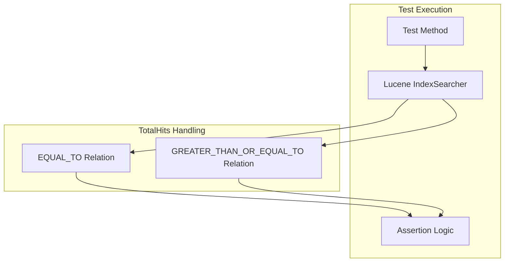

# Test Fixes

## Summary

This feature tracks fixes for flaky tests in OpenSearch's test suite, particularly focusing on tests that fail intermittently due to timing issues, race conditions, or incorrect assumptions about underlying library behavior. Stable tests are critical for maintaining CI/CD reliability and developer productivity.

## Details

### Architecture



### Components

| Component | Description |
|-----------|-------------|
| `ApproximatePointRangeQueryTests` | Test class for approximate range queries on point fields |
| `TotalHits.Relation` | Lucene enum indicating whether hit count is exact or a lower bound |
| `IndexSearcher` | Lucene component that executes searches and returns hit counts |

### Key Concepts

#### Lucene TotalHits Behavior

Lucene's `IndexSearcher.search()` method returns a `TotalHits` object containing:
- `value`: The hit count (exact or lower bound)
- `relation`: Either `EQUAL_TO` (exact) or `GREATER_THAN_OR_EQUAL_TO` (lower bound)

For performance reasons, Lucene may return a lower bound estimate when:
- The number of hits exceeds the default threshold (1000)
- Early termination is triggered for efficiency

#### Test Assertion Strategy

Tests should handle both relations:

```java
if (topDocs.totalHits.relation == Relation.EQUAL_TO) {
    // Exact count - assert equality
    assertEquals(expectedCount, topDocs.totalHits.value);
} else {
    // Lower bound - assert within expected range
    assertTrue(expectedCount <= topDocs.totalHits.value);
    assertTrue(maxPossibleHits >= topDocs.totalHits.value);
}
```

### Configuration

No configuration changes required. This is an internal test improvement.

## Limitations

- Flaky test fixes are reactive - new flaky tests may emerge as code evolves
- Some flaky tests may require more complex fixes involving test isolation or mocking

## Related PRs

| Version | PR | Description |
|---------|-----|-------------|
| v2.18.0 | [#16434](https://github.com/opensearch-project/OpenSearch/pull/16434) | Fix flaky test in testApproximateRangeWithSizeOverDefault |

## References

- [Issue #15807](https://github.com/opensearch-project/OpenSearch/issues/15807): AUTOCUT Gradle Check Flaky Test Report for ApproximatePointRangeQueryTests
- [Lucene IndexSearcher Documentation](https://lucene.apache.org/core/9_11_0/core/org/apache/lucene/search/IndexSearcher.html): TotalHits behavior documentation
- [OpenSearch Gradle Check Metrics Dashboard](https://metrics.opensearch.org/_dashboards/app/dashboards#/view/e5e64d40-ed31-11ee-be99-69d1dbc75083): Flaky test tracking

## Change History

- **v2.18.0** (2024-10-23): Fix flaky test in `testApproximateRangeWithSizeOverDefault` by adjusting totalHits assertion logic
