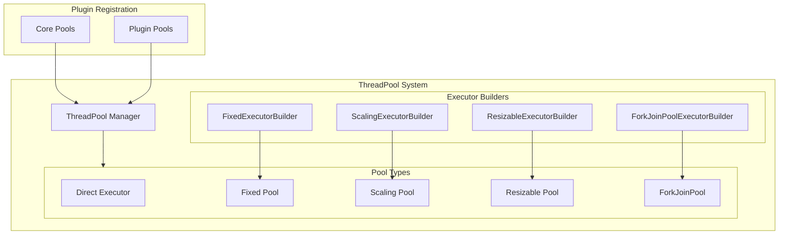

# Thread Pool

## Summary

OpenSearch's Thread Pool system manages concurrent task execution across the cluster. It provides different pool types optimized for various workloads, from fixed-size pools for predictable resource usage to scaling pools that adapt to demand. Starting with v3.4.0, OpenSearch also supports ForkJoinPool for work-stealing parallelism, enabling efficient recursive task processing for components like vector search engines.

## Details

### Architecture



### Thread Pool Types

| Type | Description | Use Case |
|------|-------------|----------|
| `DIRECT` | Executes on calling thread | Lightweight synchronous tasks |
| `FIXED` | Fixed number of threads | Predictable workloads (search, write) |
| `SCALING` | Scales between min/max | Variable workloads (generic, management) |
| `RESIZABLE` | Dynamically adjustable | Auto-tuning workloads |
| `FORK_JOIN` | Work-stealing pool | Recursive parallel tasks (v3.4.0+) |

### Built-in Thread Pools

OpenSearch includes several pre-configured thread pools:

| Pool Name | Type | Description |
|-----------|------|-------------|
| `generic` | SCALING | General-purpose operations |
| `search` | FIXED | Search query execution |
| `write` | FIXED | Index/update/delete operations |
| `management` | SCALING | Cluster management tasks |
| `flush` | SCALING | Flush operations |
| `force_merge` | FIXED | Force merge operations |
| `snapshot` | SCALING | Snapshot operations |

### ForkJoinPool Configuration (v3.4.0+)

Plugins can register ForkJoinPool executors with these settings:

| Setting | Description | Default |
|---------|-------------|---------|
| `thread_pool.{name}.parallelism` | Worker thread count (>= 1) | Required |
| `thread_pool.{name}.async_mode` | FIFO scheduling mode | `false` |
| `thread_pool.{name}.thread_factory` | Custom thread factory class | `""` |
| `thread_pool.{name}.enable_exception_handling` | Log uncaught exceptions | `true` |

### Usage Example

#### Registering a ForkJoinPool (Plugin)

```java
public class MyPlugin extends Plugin {
    @Override
    public List<ExecutorBuilder<?>> getExecutorBuilders(final Settings settings) {
        // Register a ForkJoinPool with 8 worker threads
        return List.of(new ForkJoinPoolExecutorBuilder("my_pool", 8));
    }
}
```

#### Using the Pool

```java
// Get the executor from ThreadPool
ForkJoinPool pool = (ForkJoinPool) threadPool.executor("my_pool");

// Submit parallel tasks
pool.submit(() -> {
    // Work-stealing parallel execution
    processInParallel(data);
});

// Use RecursiveTask for divide-and-conquer
RecursiveTask<Integer> task = new RecursiveTask<>() {
    @Override
    protected Integer compute() {
        // Fork subtasks and join results
        return leftTask.fork().join() + rightTask.compute();
    }
};
int result = pool.invoke(task);
```

### Monitoring Thread Pools

#### CAT API

```bash
GET _cat/thread_pool?v&h=name,type,active,queue,rejected,parallelism
```

#### Nodes Stats API

```bash
GET _nodes/stats/thread_pool
```

Response includes pool-specific metrics:

```json
{
  "thread_pool": {
    "search": {
      "threads": 13,
      "queue": 0,
      "active": 0,
      "rejected": 0,
      "largest": 13,
      "completed": 1000
    },
    "jvector": {
      "parallelism": 8
    }
  }
}
```

## Limitations

- ForkJoinPool executors cannot be dynamically resized after node startup
- Queue size and keep-alive settings do not apply to ForkJoinPool types
- ForkJoinPool stats show simplified metrics (parallelism only) as the pool manages internal state differently
- Custom thread factories must implement `ForkJoinWorkerThreadFactory`

## Change History

- **v3.4.0** (2025-10-17): Added ForkJoinPool thread pool type support for work-stealing parallelism

## References

### Documentation
- [CAT Thread Pool API](https://docs.opensearch.org/latest/api-reference/cat/cat-thread-pool/): Official documentation
- [Nodes Stats API](https://docs.opensearch.org/latest/api-reference/nodes-apis/nodes-stats/): Thread pool statistics

### Pull Requests
| Version | PR | Description | Related Issue |
|---------|-----|-------------|---------------|
| v3.4.0 | [#19008](https://github.com/opensearch-project/OpenSearch/pull/19008) | Add support for a ForkJoinPool type | [#18674](https://github.com/opensearch-project/OpenSearch/issues/18674) |

### Issues (Design / RFC)
- [Issue #18674](https://github.com/opensearch-project/OpenSearch/issues/18674): Feature request for ForkJoinPool support
