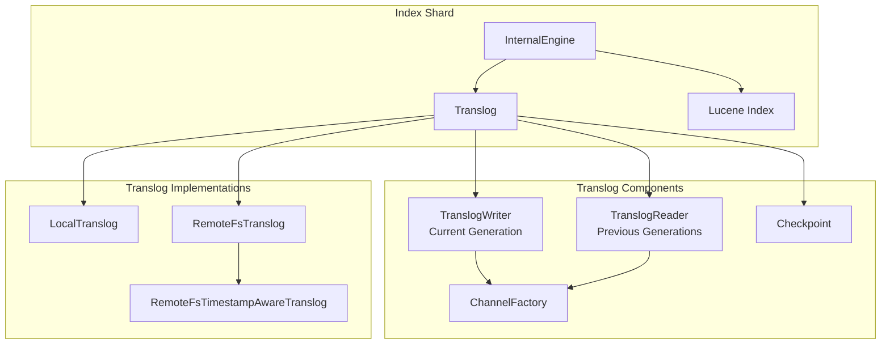
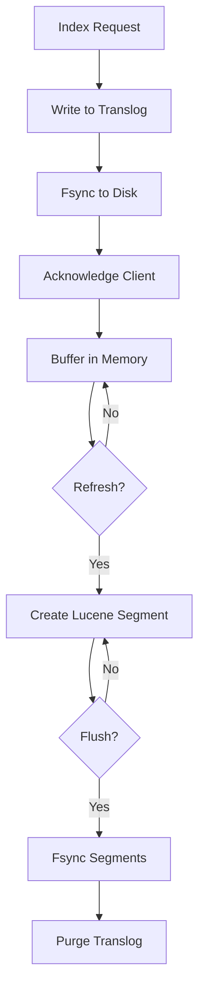

---
tags:
  - indexing
---

# Translog

## Summary

The Translog (transaction log) is a core component in OpenSearch that provides durability for indexing operations. It records all non-committed index operations in a durable manner, ensuring that data is not lost in case of failures. Each index shard has its own translog instance that works alongside the Lucene index to guarantee data persistence.

The translog serves as a write-ahead log (WAL) - operations are first written to the translog and flushed to disk before being acknowledged, ensuring durability even before the data is committed to Lucene segments.

## Details

### Architecture



### Data Flow



### Components

| Component | Description |
|-----------|-------------|
| `Translog` | Abstract base class for transaction log implementations |
| `LocalTranslog` | Standard local translog implementation |
| `RemoteFsTranslog` | Remote store-backed translog for remote-backed storage |
| `RemoteFsTimestampAwareTranslog` | Timestamp-aware variant for remote translog |
| `TranslogWriter` | Writes operations to the current translog generation |
| `TranslogReader` | Reads operations from previous translog generations |
| `Checkpoint` | Tracks translog state (generation, offset, operations count) |
| `ChannelFactory` | Factory for creating file channels (customizable since v3.3.0) |
| `TranslogDeletionPolicy` | Controls when translog files can be safely deleted |

### Configuration

| Setting | Description | Default |
|---------|-------------|---------|
| `index.translog.durability` | Sync mode: `request` (per-request) or `async` (periodic) | `request` |
| `index.translog.sync_interval` | Sync interval for async durability | `5s` |
| `index.translog.flush_threshold_size` | Size threshold to trigger flush | `512mb` |
| `index.translog.generation_threshold_size` | Size threshold to roll generation | `64mb` |
| `index.translog.retention.size` | Maximum translog size to retain | `512mb` |
| `index.translog.retention.age` | Maximum translog age to retain | `12h` |

### Usage Example

```yaml
# Index settings for translog configuration
PUT /my-index
{
  "settings": {
    "index": {
      "translog": {
        "durability": "async",
        "sync_interval": "10s",
        "flush_threshold_size": "1gb"
      }
    }
  }
}
```

### Custom Channel Factory (v3.3.0+)

```java
// Create a custom channel factory for specialized storage
ChannelFactory customFactory = (path, options) -> {
    // Custom channel creation logic
    return FileChannel.open(path, options);
};

// Use with translog constructor
Translog translog = new LocalTranslog(
    config,
    translogUUID,
    deletionPolicy,
    globalCheckpointSupplier,
    primaryTermSupplier,
    persistedSequenceNumberConsumer,
    TranslogOperationHelper.DEFAULT,
    customFactory
);
```

## Limitations

- Translog operations are single-threaded per shard for write operations
- Large translog sizes can impact recovery time
- Custom channel factories must be compatible with all translog file operations
- The channel factory cannot be changed after translog creation

## Change History

- **v3.3.0** (2025-08-27): Added `ChannelFactory` parameter to Translog constructor, enabling custom file channel implementations for use cases like storage encryption

## References

### Documentation
- [OpenSearch Introduction - Translog](https://docs.opensearch.org/3.0/getting-started/intro/#translog): Official translog documentation
- [Tuning for Indexing Speed](https://docs.opensearch.org/3.0/tuning-your-cluster/performance/): Translog tuning recommendations
- [Remote-backed Storage](https://docs.opensearch.org/3.0/tuning-your-cluster/availability-and-recovery/remote-store/index/): Remote translog configuration
- [opensearch-storage-encryption#39](https://github.com/opensearch-project/opensearch-storage-encryption/pull/39): Related storage encryption use case

### Pull Requests
| Version | PR | Description | Related Issue |
|---------|-----|-------------|---------------|
| v3.3.0 | [#18918](https://github.com/opensearch-project/OpenSearch/pull/18918) | Add Channel Factory parameter to Translog |   |
